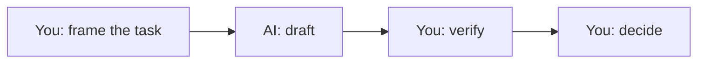

---
# Task page template. Copy this file into the right section folder, rename it,
# and fill in every section. Files in docs/_templates/ are not published.
title: Task name
layout: default
parent: For Students        # or: For Educators, Workflows & Agents
nav_order: 99
---

# Task name
{: .no_toc }

One sentence: what the reader will be able to do after this page.
{: .fs-6 .fw-300 }

  
On this page

  {: .text-delta }
1. TOC
{:toc}

## Scenario

A short, concrete situation with a fictional company and real-looking numbers.
Who is asking, what they need, and by when.

## Why it matters

What decision this task feeds, and what it costs to get it wrong.

## AI-assisted approach

Numbered steps. Say which parts AI does well, which parts you do, and where
the handoffs are. Map steps to **Use** where relevant.

Every page needs at least one diagram. Use a fenced `mermaid` block: a
flowchart of the steps, and a chart wherever the page has numbers.

## Prompt template

A copy-paste prompt in a fenced code block with `[BRACKETED]` placeholders,
followed by one or two notes on how to adapt it.

## Verify checklist

- [ ] Checkbox items the reader can actually tick off.
- [ ] Include at least one independent recalculation or source check.

## Common failure modes

| Failure | What it looks like | How to catch it |
|:--|:--|:--|
| | | |

## Disclose and decide notes

**Disclose:** what a good disclosure looks like for this task.

**Decide:** which judgment calls stay with the human, and why.

## For educators: turn this into a challenge

How to run this task as an AI-fluency challenge: setup, what students submit,
one planted error or twist, and debrief questions. Link to
[Designing an AI-fluency challenge](../educators/ai-fluency-challenge.md).
