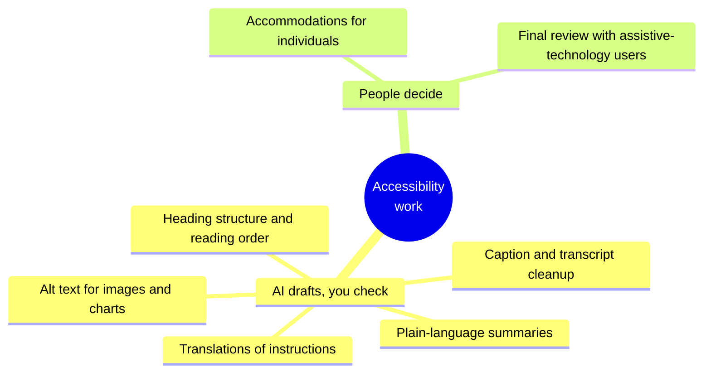

# Accessible and inclusive materials with AI
{: .no_toc }

Use AI to draft alt text, plain-language versions, captions, and translations faster, and check them so they're accurate and actually help the people who rely on them.
{: .fs-6 .fw-300 }

<details open markdown="block">
  <summary>On this page</summary>
  {: .text-delta }
1. TOC
{:toc}
</details>

{: .note }
This page is about using AI to *support* accessibility work. It doesn't replace your institution's accessibility office, legal requirements, or the people who use assistive technology. When in doubt, ask them.

## Scenario

Your course slides have 40 charts and diagrams with no descriptions. The readings are dense, and several learners are studying in their second language. A learner who uses a screen reader has just joined. You have a week. An AI tool can draft alt text for every image in minutes. Is that good enough?

## Why it matters

Accessible materials help everyone. Clear structure, plain language, and good descriptions benefit learners on phones, in noisy places, and in a second language, as well as learners with disabilities. AI can turn a backlog of accessibility work into a manageable review job. But AI-generated descriptions can be **wrong**, especially for charts, where an incorrect number in the alt text misleads exactly the learner who can't see the chart. And plain-language rewrites can quietly **change the meaning**.

International guidance on web accessibility comes from the W3C's Web Content Accessibility Guidelines (WCAG 2.2). Your institution may have its own standards built on them.

## AI-assisted approach

### Where AI helps



1. **Inventory what needs work (Use).** Images without descriptions, untagged headings, unclear instructions, and videos without captions.
2. **Draft with AI, giving it context (Use).** For alt text, tell it the image's *purpose* in the lesson, not just "describe this image."
3. **Check accuracy against the source (Verify).** Every number in chart alt text must match the chart's data.
4. **Check meaning (Verify).** Plain-language versions must say the same thing, without losing the key terms learners need to know.
5. **Test with real tools and people (Verify).** Use a screen reader yourself, and ask learners or your accessibility office for feedback.
6. **Keep individual accommodations human (Decide).** They go through your institution's process.

### Good alt text for a chart

Take the [break-even chart](). Compare three descriptions:

| Version | Alt text | Problem |
|:--|:--|:--|
| Generic AI | "A line graph with two lines." | Says nothing about what matters |
| Inaccurate AI | "Revenue and cost lines cross at about 2,000 drinks." | **Wrong number.** The break-even point is 2,400. |
| Checked | "Line chart of monthly revenue and total cost for 0 to 4,000 drinks. Revenue rises from $0 to $24,000. Total cost rises from $9,000 to $18,000. They cross at the break-even point: 2,400 drinks and $14,400." | Accurate, purposeful, and complete |

The checked version states the **purpose** (break-even), the **key values**, and the **conclusion**, which is the information a sighted learner gets from the chart.

## Prompt template

**Alt text**

```text
Write alt text for this [CHART / IMAGE] in a [COURSE] lesson.
Its purpose in the lesson: [WHAT LEARNERS SHOULD TAKE FROM IT].
The underlying data: [PASTE DATA, if a chart].

Requirements: start with the chart type; state the key values and the
main takeaway; under 60 words (and offer a longer description separately
if the chart is complex); use only the numbers in the data I provided.
```

**Plain-language version**

```text
Rewrite this [INSTRUCTION / PASSAGE] in plain language for learners,
including those reading in a second language. Keep these terms exactly,
with a short definition the first time each appears: [KEY TERMS].
Short sentences, active voice, no idioms. Don't change any requirement,
deadline, or number. After the rewrite, list anything you were unsure
how to simplify without changing the meaning.
```

## Verify checklist

- [ ] Every number in chart alt text matches the chart's data.
- [ ] Alt text states the purpose and the takeaway, not just what the image looks like.
- [ ] Plain-language versions keep every requirement, deadline, and number unchanged.
- [ ] Key course terms are kept and defined, not simplified away.
- [ ] Translations of important instructions were checked by a fluent speaker, or provided alongside the original.
- [ ] I tested at least one page with a screen reader.
- [ ] Individual accommodations went through my institution's process, not an AI tool.
- [ ] No learner's disability or accommodation information was pasted into an AI tool.

## Common failure modes

| Failure | What it looks like | How to catch it |
|:--|:--|:--|
| **Wrong numbers in alt text** | "Lines cross at about 2,000" | Give AI the underlying data, and check every number. |
| **Decorative descriptions** | "A colorful chart with blue and red lines" | Ask for purpose and takeaway. |
| **Meaning drift** | A plain-language rule that drops an exception or deadline | Compare requirements line by line. |
| **Lost vocabulary** | "Contribution margin" replaced with "money left over" | Keep key terms, and define them. |
| **Unchecked translations** | A translated deadline with the wrong date format | Have a fluent speaker check, and keep the original alongside. |
| **Privacy breach** | Accommodation details pasted into an AI tool | These are Restricted data. See [Data classification](). |

## Disclose and decide notes

**Disclose:** A brief note helps learners calibrate: *"Image descriptions and plain-language summaries were drafted with AI and checked by the instructor. Please tell me if anything is unclear or inaccurate."* The invitation to report errors matters most.

**Decide:** What counts as accessible enough, and what individual learners need, are decisions for you, your accessibility office, and the learners themselves. AI speeds up the work, but it isn't the judge of it.

## For educators: turn this into a challenge

In a faculty workshop, each participant brings three images from their own slides, including at least one chart. They draft alt text with AI using the prompt above, then swap with a partner who checks it against the original image *without looking at the slide text*. Debrief: *How many AI descriptions had a wrong or missing number? What did the purposeful versions add?* See [Designing an AI-fluency challenge]().

---

**References**

- World Wide Web Consortium (W3C). *Web Content Accessibility Guidelines (WCAG) 2.2.* W3C Recommendation. https://www.w3.org/TR/WCAG22/
