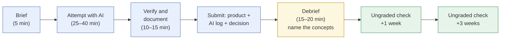
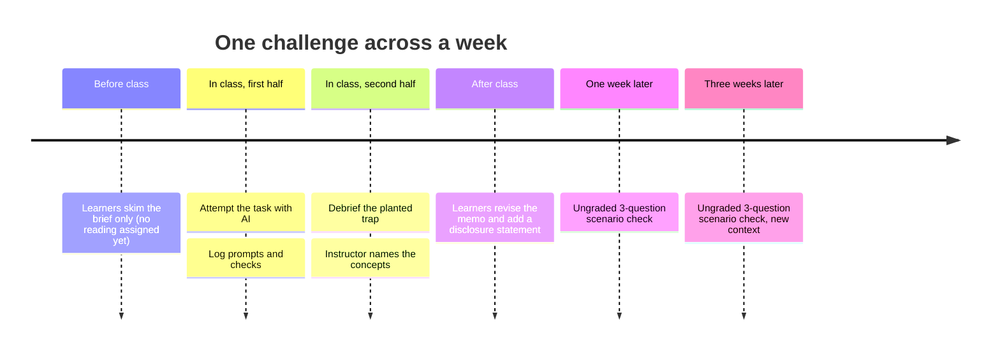
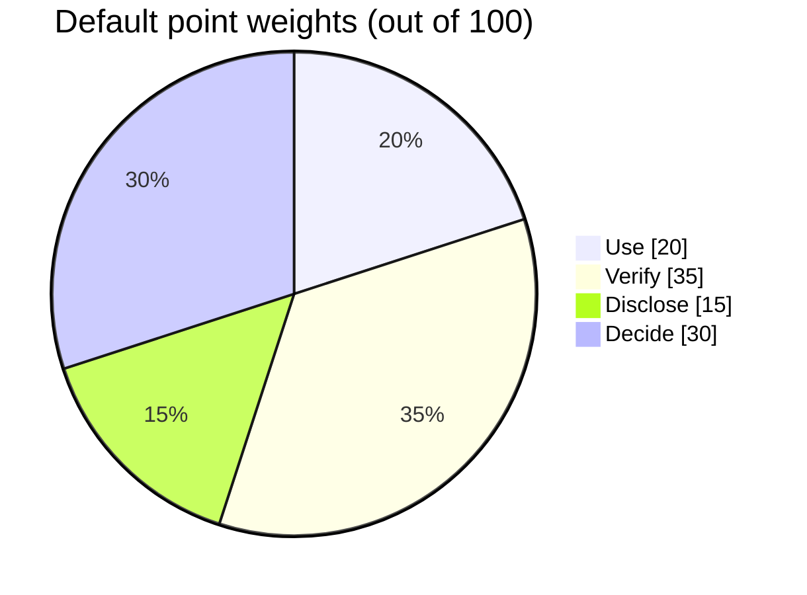

# Designing an AI-fluency challenge
{: .no_toc }

Build a short, practice-first activity in which learners use AI on a real business task and are assessed on their judgment, not just the final product.
{: .fs-6 .fw-300 }

<details open markdown="block">
  <summary>On this page</summary>
  {: .text-delta }
1. TOC
{:toc}
</details>

## Scenario

You teach an introductory managerial accounting course (or run a finance onboarding program). Your learners already use AI tools, openly or not. You want an activity where AI use is **expected**, and where what gets rewarded is catching the AI's mistakes, adding missing context, and defending a conclusion, rather than producing a polished document the AI mostly wrote.

## Why it matters

Two common responses to AI both leave a gap:

- **Banning it** doesn't build the skill learners will need at work, and it's hard to enforce.
- **Allowing it without structure** tends to reward the most polished output, which may be the least thought-through.

An AI-fluency challenge sits between these. It assumes AI is in the room and makes judgment the thing being graded. The [Use · Verify · Disclose · Decide rubric]() gives both you and your learners a shared language for what "good" looks like.

## AI-assisted approach

### Design principles

1. **Practice first.** Start learners on a realistic task before the lecture, and bring in concepts as they need them. This is sometimes called "flipping Bloom's taxonomy": starting from applying and evaluating rather than from remembering. <!-- TODO: source for "flipped Bloom's" framing --> The debrief is where concepts get named and organized.
2. **Use a real business task, not a quiz question.** It should end in a decision someone would actually make, such as open or don't open, price A or price B, or hire or wait.
3. **Make AI use expected and visible.** Require an AI log. Don't try to detect AI use; design so that using it well is the assignment.
4. **Plant a trap.** Include one detail that current AI tools tend to get wrong: a price-linked cost, a mixed time period, a misleading statistic, or an ambiguous instruction. Test it yourself first.
5. **Grade the judgment.** Most of the points go to Verify and Decide, not to how the final product looks.
6. **Follow up with ungraded, spaced retrieval.** Short scenario questions a week and a few weeks later help the learning stick. Research on retrieval practice (Roediger & Karpicke, 2006) and spaced practice (Cepeda et al., 2006) supports both. See [Scenario knowledge checks]().

### The challenge lifecycle



### A sample week



## Prompt template

This is the **challenge brief template**. Copy it, fill in the brackets, and hand it to learners.

```markdown
# AI-Fluency Challenge: [SHORT TITLE]

## Your role
You are [ROLE, e.g. a financial analyst at a fictional coffee company].
[DECISION-MAKER] needs your recommendation by [DEADLINE].

## The situation
[3–6 sentences. Fictional company, concrete numbers, one real tension.]

## Your data
[Table or attachment. Keep it small enough to check by hand.]

## Your task
Produce a [DELIVERABLE, e.g. one-page memo] that answers:
[THE DECISION QUESTION].

## AI use
AI tools are **expected** for this challenge. Use any tool you like;
a free tier is enough. You are graded on how well you use, verify,
disclose, and decide — not on whether you used AI.

## What to submit
1. Your [DELIVERABLE].
2. Your AI log: the prompts you used (paste or screenshot), and for each
   AI output, what you checked and what you changed.
3. A disclosure statement (2–4 sentences).
4. Your decision in one sentence, plus the single strongest reason for it
   and the single biggest risk to it.

## How you'll be assessed
Use · Verify · Disclose · Decide rubric (attached). Verify and Decide
carry the most weight.
```

### Scoring rubric

Adapt the points to your course. The default weights put the emphasis on judgment:



| Criterion | Beginning | Developing | Proficient |
|:--|:--|:--|:--|
| **Use (20)** | 0–8: Minimal context. Generic prompts. | 9–15: Relevant context. Some iteration. | 16–20: Clear goal, inputs, constraints, and definition of done. Purposeful iteration. |
| **Verify (35)** | 0–14: No evidence of checking. Planted trap missed. | 15–26: Some numbers or sources checked. Trap possibly caught by chance. | 27–35: Key figures recomputed, sources opened, assumptions listed, planted trap caught and explained. |
| **Disclose (15)** | 0–5: Missing or vague. | 6–11: States AI was used, with few specifics. | 12–15: Specific about what AI did, what was checked, and what was changed. |
| **Decide (30)** | 0–11: Conclusion restates the AI's. No clear reasoning. | 12–22: Own conclusion, partially justified. | 23–30: Clear decision, strongest reason, biggest risk, and where they disagreed with AI. |

### A worked example

The [Break-even analysis]() page is a ready-made challenge:

- **Role:** analyst at Harbor Bean Co.
- **Decision:** open a second kiosk or not.
- **Planted trap:** the card-processing fee is a percentage of price. When learners ask about a $6.50 price, AI tools often hold variable cost constant and report 2,118 drinks. The correct figure is 2,126.
- **Debrief:** "What costs in *your* industry are secretly tied to price?"

## Verify checklist

Before you run the challenge:

- [ ] I ran the task myself with at least two AI tools, including a free tier.
- [ ] The planted trap actually trips current tools at least some of the time. (Retest each term, since models change.)
- [ ] All companies, people, and data are fictional or public, with no real student, client, or institutional data.
- [ ] The brief matches my course's or organization's AI policy.
- [ ] The data is small enough for learners to check by hand or in a spreadsheet.
- [ ] Learners without paid tools can complete it fully.
- [ ] The rubric rewards catching errors, not just the final product.
- [ ] I've planned the debrief questions and the two spaced follow-up checks.

## Common failure modes

| Failure | What it looks like | How to fix it |
|:--|:--|:--|
| **AI solves it cleanly** | Everyone gets the same correct answer and there's nothing to debrief | Add ambiguity, a price-linked cost, a messy source, or a judgment call with no single right answer. |
| **Trap is too obvious** | "The data has an error in row 3" | Hide the trap in the setup (classification, period, units), not in a typo. |
| **Grading the polish** | Best-formatted memos get top marks regardless of reasoning | Put most of the points on Verify and Decide, and read the AI log first. |
| **Unclear disclosure rules** | Learners don't know how much to disclose, so they under-disclose | Give the disclosure template in the brief. |
| **Paid-tool advantage** | Some learners have premium features, others don't | Design and test for free tiers. Keep data small. |
| **No debrief** | Learners find the trap but never connect it to the concept | Always reserve the last 15–20 minutes for the debrief. |

## Disclose and decide notes

**Disclose:** Model the behavior. If you used AI to draft the scenario, generate data, or write the rubric, say so in the brief. Learners notice.

**Decide:** Grades are human decisions. You can use AI to help organize feedback against the rubric (see [AI in course operations]()), but a person assigns and owns every grade.

## For educators: turn this into a challenge

This page *is* the challenge template. To run it as a **faculty or trainer workshop**, have participants design one challenge for their own course in 45 minutes using the brief template above. Then have them swap briefs with a partner and try each other's challenge with an AI tool for 15 minutes. The debrief question: *did the planted trap work, and what would make it better?*

---

**References**

- Cepeda, N. J., Pashler, H., Vul, E., Wixted, J. T., & Rohrer, D. (2006). Distributed practice in verbal recall tasks: A review and quantitative synthesis. *Psychological Bulletin, 132*(3), 354–380.
- Roediger, H. L., & Karpicke, J. D. (2006). Test-enhanced learning: Taking memory tests improves long-term retention. *Psychological Science, 17*(3), 249–255.
