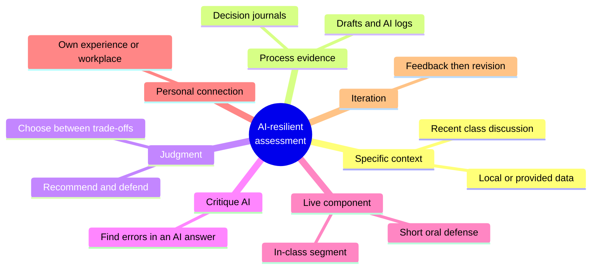
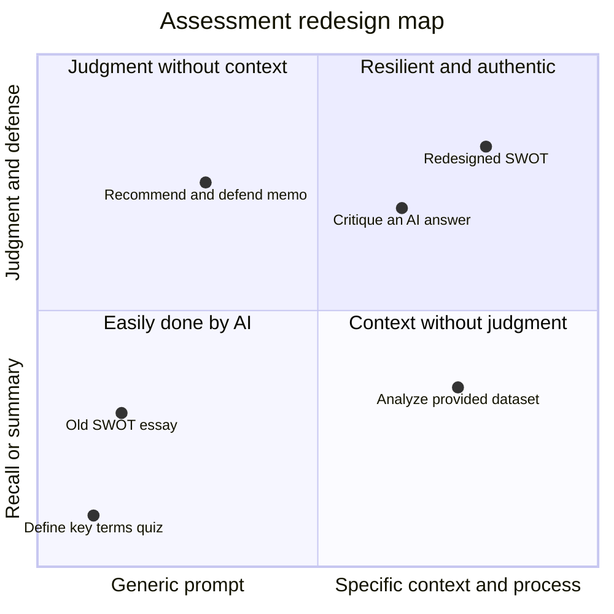

# AI-resilient assessment
{: .no_toc }

Redesign assignments so they measure learners' judgment even when AI is available, without relying on detection or bans.
{: .fs-6 .fw-300 }

<details open markdown="block">
  <summary>On this page</summary>
  {: .text-delta }
1. TOC
{:toc}
</details>

## Scenario

For years, your course has assigned: *"Write a 1,500-word SWOT analysis of a well-known public company."* This term, you paste the prompt into a chat assistant, and in 30 seconds it produces a competent, B-grade SWOT analysis. Many submissions now read the same way. You can't tell who did the thinking, and the assignment no longer measures what it was meant to.

## Why it matters

When AI can produce a passable answer from the prompt alone, the assignment measures access to AI, not learning. Detection is unreliable, and bans are hard to enforce. The more durable fix is to **design** assessments where the valuable work is the part AI can't do for the learner: applying specific context, making and defending judgments, and showing the process.

"AI-resilient" doesn't mean AI-proof. It means the assessment still tells you what you need to know about the learner.

## AI-assisted approach

### Seven design moves



| Move | What it looks like | Why AI can't simply do it |
|:--|:--|:--|
| **Specific context** | Analyze a provided dataset, or a local business visited in class | The context isn't in the model's training data or the prompt alone |
| **Process evidence** | Submit drafts, an AI log, and a short decision journal | The process shows the thinking, not just the product |
| **Judgment** | "Recommend one option and defend it against the strongest objection" | The learner has to own a position and reason about trade-offs |
| **Critique AI** | "Here's an AI-generated SWOT. Find and fix three weaknesses." | It needs evaluation, and works *with* AI |
| **Live component** | A 5-minute oral defense, or an in-class segment | The learner explains their reasoning in real time |
| **Personal connection** | Apply the framework to your own workplace or experience | The specifics come from the learner |
| **Iteration** | Feedback, revision, then a reflection on what changed | Growth across drafts is visible |

### Where assessments sit



The positions are illustrative judgments. The goal is to move assessments up and to the right.

### Worked redesign: the SWOT assignment

| Element | Before | After |
|:--|:--|:--|
| Company | Any well-known public company | **Harbor Bean Co.**, a fictional company with an instructor-provided data pack (sales, costs, two competitor profiles, a customer survey summary) |
| Task | Write a SWOT | Build the SWOT from the data pack, then **recommend one strategic move** and defend it against the strongest objection |
| AI | Unaddressed | **AI with disclosure.** Learners must also critique one AI-generated SWOT item they rejected, and say why. |
| Evidence | Final essay | Final memo (800 words), AI log, and a 5-minute recorded or live defense |
| Grading weight | Mostly writing quality | Mostly judgment, evidence from the data pack, and the defense |

The redesign keeps the learning goal (strategic analysis) and changes what produces a good grade.

## Prompt template

Use AI to stress-test your own assignment before learners see it:

```text
Here is an assignment I give learners: [PASTE ASSIGNMENT AND RUBRIC].
Learning goal: [WHAT IT SHOULD MEASURE].

1. Complete this assignment as a capable student using only an AI tool,
   in under 10 minutes. Show the result.
2. Score your result against the rubric. Be honest.
3. Identify which rubric criteria an AI-only submission satisfies easily,
   and which it can't.
4. Suggest 3 redesigns, using moves like specific context, process
   evidence, judgment and defense, critique of AI output, a live
   component, personal connection, or iteration, that keep the learning
   goal and make the AI-only submission score poorly.
```

If the AI-only result scores well against your rubric, the assignment needs redesigning.

## Verify checklist

- [ ] I ran my assignment through an AI tool myself and scored the result against my rubric.
- [ ] The redesign still measures the original learning goal.
- [ ] Most of the grade rewards judgment, use of the specific context, and process, not polish.
- [ ] The workload is reasonable for learners and for me. A live defense for 80 learners has to be scheduled.
- [ ] The assignment's AI level is stated, consistent with my [course AI policy]().
- [ ] Provided data and companies are fictional or public, with no learner or confidential data.
- [ ] Accessibility: live components have reasonable alternatives for learners who need them.

## Common failure modes

| Failure | What it looks like | How to fix it |
|:--|:--|:--|
| **Arms race** | Adding hidden "traps" to catch AI users | Design for judgment and process, not for catching people. |
| **Grading polish** | A fluent AI-written memo outscores a rougher one with better reasoning | Weight the rubric toward judgment and evidence. |
| **Unmanageable workload** | Oral defenses for 120 learners, every week | Use short defenses on a sample or rotation, or recorded 3-minute videos. |
| **Losing the learning goal** | The redesign tests AI skills instead of strategy | Check every change against the original goal. |
| **Context that leaks** | The "specific" company is famous, so AI knows it well | Use a fictional or local company with provided data. |
| **Process theater** | AI logs written after the fact to satisfy the requirement | Ask about the log in the defense. Grade the reasoning, not its length. |

## Disclose and decide notes

**Disclose:** Explain to learners *why* the assignment is designed the way it is. Knowing that the defense and the data pack carry the grade encourages them to engage, rather than look for shortcuts.

**Decide:** You decide what evidence of learning is good enough. AI can help you test and redesign assignments, but what counts as mastery is a teaching judgment.

## For educators: turn this into a challenge

In a faculty workshop, each participant runs one of their own assignments through the stress-test prompt and scores the AI-only result against their real rubric. Then they redesign it using at least two of the seven moves and run the test again. Debrief: *How did the AI-only score change? What did the redesign cost in grading time, and is it worth it?* See [Designing an AI-fluency challenge]().
