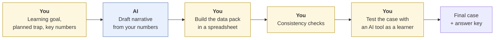
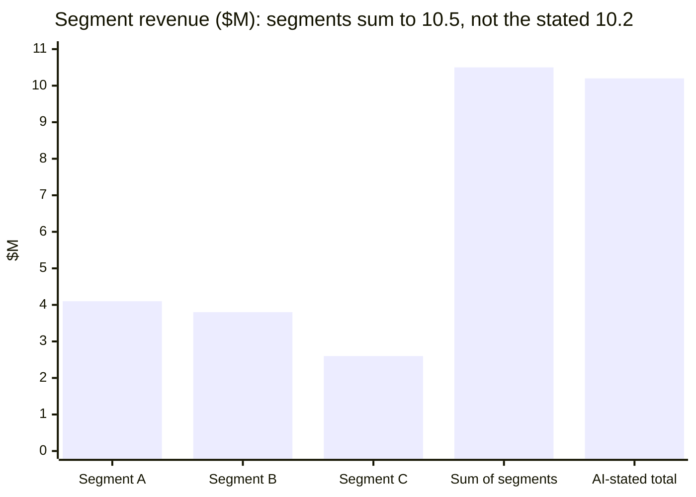

# Creating cases and data packs with AI
{: .no_toc }

Use AI to draft fictional business cases and the data that goes with them, then check that the numbers are internally consistent before learners find the errors you didn't intend.
{: .fs-6 .fw-300 }

<details open markdown="block">
  <summary>On this page</summary>
  {: .text-delta }
1. TOC
{:toc}
</details>

## Scenario

You want a fresh case for next week's strategy class: a fictional mid-size company with three business segments, a two-page narrative, and a data pack (segment revenues, costs, and a customer survey summary). You ask an AI tool to generate it. The narrative is vivid. The data pack says segment revenues are **$4.1M, $3.8M, and $2.6M**, and total revenue is **$10.2M**.

Those segments add up to **$10.5M**.

## Why it matters

Fictional cases with data packs are central to this guide's approach. They avoid real company data, they can't be looked up online, and you control the traps. AI makes them fast to produce. But AI-generated numbers are often **internally inconsistent**: totals that don't add up, percentages that don't match counts, a balance sheet that doesn't balance. If learners find an unplanned error, it undermines the exercise. And sometimes AI drifts toward a **real company's** story or name, which you need to catch too.

## AI-assisted approach



1. **Start from the learning goal and the planned trap (Decide).** For example: "Learners should spot that the fastest-growing segment has the lowest margin."
2. **Set the key numbers yourself, in a spreadsheet (Use).** Let formulas calculate totals, margins, and growth rates. Don't let the AI generate the data pack's numbers directly.
3. **Have AI write the narrative around your numbers (Use).** It's good at characters, context, and realistic tension.
4. **Run consistency checks (Verify).** See the checklist below.
5. **Check for real-world resemblance (Verify).** Search the company and character names. Make sure the story isn't a thinly disguised real company.
6. **Test-drive it (Verify).** Give the case to an AI tool as a learner would, and see whether it catches the trap. If it does every time, make the trap subtler.

### The consistency check

| Check | Example | Result |
|:--|:--|:--|
| Parts sum to totals | 4.1 + 3.8 + 2.6 = 10.5 vs. stated 10.2 | ✗ Fix the total or a segment |
| Percentages match counts | "42% of 500 respondents" = 210 | Check the count is stated as 210 |
| Margins match profit ÷ revenue | Profit $0.9M on $10.5M = 8.6% | Check against the stated margin |
| Growth rates match the two years | $9.6M to $10.5M = 9.4% growth | Check against the stated rate |
| Balance sheet balances | Assets = liabilities + equity | Must be exact |
| Units and periods are consistent | All annual, all in $M | One convention throughout |



## Prompt template

```text
Write a [LENGTH] fictional business case for [COURSE / LEVEL].

Learning goal: [WHAT LEARNERS SHOULD FIGURE OUT].
Company: fictional, [INDUSTRY], [SIZE]. Don't base it on or name any
real company, and avoid names that closely resemble real brands.

Use EXACTLY these numbers (don't add any others): [PASTE KEY FIGURES].
Include: a protagonist facing a decision, 2–3 realistic tensions,
one detail that supports [PLANNED TRAP] without pointing at it, and
3 discussion questions. Don't include the answer.

After the case, list every number you mentioned, so I can check them
against my data pack.
```

## Verify checklist

- [ ] All numbers come from my spreadsheet, and totals are formulas, not typed values.
- [ ] Parts sum to totals, percentages match counts, and margins and growth rates recompute.
- [ ] Any balance sheet balances exactly.
- [ ] Every number in the narrative matches the data pack (use the AI's list).
- [ ] The company and character names don't match real companies or public figures.
- [ ] The planned trap works: I tested the case with an AI tool as a learner would.
- [ ] I wrote the answer key myself and checked it.
- [ ] The case includes no real student, client, or institutional data.

## Common failure modes

| Failure | What it looks like | How to catch it |
|:--|:--|:--|
| **Totals that don't add up** | Segments sum to 10.5, total says 10.2 | Build the data pack with formulas, and recompute totals. |
| **Narrative-data mismatch** | The story says "margins doubled," the data shows a 20% rise | Compare the AI's number list against the spreadsheet. |
| **Real-company drift** | A "fictional" streaming company that's obviously a real one | Search names. Change the details that point to a real firm. |
| **Trap too obvious** | Learners spot it in the first paragraph | Bury it in the data, not the narrative. |
| **Trap too hidden** | Nobody finds it, even with hints | Test with colleagues or an AI-as-learner run first. |
| **Unintended second trap** | An accidental error that learners find instead | The consistency checklist, every time. |

## Disclose and decide notes

**Disclose:** Note on the case that it's fictional and AI-assisted, for example: *"Fictional case drafted with AI assistance; data and answer key prepared by the instructor."* That models the behavior you're teaching.

**Decide:** The learning goal, the trap, and the answer key are your teaching decisions. AI can draft the story. It shouldn't decide what the case is *for*.

## For educators: turn this into a challenge

Make case-building the assignment. Advanced learners use AI to create a short case and data pack for a concept they've studied, including one planted trap. Teams swap cases and try to solve them, reporting both the intended trap and any *unintended* errors. Debrief: *How many cases had unplanned inconsistencies? Which checks would have caught them?* See [Designing an AI-fluency challenge]().
