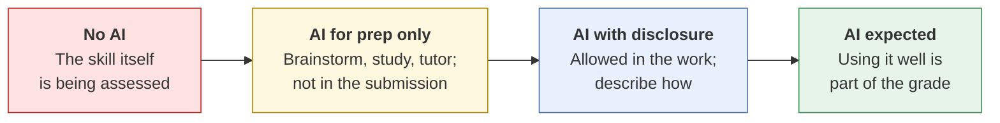

# Writing a course AI policy
{: .no_toc }

Write a clear, fair AI policy for your course or training program, with assignment-level rules learners can actually follow.
{: .fs-6 .fw-300 }

<details open markdown="block">
  <summary>On this page</summary>
  {: .text-delta }
1. TOC
{:toc}
</details>

## Scenario

On the first day of class, a learner asks, *"Can we use AI?"* Your syllabus says: *"Use of AI tools must be appropriate and in accordance with academic integrity policies."* The learner asks what "appropriate" means. You realize you don't have a precise answer, and that the answer differs between the reflection paper, the group case analysis, and the final exam.

## Why it matters

Vague policies are unfair to learners. Some will avoid AI entirely out of fear, while others will use it heavily, assuming it's fine. Unclear rules also make integrity conversations harder for you. A good policy:

- Says clearly what's allowed, **per assignment**.
- Explains **why**, tied to what each assignment is meant to build.
- Tells learners **how to disclose** AI use.
- Tells learners how **you** use AI.
- Fits within your institution's or employer's policy, which always takes precedence.

## AI-assisted approach

### Choose a level per assignment, not one rule for the course



| Level | Use it for | Example |
|:--|:--|:--|
| **No AI** | Assessing a skill the learner must have on their own | In-class exam on financial statement analysis |
| **AI for prep only** | Building understanding, while the submission shows the learner's own thinking | Reflection paper (AI as a [Socratic tutor]() is fine) |
| **AI with disclosure** | Realistic work tasks where AI is a normal tool | Group case analysis |
| **AI expected** | Building AI fluency itself | [AI-fluency challenge]() |

### Steps

1. **Check your institution's or employer's policy first (Use).** Your course policy works within it.
2. **List each assessment and what it's meant to build (Use).** Choose a level for each one based on that purpose.
3. **Draft the policy with AI (Use).** Use the template below. AI is good at producing clear, friendly wording from your decisions.
4. **Test it (Verify).** Give the draft to a colleague, or ask AI to role-play a confused learner, and see whether the rules hold up against real edge cases.
5. **Publish it in three places (Decide):** the syllabus, each assignment brief, and a short first-week discussion.

## Prompt template

Here is a **syllabus AI policy template**. Fill in the brackets, or give the filled version to an AI tool to polish the wording.

```markdown
## Using AI in this course

AI tools are part of modern [business] work, and learning to use them with
good judgment is part of this course. The rules differ by assignment because
the assignments build different skills.

| Assignment | AI level | What that means |
|---|---|---|
| [Assignment 1] | No AI | Complete this on your own. It assesses [SKILL]. |
| [Assignment 2] | AI for prep only | Use AI to study or brainstorm. Your submission must be your own words and reasoning. |
| [Assignment 3] | AI with disclosure | You may use AI. Include a disclosure statement (below). |
| [Assignment 4] | AI expected | Using AI well is part of the grade (see rubric). |

**Disclosure statement** (when AI is allowed): Say which kind of tool you
used, what it did, what you checked, and what you changed. Two to four
sentences is enough.

**You are responsible for everything you submit**, including any errors
AI introduced. Check facts, numbers, and sources.

**Don't enter** other people's personal information or confidential data
into AI tools.

**How I use AI:** [e.g., I sometimes use AI to draft announcements and
initial feedback comments. I read every submission myself, and I assign
every grade personally.]

**Not sure?** Ask before you submit, not after. Asking will never count
against you.

This policy follows [INSTITUTION / ORGANIZATION] policy, which takes
precedence where they differ.
```

**Edge-case test prompt:**

```text
Act as five different learners reading this AI policy: [PASTE].
Each asks one realistic question the policy doesn't clearly answer
(e.g., grammar checkers, translation tools, AI built into other software,
group members with different practices). List the questions only.
```

## Verify checklist

- [ ] The policy fits within my institution's or employer's AI and integrity policies.
- [ ] Every assessment has a stated AI level and a reason tied to its purpose.
- [ ] The disclosure requirement is specific, with an example.
- [ ] Learners are told not to enter others' personal or confidential data.
- [ ] I've disclosed how I use AI in the course.
- [ ] I tested the policy against edge cases: grammar tools, translation, AI built into other software, group work.
- [ ] Each assignment brief repeats its AI level.
- [ ] The policy invites questions and says that asking won't count against learners.

## Common failure modes

| Failure | What it looks like | How to fix it |
|:--|:--|:--|
| **One rule for everything** | "AI is not permitted," even for brainstorming | Set a level per assignment. |
| **Vague terms** | "Appropriate use" with no definition | Use the four levels and give examples. |
| **Relying on detectors** | Treating an AI-detection score as proof of misconduct | Detection tools can be wrong, including false positives on genuine work. Never use a score as the only evidence. <!-- TODO: source on AI-text detector reliability --> Design assessments that don't depend on detection instead (see [AI-resilient assessment]()). |
| **Forgotten edge cases** | Grammar checkers, translation tools, and AI features built into everyday software | Name them explicitly. |
| **Policy hidden in the syllabus** | Learners never read it | Repeat the level in each assignment brief, and discuss it in week one. |
| **No instructor disclosure** | Learners must disclose, but the instructor doesn't | Model the behavior you're asking for. |

## Disclose and decide notes

**Disclose:** If you used AI to draft your policy, a short note models good practice: *"Drafted with AI assistance from my decisions; reviewed and finalized by the instructor."*

**Decide:** The AI level for each assessment is a teaching decision that rests on what you want learners to be able to do on their own. Revisit it each term as tools and your learners' needs change.

## For educators: turn this into a challenge

In a faculty or trainer workshop, each participant brings one real syllabus. In 30 minutes, they assign an AI level to every assessment and write the reason in one sentence. Pairs then swap and try to "break" each other's policy with edge-case questions, using the edge-case test prompt. Debrief: *Which assessment was hardest to classify? What did that reveal about what it's really measuring?* See [Designing an AI-fluency challenge]().
