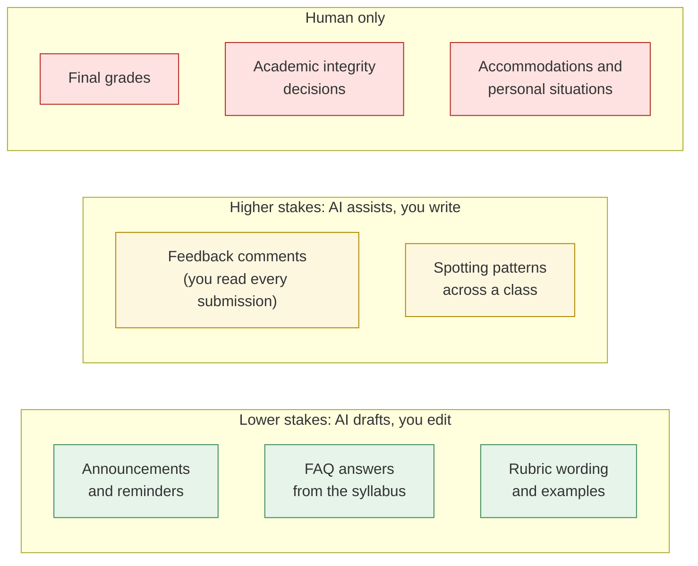
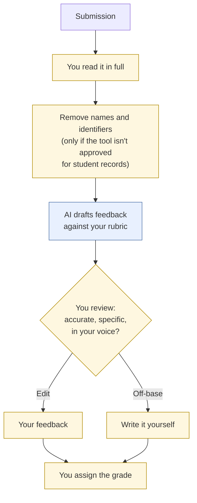
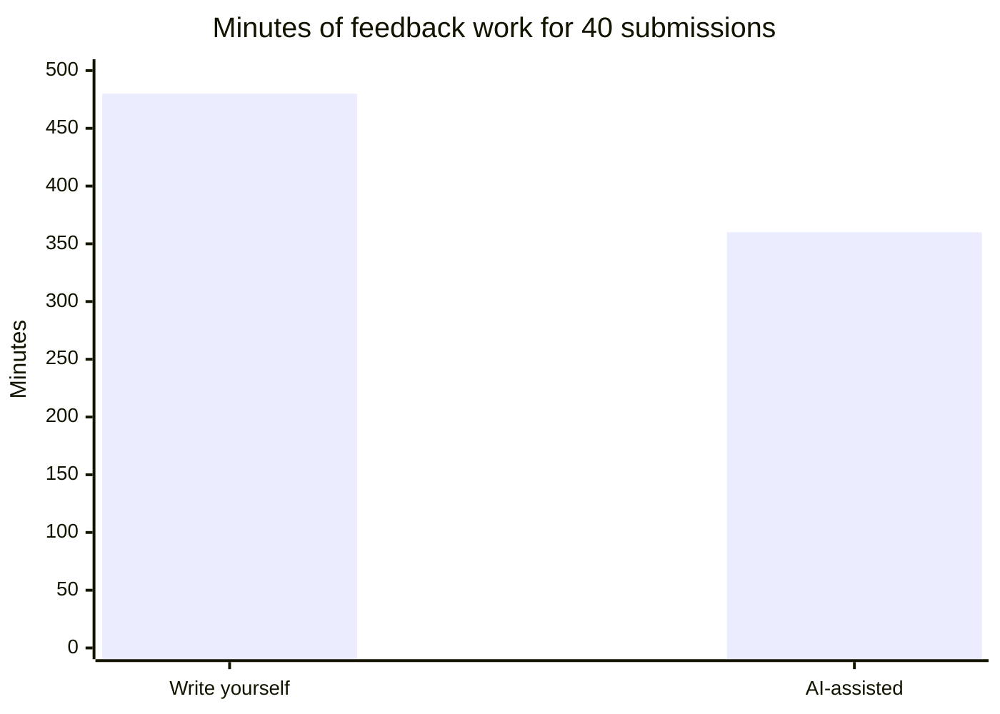

# AI in course operations
{: .no_toc }

Use AI for feedback drafts, announcements, and grading support, with a human owning every final grade.
{: .fs-6 .fw-300 }

<details open markdown="block">
  <summary>On this page</summary>
  {: .text-delta }
1. TOC
{:toc}
</details>

## Scenario

You teach two sections of a business course with 40 learners each. Every week brings announcements, reminder emails, the same five questions about the syllabus, and a stack of short written assignments that each deserve thoughtful feedback. You want AI to take some of the load, without compromising fairness, privacy, or the quality of your feedback.

## Why it matters

Course operations is where AI can give educators real time back, and also where the risks are personal. Learners trust that their work is read by their instructor, that grades are fair, and that their data is protected. A careless setup can mean generic feedback that learners recognize as machine-written, inconsistent grading, or student records pasted into an unapproved tool.

The rule for this page: **AI can draft; you decide and send.** Grades are always a human decision.

## AI-assisted approach

### Where AI fits



| Task | AI's role | Your role | Data class |
|:--|:--|:--|:--|
| Weekly announcement | Draft from your bullet points | Edit for voice and accuracy, then post | Public or Internal |
| Syllabus FAQ | Draft answers using only the syllabus text | Check every answer against the syllabus | Internal |
| Rubric development | Suggest criteria wording and level descriptors | Decide criteria and weights | Internal |
| Feedback on submissions | Draft comments against your rubric, from de-identified text | Read every submission. Edit or rewrite the comments. | **Restricted** (student work) |
| Class-wide patterns | Summarize common errors across de-identified excerpts | Decide what to reteach | Restricted unless de-identified |
| Final grades | None | Assign and own every grade | Restricted |

### The feedback workflow



**Read first, then draft.** Reading the submission before you see the AI's comments keeps your own judgment primary, and it catches anything the rubric doesn't cover.

### Is it worth it? An honest time estimate

For 40 short written assignments:

| Approach | Per submission | Total for 40 |
|:--|--:|--:|
| Write all feedback yourself (read 6 min + write 6 min) | 12 min | 480 min (8 hours) |
| AI-assisted (read 6 min + review and edit AI draft 3 min) | 9 min | 360 min (6 hours) |



That saves 2 hours, or 25%, per assignment, and the reading time doesn't shrink. If the AI drafts need heavy rewriting, the savings disappear. Time a batch of 10 before committing. See [Should you use AI here?]().

## Prompt template

**Feedback draft**

```text
You are helping an instructor draft feedback on a short business
assignment. The instructor will read the submission, then edit or
rewrite your draft before anything is sent.

Assignment prompt: [PASTE]
Rubric: [PASTE CRITERIA AND LEVEL DESCRIPTORS]
Submission (de-identified): [PASTE]

Draft feedback that:
- Names 1–2 specific strengths, quoting the submission.
- Names the 1–2 most important improvements, tied to rubric criteria,
  with a concrete next step for each.
- Is under 120 words, direct, and encouraging without empty praise.
Do NOT suggest a grade or score.
```

**Announcement**

```text
Draft a course announcement from these points: [BULLETS].
Audience: [LEARNERS]. Tone: [e.g., warm, brief]. Under 150 words.
Use only the dates and details I've given. If something seems missing,
list it as a question at the end instead of filling it in.
```

## Verify checklist

- [ ] The tool is approved by my institution for the data I'm using, or I de-identified the data first.
- [ ] I read every submission myself before reviewing AI-drafted feedback.
- [ ] Every comment I send is accurate about the submission, and I'd stand behind it.
- [ ] Dates, deadlines, and policies in announcements match the syllabus and the learning platform.
- [ ] AI never suggested a grade, and I assigned every grade myself.
- [ ] Feedback is consistent across learners at the same level of work.
- [ ] My course policy tells learners how I use AI in course operations.

## Common failure modes

| Failure | What it looks like | How to catch it |
|:--|:--|:--|
| **Generic feedback** | "Great work! Consider adding more detail." on every submission | Require quotes from the submission. Edit anything a learner would recognize as boilerplate. |
| **Feedback on the wrong thing** | Comments about content the submission doesn't contain | Read first. Check every quoted line. |
| **Grade creep** | AI "suggests" scores and they quietly become the grades | Never ask for scores. Remove them if they appear. |
| **Wrong dates** | An announcement with an invented deadline | Use only the dates you provide, and check against the platform. |
| **Privacy breach** | Named student work pasted into a personal AI account | Use approved tools only, or de-identify. See [Data classification](). |
| **Bias in drafts** | Feedback tone that differs by writing style or apparent background | Spot-check feedback across the class for consistency. See [Bias, fairness, and ethics](). |

## Disclose and decide notes

**Disclose:** Tell learners how you use AI, for example in your syllabus: *"I sometimes use AI to help draft announcements and initial feedback comments. I read every submission myself, review and edit all feedback, and assign every grade personally."* See [Writing a course AI policy]().

**Decide:** Grades, academic integrity decisions, and anything involving a learner's personal circumstances are human decisions. AI shouldn't make them, recommend them, or be the main source of evidence for them.

## For educators: turn this into a challenge

For a faculty or trainer workshop: each participant brings one real (de-identified) or invented submission and their rubric. They use the feedback prompt, then mark up the AI draft. What would they keep, change, or delete? Pairs compare markups. Debrief: *What does the AI consistently miss? Is the time saved worth the review?* See [Designing an AI-fluency challenge]().
