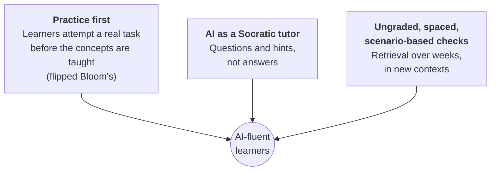

# For Educators: Designing with AI

Activities, prompts, and templates for building AI fluency, and for using AI in course operations without giving up professional judgment.
{: .fs-6 .fw-300 }

These pages are for faculty, instructional designers, and corporate trainers. The approach rests on three ideas:

## Where to start

1. **Designing an AI-fluency challenge:** the core template. Build one activity for your course.
2. **Socratic tutor prompt:** a copy-paste prompt you can give learners today.
3. **Scenario knowledge checks:** follow-ups that make learning stick.
4. **AI in course operations:** feedback, announcements, and grading support, with a human owning every final grade.
