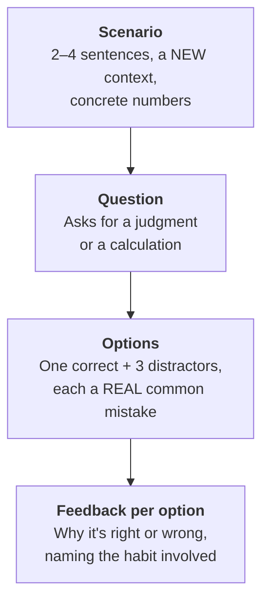
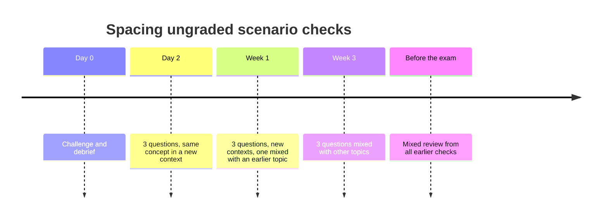

# Scenario knowledge checks
{: .no_toc }

A template for short, ungraded, scenario-based questions, spaced over weeks so that judgment skills stick.
{: .fs-6 .fw-300 }

<details open markdown="block">
  <summary>On this page</summary>
  {: .text-delta }
1. TOC
{:toc}
</details>

## Scenario

Your learners just finished the [break-even challenge](). In the debrief, most of them understood why the card fee mattered when the price changed. Three weeks from now, will they still catch a price-linked cost in a different setting, like a sales commission or a royalty, without being told to look for one?

Usually not, unless they practice remembering it.

## Why it matters

A debrief creates understanding. Retrieval and spacing make it last. Two well-established findings from learning research support this:

- **Retrieval practice:** Recalling something, for example by answering a question, strengthens long-term memory more than re-reading it (Roediger & Karpicke, 2006).
- **Spaced practice:** Spreading practice out over time leads to better retention than cramming it into one session (Cepeda et al., 2006).

Keeping the checks **ungraded** lowers the stakes, so learners can get things wrong and learn from the feedback. **Scenario-based** questions in new contexts test judgment rather than recall of one example.

## AI-assisted approach

### Anatomy of a good item



The distractors do the teaching. Each wrong answer should be one that learners (or AI tools) actually give, so the feedback can name the mistake.

### Spacing schedule



### Steps

1. **List the 2–3 judgment points from the challenge (Use).** For break-even: price-linked costs, rounding up, and matching periods.
2. **Ask AI to draft items in new contexts (Use).** AI is good at producing varied scenarios quickly. Give it the template below and the specific mistakes to use as distractors.
3. **Work every item yourself (Verify).** Calculate every answer and distractor independently. AI-generated answer keys are often wrong. See [How LLMs fail]().
4. **Check that each distractor matches a real mistake (Verify).** If a distractor isn't a plausible error, replace it.
5. **Schedule and deliver (Decide).** Use your learning platform's quiz tool, set to ungraded or practice mode, or simply use slides at the start of class.

## Prompt template

```text
Write [NUMBER] ungraded, scenario-based multiple-choice questions for
[LEARNERS] on this concept: [CONCEPT / JUDGMENT POINT].

Each question must:
- Use a NEW business context (not [ORIGINAL EXAMPLE]); vary industries.
- Include concrete numbers if the concept is quantitative.
- Have exactly one correct answer and three distractors. Each distractor
  must be the result of one of these specific mistakes:
  [MISTAKE 1], [MISTAKE 2], [MISTAKE 3].
- Give 1–2 sentences of feedback for EVERY option, explaining why it is
  right or which mistake it reflects.

Show your full calculation for every option so I can check it.
Format: Scenario / Question / A–D / Feedback A–D / Correct answer.
```

### A sample item

> **Scenario.** A tutoring company has fixed costs of $4,500 a month. It charges $10 per session. Each session costs $3.50 in materials and platform fees, plus a 5% booking commission on the price. The company is raising the price to $12.
>
> **Question.** How many sessions a month does it need to break even at the new price?
>
> | Option | Feedback |
> |:--|:--|
> | A. 563 | Uses the old variable cost of $4.00. The commission is 5% of price, so it rises to $0.60, making the variable cost $4.10. |
> | B. 569 | Correct setup, but rounded down. 569.6 sessions means 569 still falls short. Break-even always rounds up. |
> | **C. 570** | **Correct.** Variable cost = $3.50 + (5% × $12) = $4.10. Contribution margin = $12 − $4.10 = $7.90. $4,500 ÷ $7.90 = 569.6, so 570 sessions. |
> | D. 750 | This is the break-even at the *old* price: $4,500 ÷ ($10 − $4.00). |

### Item types beyond calculation

| Habit | Sample stem |
|:--|:--|
| **Use** | "Which of these is the best first step before asking an AI tool to analyze this customer list?" |
| **Verify** | "An AI-drafted brief cites a 2022 survey you've never heard of. What should you do first?" |
| **Disclose** | "Which of these disclosure statements best meets a policy requiring you to describe AI's role?" |
| **Decide** | "The AI recommends option B. Which fact in the scenario should make you hesitate?" |

## Verify checklist

- [ ] I solved every item myself, including every distractor's calculation.
- [ ] Each distractor reflects a real, specific mistake, and the feedback names it.
- [ ] Contexts differ from the original example and from each other.
- [ ] Every item has exactly one defensible correct answer.
- [ ] The scenarios use fictional companies and contain no learner data.
- [ ] The checks are set to ungraded or practice mode.
- [ ] The schedule spaces the checks out (for example, day 2, week 1, week 3), not all in one week.

## Common failure modes

| Failure | What it looks like | How to fix it |
|:--|:--|:--|
| **Wrong answer key** | AI marks 563 as correct because it held the commission constant | Solve every item yourself. Ask the AI to show its work, then check it. |
| **Trivia, not judgment** | "What does CAGR stand for?" | Rewrite the item as a scenario that requires a decision or a calculation. |
| **Same context every time** | Every item is a coffee shop | Ask for a different industry per item. |
| **Implausible distractors** | Options no one would actually choose | Generate distractors from named mistakes. |
| **Accidentally graded** | Points appear in the gradebook and learners start to worry | Check the quiz settings before you publish. |
| **Massed, not spaced** | All checks happen in the same week as the challenge | Schedule them in advance across several weeks. |

## Disclose and decide notes

**Disclose:** If AI drafted the items, it's good practice to say so, along with how you checked them: "Questions drafted with AI and checked by your instructor." This models the habit you're teaching.

**Decide:** You decide which judgment points matter enough to practice, and whether the AI's scenarios really test them.

## For educators: turn this into a challenge

Turn learners into item writers. After a challenge, each pair uses AI to draft two scenario items on the concept, then **swaps with another pair**, who must solve them and check the answer keys and distractors. Pairs that find an incorrect key get credit. This builds the concept, the skill of verifying AI output, and a question bank for later checks. See [Designing an AI-fluency challenge]().

---

**References**

- Cepeda, N. J., Pashler, H., Vul, E., Wixted, J. T., & Rohrer, D. (2006). Distributed practice in verbal recall tasks: A review and quantitative synthesis. *Psychological Bulletin, 132*(3), 354–380.
- Roediger, H. L., & Karpicke, J. D. (2006). Test-enhanced learning: Taking memory tests improves long-term retention. *Psychological Science, 17*(3), 249–255.
