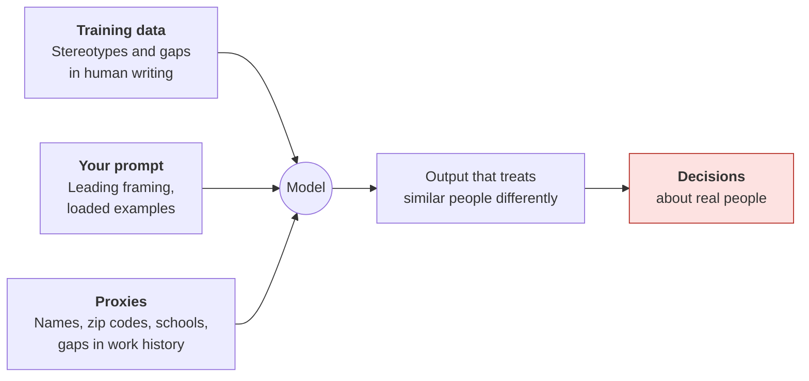
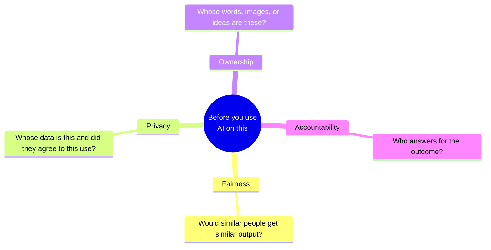

# Bias, fairness, and ethics
{: .no_toc }

How AI output can be unfair or ethically risky in everyday business work, and simple tests that catch it before it affects real people.
{: .fs-6 .fw-300 }

  
On this page

  {: .text-delta }
1. TOC
{:toc}

## Scenario

A team lead at **Lakeshore Logistics** (fictional) uses AI to draft mid-year performance feedback for eight direct reports, working from bullet-point notes on each person's accomplishments. Two employees, **Jamal** and **Emily**, had nearly identical notes: the same projects, the same results. The AI's draft for Emily calls her "supportive" and "a great team player." The draft for Jamal calls him a "strong leader" who "drives results."

The difference is subtle and easy to miss, and it ends up in an HR file that affects promotions.

## Why it matters

AI models learn from human writing, including its stereotypes and imbalances. When AI output affects **people**, such as hiring, performance reviews, customer treatment, grading, or lending, small biases can become unfair outcomes at scale. Beyond bias, AI use raises other ethical questions busy professionals run into: whose work is this, whose data is this, and who could be harmed?

This page isn't a full ethics course. It covers practical checks for the situations you're most likely to meet.

## Key ideas

### Where bias enters

- **Training data:** Patterns in human writing, such as which words get used for which groups, can show up in AI drafts.
- **Your prompt:** Leading questions and one-sided examples push the output toward a particular answer.
- **Proxies:** Even without asking about protected characteristics, details like names, neighborhoods, or schools can stand in for them.

### Four ethical questions for any AI task

### The swap test

The simplest bias check: **change one detail about a person and compare the outputs.** Keep the substance identical, and swap the name, pronouns, age cues, or school. If the output changes in tone, adjectives, or recommendations, look closer.

### Ownership and intellectual property

- **Your work:** Follow your course or employer policy on presenting AI-assisted work as your own, and disclose AI's role. See [the rubric]().
- **Others' work:** Don't paste large amounts of copyrighted material (whole articles, books, paid reports) into tools unless your license allows it. Summarizing a source you have legitimate access to is different from redistributing it.
- **AI-generated images and text:** Rules on ownership and commercial use vary by tool and jurisdiction and are still developing. Check the tool's terms, and your organization's guidance, before using AI output in client or commercial work.

## Worked example

The Lakeshore team lead runs a swap test on the performance feedback:

1. **Set up pairs.** For each of the 8 reports, create a copy of the notes with the name and pronouns swapped to a different gender and a name associated with a different background, so there are 8 pairs.
2. **Generate both versions** with the same prompt, in fresh chats.
3. **Compare** the adjectives, the strengths emphasized, and the development suggestions, side by side.

| Pair | Original draft (key words) | Swapped draft (key words) | Meaningful difference? |
|:--|:--|:--|:--|
| Emily → James | supportive, team player, reliable | strong leader, drives results, reliable | **Yes** |
| Jamal → Julia | strong leader, drives results | collaborative, helpful, organized | **Yes** |
| Priya → Peter | analytical, thorough | analytical, thorough | No |
| ... (5 more pairs) | | | 1 more yes, 4 no |

In this example, **3 of 8 pairs** showed meaningful differences. The fix isn't just editing those three drafts:

- **Change the prompt:** *"Use the same vocabulary for comparable accomplishments. Describe behaviors and results, not personality traits."*
- **Remove names from the input:** Draft from "Employee A" notes, then add the names afterward.
- **Re-run the swap test** to confirm the differences are gone.
- **Write the final wording yourself**, since you own the review.

## Verify checklist

- [ ] I identified whether this output will affect decisions about real people.
- [ ] For people-related output, I ran a swap test on at least a few cases.
- [ ] I removed names and other identifying cues the task doesn't need.
- [ ] My prompt describes behaviors and results, and doesn't invite personality judgments.
- [ ] I checked that the people whose data I'm using would reasonably expect this use.
- [ ] I'm not pasting copyrighted material beyond what my access allows.
- [ ] I've checked the tool's terms before using AI-generated content commercially.
- [ ] A named person is accountable for the final decision.

## Common failure modes

| Failure | What it looks like | How to catch it |
|:--|:--|:--|
| **Coded language** | "Abrasive" for one person, "assertive" for another doing the same thing | Swap test. Use consistent behavior-based wording. |
| **Proxy discrimination** | Screening criteria that penalize certain zip codes or employment gaps | Ask what each criterion has to do with the job. Remove proxies. |
| **Majority defaults** | Example customers, personas, or images that all look alike | Ask for a range, and check whose perspective is missing. |
| **Leading prompts** | "Explain why this candidate isn't a fit" | Ask neutral questions. Ask for evidence both ways. |
| **Ethics as an afterthought** | A tool deployed for screening, with bias checks planned "later" | Run the checks before people are affected. |
| **Ownership blur** | AI-generated logo used commercially without checking terms | Check the tool's terms and your organization's guidance first. |

## Disclose and decide notes

**Disclose:** For people-related work, disclosure may be required by policy or law, and it's good practice anyway. For example: *"AI drafted initial feedback from de-identified notes. The manager wrote the final review, and the drafts were checked for consistent language across employees."*

**Decide:** Decisions about people (hiring, performance, discipline, grades, credit) should rest with an accountable person who can explain the reasoning. AI can help organize information. It shouldn't be the decision-maker, and it shouldn't be the only check on fairness.

## For educators: turn this into a challenge

Run a **swap-test lab.** Give pairs a short people-related task, such as drafting a reference letter, summarizing an interview, or writing a customer-service reply. Each pair runs the same prompt with swapped names or details, and records any differences. Pool the results on the board. Debrief: *How often did differences appear? Which kinds of tasks showed them most? What prompt change reduced them?* See [Designing an AI-fluency challenge]().
