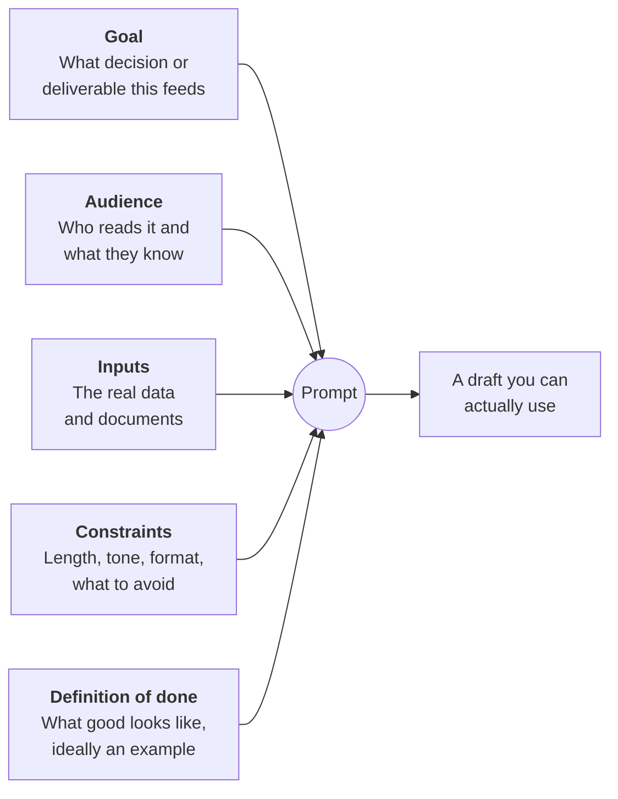
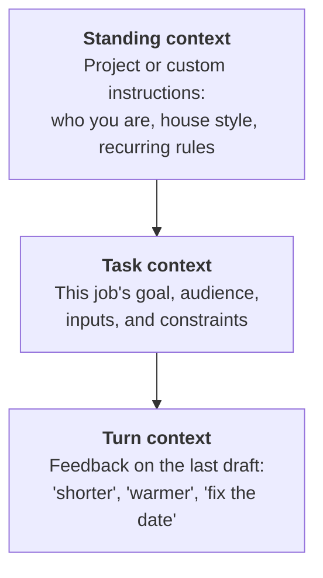

# Context engineering
{: .no_toc }

How to give an AI tool the goal, inputs, and constraints it needs. This matters more than clever wording.
{: .fs-6 .fw-300 }

<details open markdown="block">
  <summary>On this page</summary>
  {: .text-delta }
1. TOC
{:toc}
</details>

## Scenario

Two analysts at **Ridgeway Coffee Roasters** (fictional) each need a customer email announcing a price increase on wholesale beans. Both use the same AI tool.

Analyst A types: *"Write an email announcing a price increase."*

Analyst B spends three minutes giving the tool the actual new prices, the reason (green coffee costs rose), the audience (café owners, many of them long-term accounts), the effective date, the tone wanted, what *not* to say, and an example of a past email customers responded well to.

Analyst A gets a generic, slightly apologetic template with placeholder prices. Analyst B gets a draft that needs two small edits. The difference isn't the wording of the prompt. It's the **context**.

## Why it matters

A model can only work with what it learned in training plus what you give it. It knows nothing about your company, your customers, your numbers, or your standards unless you supply them. Most "AI gave me a useless answer" stories are really "AI was asked to guess" stories.

Context engineering means deciding what information the model needs, and in what form. It's the core of the **Use** habit, and it has a large effect on output quality.

## Key ideas

### The five essentials



| Element | Ask yourself | Example |
|:--|:--|:--|
| **Goal** | What happens after I have this? | "Keep long-term accounts while announcing a 9% increase." |
| **Audience** | Who reads it, and what do they already know or feel? | "Independent café owners. Many have bought from us for 5+ years. They're price-sensitive." |
| **Inputs** | What facts must it use? | The price table, the effective date, the reason for the increase. |
| **Constraints** | What must it do or avoid? | "Under 200 words. No apology for the increase. Don't mention competitors." |
| **Definition of done** | How will I judge the result? | "Like the attached email from 2023, which got good replies." |

**Provide inputs; don't describe them.** "Use our new prices" invites invented numbers. Pasting the price table doesn't.

### Three layers of context

Context doesn't all have to go in one prompt. It can live at three levels:



Put things you repeat every time (your role, your organization's style, standing rules such as "always show formulas") into standing context, using the tool's project or custom-instructions feature. See [Tools]().

### More isn't always better

Relevant context helps. Irrelevant context can hurt: models can lose track of details in long inputs, especially in the middle (see [How LLMs fail]()). Give the model what a smart new colleague would need for *this* task, not everything you have.

## Worked example

Analyst B's prompt:

```text
Goal: Announce a wholesale price increase while keeping long-term accounts.

Audience: Independent café owners who buy our beans wholesale. Many have
been customers for 5+ years. They're price-sensitive and busy.

Inputs:
- Effective date: first order on or after the 1st of next month.
- House blend: $11.00/lb → $12.00/lb. Single-origin: $14.00/lb → $15.25/lb.
- Reason: green coffee costs rose significantly this year.
- Orders placed before the effective date keep current pricing.

Constraints: Under 200 words. Warm, direct, no apology for the increase.
Don't mention competitors. Plain text, no bullet points.

Definition of done: Similar in tone to this past email, which customers
responded well to: [PASTE EXAMPLE]

Before drafting, ask me anything you need that I haven't provided.
```

Before writing anything, the tool asks: *"Should I mention whether volume discounts still apply?"* That's a good question, and Analyst B hadn't thought of it.

**Checking the numbers before the email goes out:** House blend: ($12.00 − $11.00) ÷ $11.00 = 9.1%. Single-origin: ($15.25 − $14.00) ÷ $14.00 = 8.9%. If the draft says "about 9%", that's accurate for both. If it says "under 9%", it's wrong for the house blend.

## Verify checklist

- [ ] My prompt states the goal, audience, inputs, constraints, and definition of done.
- [ ] I pasted the actual data rather than describing it.
- [ ] I included an example of good output where I had one.
- [ ] I removed context that isn't relevant to this task.
- [ ] I invited the model to ask clarifying questions.
- [ ] I didn't include data above the tool's approved class. See [Data classification]().
- [ ] My standing instructions are still current.

## Common failure modes

| Failure | What it looks like | How to catch it |
|:--|:--|:--|
| **Asking it to guess** | A generic output with placeholders or invented facts | Check for placeholders and specific details you didn't supply. |
| **Describing instead of providing** | "Use last quarter's numbers", so it invents numbers | Paste the data. |
| **Context overload** | A 40-page paste for a one-paragraph answer, with key details missed | Trim to what's relevant, and point to the important section. |
| **Conflicting instructions** | "Be brief" plus "cover everything in detail" | Re-read the prompt as if you were the one being asked. |
| **Stale standing instructions** | Custom instructions still mention last term's course or an old role | Review standing instructions monthly. |
| **No definition of done** | Endless revision rounds | Write down what "good" means before you start, ideally with an example. |

## Disclose and decide notes

**Disclose:** Good context makes disclosure easier. You can say exactly what you gave the tool and what it produced.

**Decide:** Choosing the context is itself a judgment call. What you include or leave out shapes the output. If the AI's answer surprises you, check what context you gave it before trusting or rejecting it.

## For educators: turn this into a challenge

Run **"same task, two prompts."** Give everyone the same business task. Half the class writes a one-line prompt, and the other half uses the five-essentials template. Compare the outputs side by side and have learners score each one against the definition of done. Debrief: *Which missing element hurt the one-line outputs most?* Then have the one-line group add only that element and try again. See [Designing an AI-fluency challenge]().
