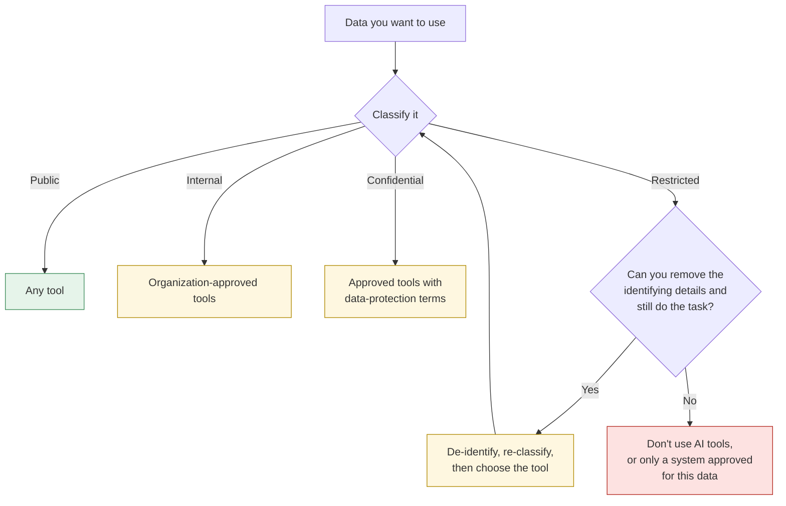
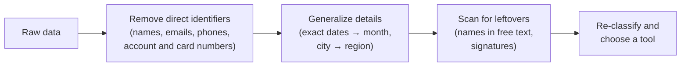

# Data classification
{: .no_toc }

Which kinds of data can go into which kinds of AI tools, and how to tell before you paste.
{: .fs-6 .fw-300 }

  
On this page

  {: .text-delta }
1. TOC
{:toc}

{: .note }
This page gives general guidance, not legal advice. Your organization's data policy and the law in your jurisdiction take precedence. When they're stricter than this page, follow them.

## Scenario

Jordan, a customer-success analyst at **Brightline Software** (fictional), has 400 customer complaint emails to analyze before a quarterly review. A free chat assistant could sort them into themes in minutes. The emails contain customer names, email addresses, a few phone numbers, and, in three cases, partial credit card numbers that customers pasted in by mistake.

Jordan's instinct is to paste them all in. The better first question is: *what kind of data is this, and which tools is it allowed in?*

## Why it matters

When you paste data into an AI tool, it leaves your control. Depending on the tool and its settings, it may be stored, reviewed by the provider's staff, or used to improve future models. Consumer tools and organization-approved tools often handle data very differently. A careless paste can:

- Breach a privacy law or a contract with a customer.
- Expose student records, health information, or payment data.
- Leak unreleased financials, strategy, or code.
- Be impossible to undo.

Thirty seconds of classification prevents most of this.

## Key ideas

### Four data classes

Most organizations use some version of these four levels. Names vary, so check yours.

| Class | Examples | Default rule for AI tools |
|:--|:--|:--|
| **Public** | Published reports, press releases, public websites, your own published writing | Any tool |
| **Internal** | Internal memos, meeting notes, non-sensitive process documents | Only tools your organization has approved |
| **Confidential** | Unreleased financials, strategy, contracts, customer lists, source code | Approved tools with data-protection terms, and only as needed |
| **Restricted** | Personal data tied to individuals: student records and grades, health information, payment card numbers, government IDs, passwords | Don't paste. Remove identifiers first, or use only a system specifically approved for that data. |

### Match the data to the tool

### Know your tool's data terms

Before using a tool for anything above Public, find answers to four questions in its settings and terms, or ask your IT or data team:

1. **Training:** Can my inputs be used to train or improve models? Can I turn that off?
2. **Retention:** How long are my inputs stored, and can I delete them?
3. **Access:** Who at the provider can see my inputs, and under what circumstances?
4. **Approval:** Has my organization approved this tool for this class of data?

Consumer accounts and organization accounts for the same product can have different answers.

### Education and personal data

Educators carry extra obligations. In the United States, student education records are protected under FERPA, and other countries have their own privacy laws, such as the GDPR in the European Union. Treat grades, submissions tied to names, accommodation details, and student contact information as **Restricted** unless your institution has approved a specific tool for them.

### De-identification, in practice

Often you can keep the useful part of the data and drop the risky part:

## Worked example

Jordan works through the complaint emails like this:

1. **Classify:** Customer names, emails, and phone numbers are personal data. The three partial card numbers make the dataset **Restricted**.
2. **Ask whether the task needs the identifiers.** Theme analysis needs the complaint text, not who sent it.
3. **De-identify** in a spreadsheet *before* any AI tool sees the data:

   | Before | After |
   |:--|:--|
   | From: Dana Whitfield &lt;dana.w@example.com&gt; | Customer C-0142 |
   | "I've been charged twice on my card ending 4417 since March 3..." | "I've been charged twice on my card [REMOVED] since [MONTH]..." |
   | "Call me at 555-0137, this is the third time!" | "Call me at [PHONE], this is the third time!" |
   | Signature: Dana Whitfield, Ops Lead, Tidewater Logistics | Signature removed |

4. **Scan for leftovers:** A search for "@", digit runs, and "Regards" turns up two names in signatures that the first pass missed.
5. **Re-classify:** The cleaned text is now **Internal**: it's still business-sensitive, but no longer personal. Jordan uses the company-approved AI tool, not a personal free account.
6. **Keep the key file separate:** The table mapping C-0142 back to a real customer stays in the CRM, where only authorized staff can see it.

The analysis takes 20 minutes longer than pasting everything in, and nothing personal leaves the company.

## Verify checklist

- [ ] I classified the data (Public, Internal, Confidential, or Restricted) before choosing a tool.
- [ ] I know my tool's training, retention, and access terms, for the account type I'm actually using.
- [ ] My organization has approved this tool for this class of data.
- [ ] I removed direct identifiers the task doesn't need.
- [ ] I scanned free text for leftover names, numbers, and signatures.
- [ ] Any key that re-identifies the data stays outside the AI tool.
- [ ] If I wasn't sure, I asked before pasting, not after.

## Common failure modes

| Failure | What it looks like | How to catch it |
|:--|:--|:--|
| **Free-text leaks** | Names and numbers hidden in comments, signatures, or quoted replies | Search for "@", long digit runs, and common sign-offs before pasting. |
| **"It's just a summary"** | Pasting a whole confidential document to get three bullet points | The tool still receives the whole document. Classify the input, not the output. |
| **Wrong account** | Using a personal account for work data the organization only approved on its enterprise account | Check which account you're signed into. |
| **Screenshots and files** | Uploading an image or spreadsheet that contains more than you meant to share | Open the file and check every tab and region before uploading. |
| **Re-identification** | "Anonymous" data where a combination of role, region, and date points to one person | Generalize further when groups are small. |
| **Connected tools** | An AI tool connected to your email or drive can reach far more than what you paste | Review what a connector can access before turning it on. See [Tools](). |

## Disclose and decide notes

**Disclose:** Note how data was handled, not just that AI was used. For example: *"Complaint text was de-identified before analysis in the company-approved AI tool. No customer names or contact details were shared."*

**Decide:** Classification is a judgment call, and when you're unsure, ask your data owner or IT team. The cost of asking is a short delay. The cost of a wrong guess can be permanent.

## For educators: turn this into a challenge

Give learners eight short data samples (a press release, a meeting note, a salary table, a student roster with grades, a customer complaint containing a phone number, and so on). In pairs, they classify each one, name an acceptable tool type, and for any Restricted item, de-identify it so it could be used. Hide one tricky case, such as a name buried in a signature. Debrief: *Which item did pairs disagree on, and what extra fact would settle it?* See [Designing an AI-fluency challenge]().
