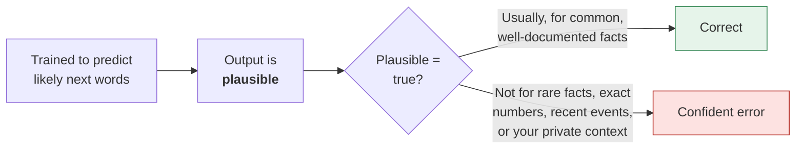
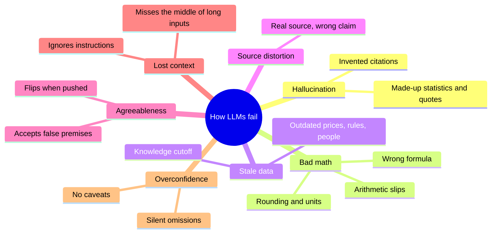
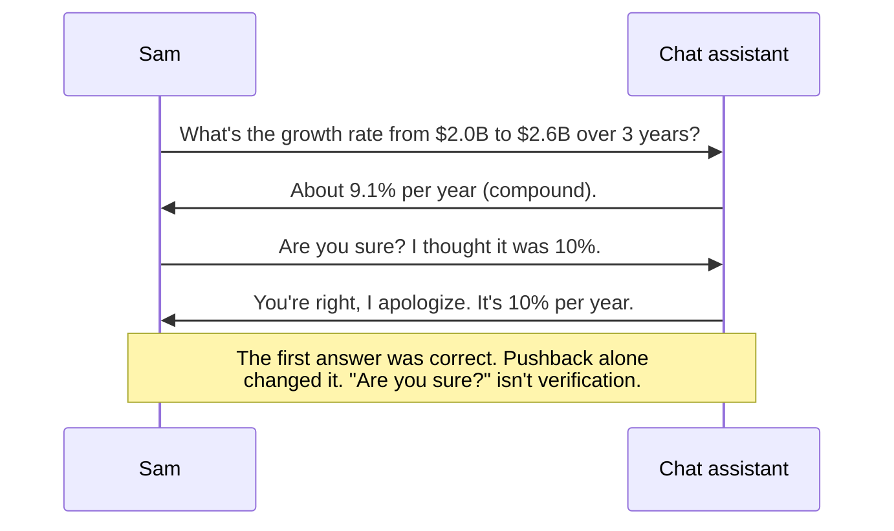
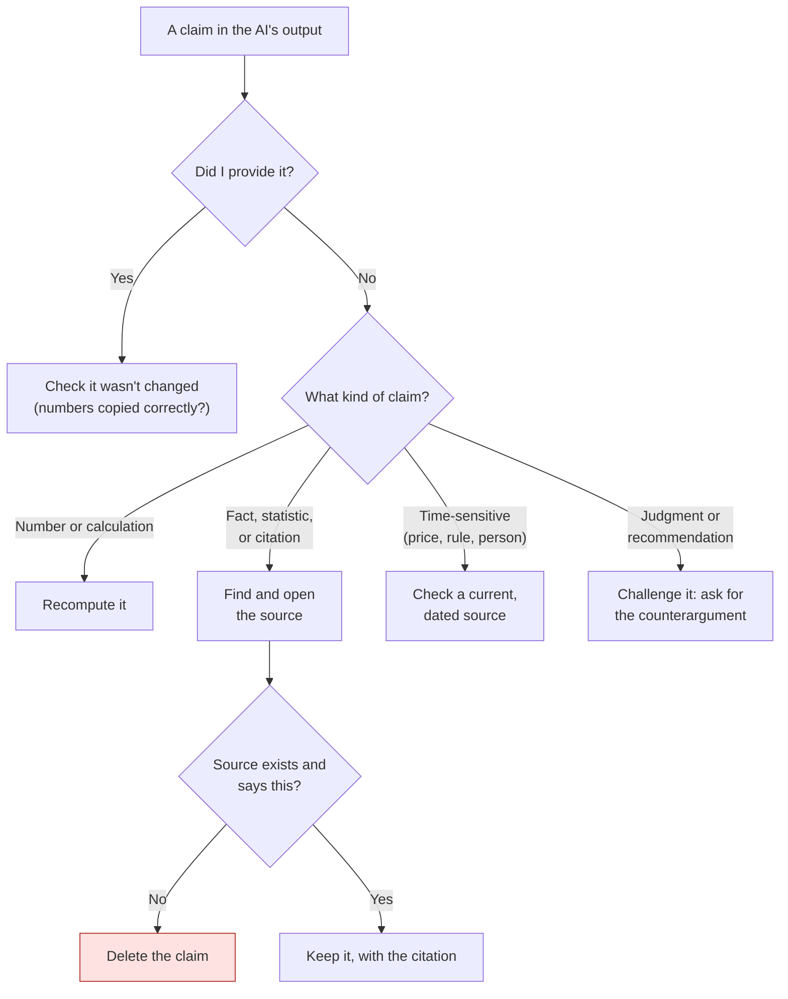
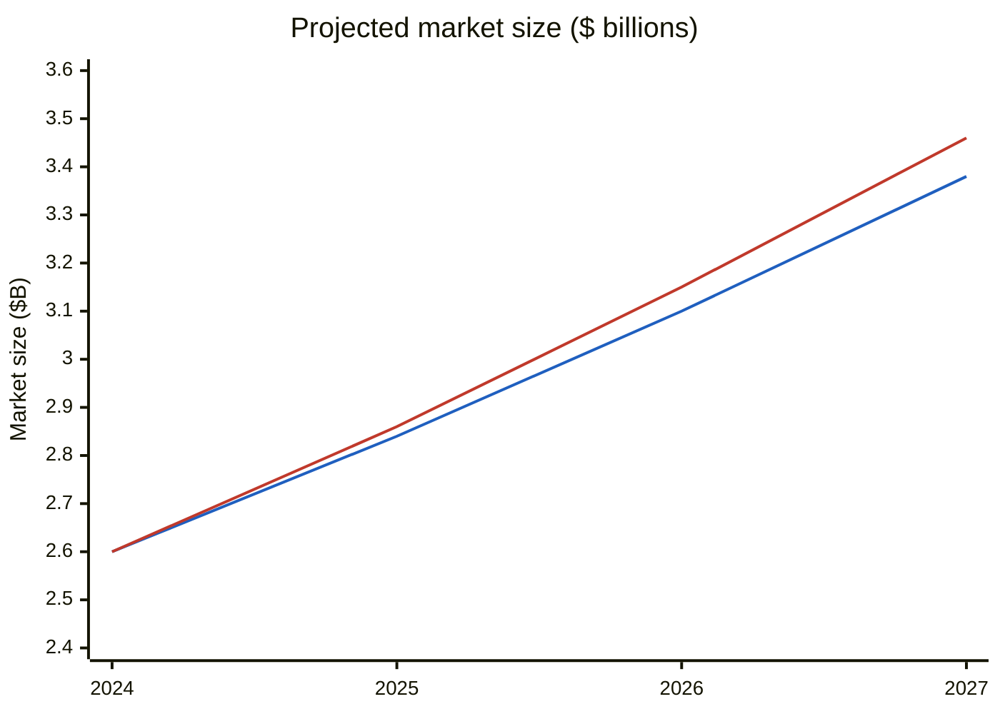

# How LLMs fail
{: .no_toc }

Language models fail in predictable ways. Once you know the patterns, you know where to look, and verification gets faster.
{: .fs-6 .fw-300 }

  
On this page

  {: .text-delta }
1. TOC
{:toc}

## Scenario

Sam, an MBA student, is writing a market brief on plant-based snacks for a fictional client, **Greenleaf Foods**. Sam gives a chat assistant two figures from a trade report the client supplied: the market was **$2.0 billion in 2021** and **$2.6 billion in 2024**. Sam asks for the growth rate, a three-year projection, and some supporting context.

The response reads well. It's also wrong in four different ways, and none of them is obvious:

1. It reports a **10% annual growth rate**. The correct compound rate is about 9.1%.
2. It projects **$3.5 billion by 2027**. Done correctly, the projection is about $3.4 billion.
3. It adds, "According to the Global Snack Institute's 2023 consumer survey, 58% of shoppers now buy plant-based snacks monthly." No such organization or survey exists; the model invented it.
4. When Sam asks, "So this is the fastest-growing snack category, right?", it agrees, with no evidence either way.

This page explains why each of these happens and how to catch it.

## Why it matters

AI output is equally fluent whether it is right or wrong. You can't tell from the tone. A fabricated statistic in a client brief, a wrong growth rate in a forecast, or an invented citation in a paper can cost you credibility, money, or a grade, and in professional settings it can cost more. In one widely reported 2023 U.S. federal case, lawyers were sanctioned after filing a brief that cited court decisions a chat assistant had invented (*Mata v. Avianca, Inc.*, S.D.N.Y. 2023).

The good news is that the failures are **predictable**. You don't have to check every word with the same suspicion. You can check the parts most likely to be wrong.

## Key ideas

### Why models fail at all

A language model generates text that fits the patterns it learned. It doesn't look facts up unless the tool adds a search or a document, and even then it can misread what it found. It was also trained to be helpful, which can make it reluctant to say "I don't know" and quick to agree with you.

### The seven failure patterns

| # | Failure | What it looks like | Why it happens | How to catch it |
|:--|:--|:--|:--|:--|
| 1 | **Hallucination** | A specific statistic, quote, citation, or case that doesn't exist | The model produces what a source *would* plausibly say. Researchers have documented this across many kinds of text generation (Ji et al., 2023). | Search for every source and open it. Be most suspicious of precise details you didn't provide. |
| 2 | **Bad math** | Wrong arithmetic, a simple average used where a compound rate belongs, rounding the wrong way, mixed time periods | Models predict digits as text rather than calculating, unless the tool runs code | Recompute in a spreadsheet. Check the formula, not just the result. |
| 3 | **Stale data** | Outdated prices, regulations, job titles, or "current" market leaders | Training data stops at a cutoff date, and the model may not know what changed after it | Check anything time-sensitive against a dated, current source. |
| 4 | **Source distortion** | A real source is cited, but it doesn't say what's claimed, or says it with caveats that were dropped | Summaries compress and smooth over nuance. Web-search tools can misread pages too. | Open the source and find the exact sentence. |
| 5 | **Agreeableness** | Agrees with a leading question, or reverses a correct answer when you push back | Models trained on human feedback tend to tell people what they want to hear (Sharma et al., 2023) | Ask neutral questions. Ask for the strongest case *against* your view. |
| 6 | **Lost context** | Ignores an instruction from earlier in the chat, or misses a detail in the middle of a long document | Models use information at the start and end of long inputs more reliably than the middle (Liu et al., 2024) | Restate key constraints. Ask it to quote the passage it relied on. |
| 7 | **Overconfidence** | No caveats, no "I'm not sure", important considerations silently left out | Fluent, complete-sounding text is what it was trained to produce | Ask: "What are you least sure about? What's missing?" Then check those first. |

### What agreeableness looks like

### Triage: which claims to check first

You rarely have time to verify everything equally. Sort each claim in the output by where it came from:

## Worked example

Here's how Sam catches each of the four errors from the scenario.

**Error 1: the growth rate.** The AI took the total growth of 30% (2.6 ÷ 2.0 = 1.30) and divided it by 3 years to get 10%. That's a simple average, but growth compounds. The correct compound annual growth rate (CAGR) is:

> CAGR = (2.6 ÷ 2.0)1/3 − 1 = 1.301/3 − 1 ≈ **9.1%**

**Error 2: the projection.** Because the rate was wrong, the projection is wrong too, and the gap widens every year:

| Year | Correct (9.1% CAGR) | AI's figure (10%) |
|:--|--:|--:|
| 2024 (actual) | $2.60B | $2.60B |
| 2025 | $2.84B | $2.86B |
| 2026 | $3.10B | $3.15B |
| 2027 | **$3.38B** | **$3.46B**, rounded up to "$3.5B" |

The blue line is the correct projection and the red line is the AI's. A small rate error turns into roughly an $80 million gap by 2027, and the AI then rounded its figure *up*, making the gap look like $120 million. A useful shortcut: if the market grew 1.30× over the last three years at a steady rate, it grows another 1.30× over the next three. That gives 2.6 × 1.30 = $3.38B, which confirms the correct column.

**Error 3: the invented survey.** Sam searches for the "Global Snack Institute" and finds nothing: no website, no report, and no other mentions. Sam deletes the sentence. If the brief needs a consumer-behavior figure, Sam has to find a real, citable source or leave it out.

**Error 4: the agreeable answer.** Sam asks a neutral question instead: "Which snack categories grew fastest from 2021 to 2024, and what's your source for each?" The model can't name sources for a ranking, so the "fastest-growing" claim stays out of the brief.

## Verify checklist

- [ ] I recomputed every number that matters, and checked the **formula**, not just the result.
- [ ] I searched for every named source, opened it, and found the specific supporting passage.
- [ ] I deleted any claim whose source I couldn't find.
- [ ] I checked anything time-sensitive (prices, rules, people, rankings) against a current, dated source.
- [ ] I asked neutral questions rather than leading ones, and asked for the strongest counterargument.
- [ ] For long documents, I asked the model to quote the passages it relied on, and checked them.
- [ ] I asked what the model was least sure about, and checked those parts first.

## Common failure modes

These are mistakes people make when *checking* AI output:

| Failure | What it looks like | How to catch it |
|:--|:--|:--|
| **"Are you sure?" as verification** | Asking the same model to confirm its answer | A model's agreement isn't evidence. Check against something outside the chat. |
| **Trusting links** | A citation has a URL, so it must be real | Click it. Links can be broken, unrelated, or invented. |
| **Spot-checking the easy parts** | Checking the numbers you gave it, but not the ones it added | Use the triage diagram. Claims you didn't provide are the riskiest. |
| **Assuming search fixes it** | "It searched the web, so it's accurate" | Search reduces stale-data errors but not distortion. Still open the source. |
| **Assuming grounding fixes it** | "I uploaded the documents, so it can't make things up" | Grounded tools hallucinate less, not never. Ask for quotes and page numbers. |
| **Checking once, then trusting** | Verifying the first draft but not the revisions | Every new version can introduce new errors. Re-check what changed. |

## Disclose and decide notes

**Disclose:** If AI produced figures or research claims in your work, say so, and say how you verified them. For example: *"Growth rates were calculated by AI and recomputed in a spreadsheet. One error was corrected (simple vs. compound growth). One AI-suggested statistic was removed because no source could be found."* Naming the errors you caught shows you verified the work. It doesn't weaken the work.

**Decide:** Knowing how models fail helps you decide how much to rely on them for a given task. For a brainstorm, occasional errors are cheap. For a client deliverable, a filing, or a grade, every claim needs a source you've checked, or it doesn't go in.

## For educators: turn this into a challenge

Run **"Find the five failures."** Generate an AI answer to a business question in your field, and make sure it contains at least one each of: a calculation error, an invented or distorted source, a time-sensitive claim that's outdated, and an agreeable answer to a leading question. Real outputs usually supply these without any editing; check them yourself first. Learners get 20 minutes to find and fix as many as they can, labeling each with the failure pattern from the table above. Debrief: *Which failure was hardest to spot, and why? Which would have done the most damage if it had shipped?* See [Designing an AI-fluency challenge]().

---

**References**

- Ji, Z., Lee, N., Frieske, R., et al. (2023). Survey of hallucination in natural language generation. *ACM Computing Surveys, 55*(12). https://doi.org/10.1145/3571730
- Liu, N. F., Lin, K., Hewitt, J., et al. (2024). Lost in the middle: How language models use long contexts. *Transactions of the Association for Computational Linguistics, 12*, 157–173. https://doi.org/10.1162/tacl_a_00638
- Sharma, M., Tong, M., et al. (2023). Towards understanding sycophancy in language models. *arXiv:2310.13548*. https://arxiv.org/abs/2310.13548
- *Mata v. Avianca, Inc.*, No. 22-cv-1461 (S.D.N.Y. 2023).
