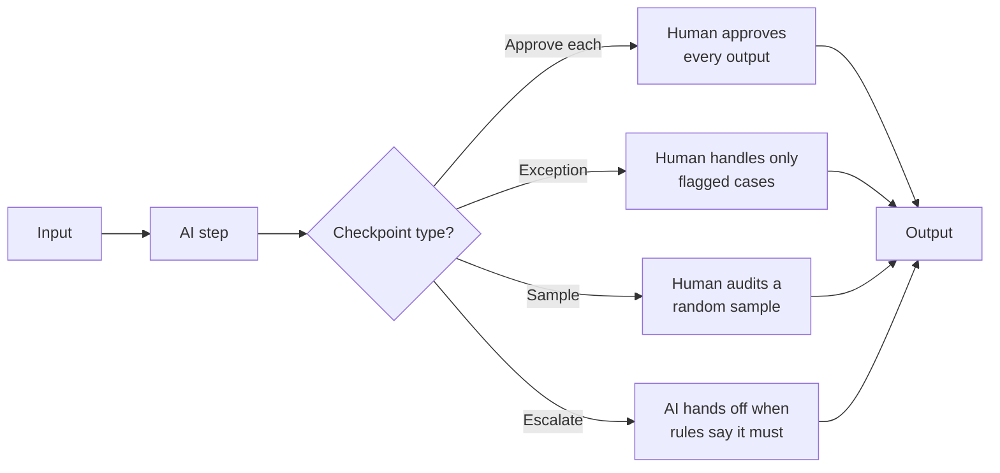
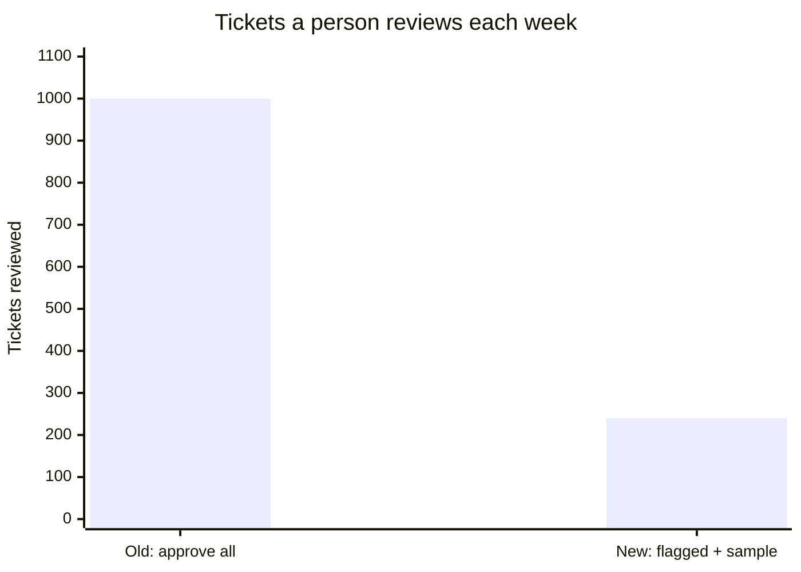

# Human-in-the-loop design
{: .no_toc }

Where to put human checkpoints in an AI-assisted process so that errors get caught before they cost anything, without making people check everything.
{: .fs-6 .fw-300 }

  
On this page

  {: .text-delta }
1. TOC
{:toc}

## Scenario

**Brightline Software** (fictional) gets about **1,000 support tickets a week**. An AI tool now routes each ticket to one of five teams: Billing, Technical, Account, Sales, or General. The support manager first had one person check every routing decision. Within two weeks, that person was clicking "approve" on nearly everything in under two seconds per ticket. The checkpoint was still there on paper, but it had stopped catching errors.

## Why it matters

"A human reviews it" is the most common safeguard in AI-assisted work, and among the easiest to get wrong. Checkpoints fail in two opposite ways:

- **Too few:** errors reach customers, learners, or decisions unchecked.
- **Too many:** reviewers get overloaded and start rubber-stamping, trusting the machine because it's usually right. That trust is called **automation bias**. The result is the cost of review without the protection.

Good human-in-the-loop design puts the *right* checks in the *right* places, and makes them doable.

## Key ideas

### Four kinds of checkpoint

| Checkpoint | Use when | Watch out for |
|:--|:--|:--|
| **Approve each** | Every error is costly: grades, refunds, client deliverables | Rubber-stamping when volume is high |
| **Exception review** | Most cases are routine, and you can define which ones aren't | Flag rules that miss new kinds of problems |
| **Sample audit** | Errors are cheap and reversible, but you need to know the error rate | A sample too small to estimate anything |
| **Escalation** | Some cases must never be automated, such as complaints, legal issues, or safety | Escalation rules that are too narrow |

### Where to put checkpoints

Place them:

1. **Before anything irreversible:** sending, paying, publishing, posting a grade.
2. **After the step most likely to fail:** often extraction from messy inputs, or calculations.
3. **At handoffs:** between AI steps in a workflow, before errors compound. See [Workflows & Agents]().
4. **Where accountability changes hands:** the person who approves is the person who owns the result.

### Make the check doable

A checkpoint works only if the reviewer has the **time**, the **information**, and the **authority** to say no. Show the reviewer the AI's inputs and reasoning, not just its conclusion. Keep volumes realistic. Measure how often reviewers change things. A near-zero change rate means either the AI is excellent or the review has stopped working, and you need to know which.

## Worked example

Brightline redesigns the routing checkpoint.

**Step 1: Measure.** The team hand-checks a random sample of last month's tickets and finds the AI misroutes about **6%**, or about **60 tickets a week** out of 1,000.

**Step 2: Find where errors cluster.** Most errors involve tickets that mention more than one topic, come from new customers, or mention refunds. The team writes simple **flag rules** for these. (They use rules rather than the model's own confidence score, because self-reported confidence isn't always reliable.) About **200 tickets a week** (20%) get flagged.

**Step 3: Split the flow.**

| Group | Tickets / week | Misrouted | Error rate | Checkpoint |
|:--|--:|--:|--:|:--|
| Flagged | 200 | 36 | 18% | **Exception review:** a human routes each one |
| Not flagged | 800 | 24 | 3% | **Sample audit:** 5% random sample (40 tickets / week) |
| **Total** | **1,000** | **60** | 6% | |

**Result:** People now review **240** tickets a week instead of 1,000, with enough time to read each one carefully. The flagged group contains 36 of the 60 errors, or 60% of them, and every one of those gets a careful human look. The 5% sample of unflagged tickets is expected to turn up about 1 error a week (40 × 3% = 1.2). Over a month, that's about 160 sampled tickets, enough to notice if the unflagged error rate starts climbing.

**What stays human regardless:** any ticket mentioning legal action, data loss, or a security issue is escalated straight to a senior agent.

## Verify checklist

- [ ] I know which outputs are irreversible, and each has a checkpoint before it.
- [ ] Each checkpoint has a named owner with the time, the information, and the authority to reject.
- [ ] I measured the AI's error rate on a real sample, not the vendor's claim.
- [ ] Review volume is realistic, so reviewers aren't rubber-stamping.
- [ ] Some cases always escalate to a human, and those rules are written down.
- [ ] I track how often reviewers change the AI's output, and investigate if it's near zero.
- [ ] I re-measure after any change to the tool, prompt, or inputs.

## Common failure modes

| Failure | What it looks like | How to catch it |
|:--|:--|:--|
| **Rubber-stamping** | Approval in seconds, with almost no changes | Track time per review and change rates. Lower the volume, or switch to exception review. |
| **Checkpoint after the damage** | The human reviews after the email has gone out | Move the checkpoint before the irreversible step. |
| **Reviewing the conclusion only** | The reviewer sees "Route: Billing" but not the ticket | Show the inputs and the reasoning alongside the output. |
| **Unmeasured automation** | "It seems to work fine" | Audit a random sample on a regular schedule. |
| **Flag rules that go stale** | New problem types slip past old rules | Review samples for new patterns monthly. |
| **Blurred accountability** | "The AI routed it" | Name the person who owns each checkpoint's outcome. |

## Disclose and decide notes

**Disclose:** Describe the checkpoint, not just "human-reviewed." For example: *"AI routes tickets. Flagged tickets (about 20%) are routed by a person, and 5% of the rest are audited each week."*

**Decide:** How much error you can accept, and where, is a business decision, not a technical one. Write it down, and own it.

## For educators: turn this into a challenge

Give learners a fictional process, such as AI that drafts refund decisions, screens job applications, or tags expense reports. Ask them to design the checkpoints: which type, where, who owns each, and what always escalates. Include volume and error-rate numbers so they have to do the workload math. Debrief: *Where did teams disagree about "approve each" versus "sample"? What would change your mind?* See [Designing an AI-fluency challenge]().
