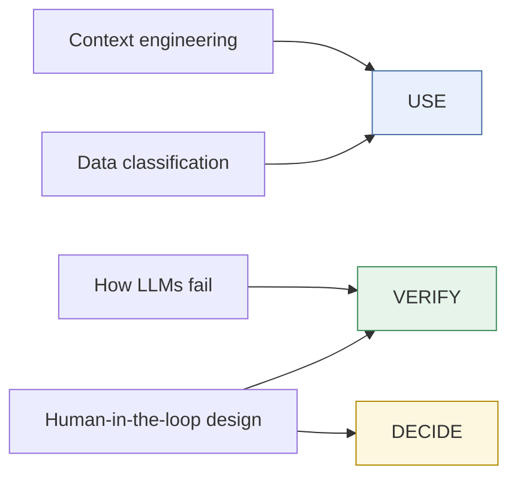

# Foundations

The concepts underneath every task in this guide. Read these when a task page sends you here, or all at once if you want the full picture.
{: .fs-6 .fw-300 }

Each foundation supports one or more habits in the rubric:

- **Context engineering:** what to give the tool so it can do the job well.
- **How LLMs fail:** hallucination, bad math, stale data, and how to catch each.
- **Data classification:** what may go into which tool.
- **Human-in-the-loop design:** where people must check, approve, or decide.
