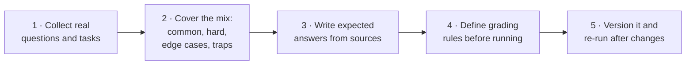
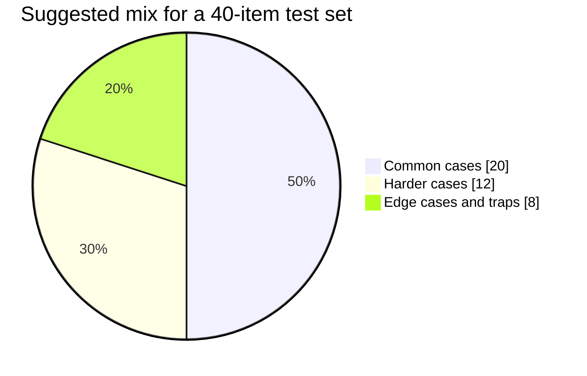
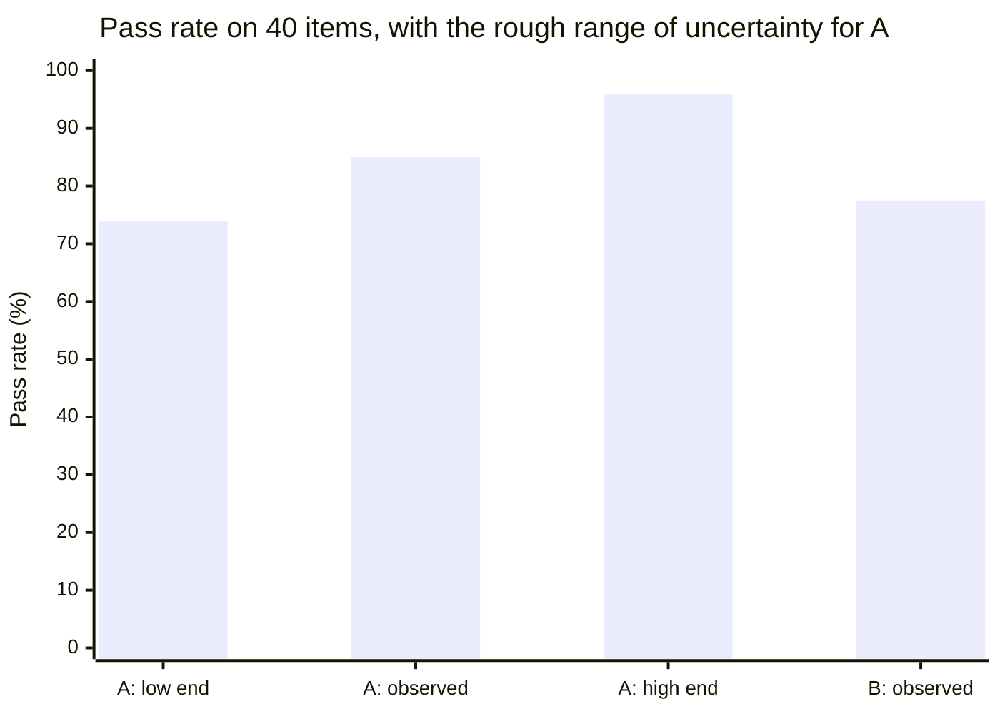

# Building an evaluation test set
{: .no_toc }

How to build a small set of test cases with known answers, so you can tell whether an AI workflow is good enough, and whether a change made it better or worse.
{: .fs-6 .fw-300 }

  
On this page

  {: .text-delta }
1. TOC
{:toc}

## Scenario

Brightline's HR policy assistant (see [Software and infrastructure]()) is up for a change: the team wants to try a new prompt, **Version B**, that should give shorter answers. They run both versions on their 40-question test set:

- **Version A** (current): **34 of 40** correct (85%)
- **Version B** (new): **31 of 40** correct (77.5%)

Someone says, "B is clearly worse. Throw it out." Someone else says, "That's only three questions. Is the difference real?"

## Why it matters

"Use a test set" appears all over this guide: before launch, after a model update, when comparing tools. A test set turns "it seems fine" into a number you can track. But a test set only helps if it's built well: realistic cases, clear grading rules, and enough items to tell a real difference from noise.

## Key ideas

### What a test item looks like

| Field | Example |
|:--|:--|
| **ID** | HR-017 |
| **Input** | "Can I carry over unused vacation days into next year?" |
| **Expected answer (key facts)** | Up to 5 days carry over; they must be used by March 31; this applies to full-time staff only |
| **Source** | Leave Policy §4.2 |
| **Grading rule** | Correct = all 3 key facts present, nothing contradicting the policy, and cites §4.2 |
| **Category** | Leave, with an exception |
| **Difficulty** | Medium (it has an exception) |

### Build the set in five steps

1. **Collect real inputs.** Use actual questions from your help desk, inbox, or past assignments, de-identified. Invented questions tend to be easier than real ones.
2. **Cover the mix.** Roughly 50% common cases, 30% harder cases (exceptions, multi-part questions), and 20% edge cases and traps (out of scope, ambiguous, a question that should be refused or escalated).
3. **Write expected answers from sources,** not from the AI's output.
4. **Define grading rules before you run anything.** Decide what counts as "correct" in advance, so the results can't sway the rules.
5. **Version and re-run.** Keep the set with your workflow spec. Re-run after every prompt, model, or document change.

### How many items do you need?

Small test sets catch big problems but can't reliably detect small differences. With 40 items and an 85% pass rate, a rough 95% confidence range runs from about **74% to 96%**, a span of more than 20 percentage points.

Version B's 77.5% falls *inside* Version A's range. On these numbers alone, the difference might be noise.

## Worked example

To compare versions fairly, look at the **same items** in both runs, not just the totals:

| | B correct | B wrong |
|:--|--:|--:|
| **A correct** | 29 | **5** |
| **A wrong** | **2** | 4 |

- Both got 29 right and 4 wrong. Those items don't tell the versions apart.
- **7 items differ:** B failed 5 that A passed, and passed 2 that A failed. Net: A ahead by 3, which matches 34 vs. 31.
- With only 7 differing items, a split of 5 to 2 is quite likely by chance. A simple sign test gives a probability of about **0.45**, far from convincing.

**What the team does instead of deciding on the totals:**

1. **Read the 5 items B failed.** Four are exception cases, where B's shorter answers dropped the exception. That's a *real*, explainable pattern, even if the statistics are weak.
2. **Fix B's prompt:** "Keep answers short, but always state exceptions and limits."
3. **Add 20 more exception-type items** to the test set, since that's where the versions differ.
4. **Re-run both versions on the 60 items.**

The lesson: **use the totals to spot problems, and the item-level differences to understand them.** Don't make a confident decision on a 3-item gap.

## Verify checklist

- [ ] Test items come from real (de-identified) inputs, not only invented ones.
- [ ] The set includes harder cases and edge cases, not just easy ones.
- [ ] Expected answers come from authoritative sources, not from AI output.
- [ ] Grading rules were written down before any run.
- [ ] I compare versions item by item, not just by totals.
- [ ] I don't treat small differences on small sets as conclusive.
- [ ] The set is versioned and re-run after every change.
- [ ] A person reviews failures, to understand *why* items fail.

## Common failure modes

| Failure | What it looks like | How to catch it |
|:--|:--|:--|
| **Easy-only test sets** | 100% pass, then failures on real questions | Include exceptions, ambiguity, and out-of-scope items. |
| **AI-written answer keys** | The test set encodes the model's own mistakes | Write keys from source documents. |
| **Moving goalposts** | Grading rules adjusted after seeing the results | Fix the rules before running. |
| **Over-reading small gaps** | Switching versions because of a 3-item difference | Look at item-level differences, add items, and re-run. |
| **Stale test set** | Policies changed but the expected answers didn't | Update the keys when the source documents change. |
| **Test set leakage** | The test questions were used as examples in the prompt | Keep test items out of prompts and templates. |

## Disclose and decide notes

**Disclose:** When reporting results, include the number of items and the uncertainty: *"34 of 40 (85%) on our test set. With 40 items, results within about ±11 percentage points are hard to distinguish."*

**Decide:** The test set tells you how a version performs on your cases. Whether that's good enough, and which failures are acceptable, is the workflow owner's decision, informed by what's at stake.

## For educators: turn this into a challenge

Teams build a 20-item test set for a simple AI task, such as answering questions about your syllabus. They need at least 4 edge cases, plus grading rules written in advance. They run two prompt versions and fill in the 2×2 comparison table. Debrief: *Did the totals and the item-level view tell the same story? Which edge case broke both versions?* See [Designing an AI-fluency challenge]().
