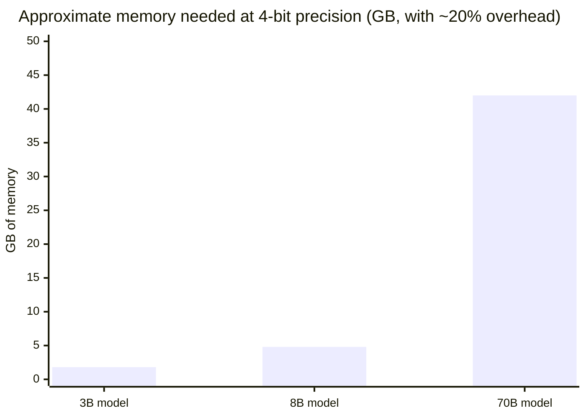
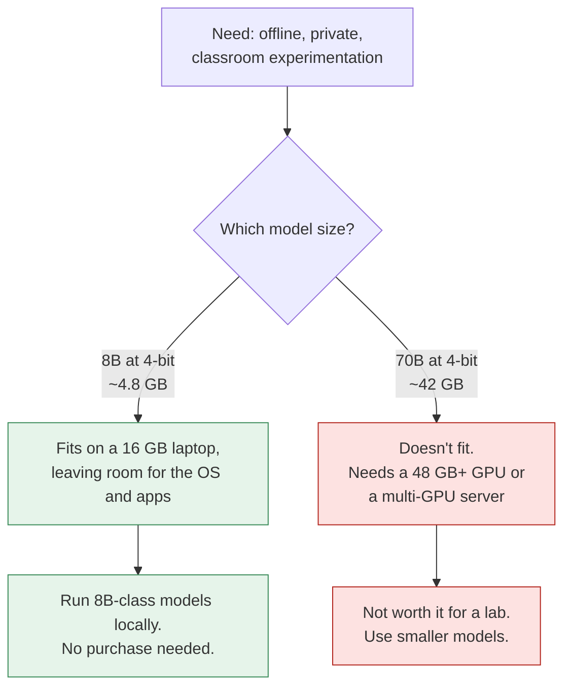

# Hardware requirements
{: .no_toc }

What computing power each way of running AI needs, and how to estimate whether a model will fit on a given machine.
{: .fs-6 .fw-300 }

  
On this page

  {: .text-delta }
1. TOC
{:toc}

## Scenario

An instructor wants learners to experiment with a language model **offline**, in a lab with no internet access and with no data leaving the room. A colleague says, "Just run one locally." The lab has 16 GB laptops. Will a model run on them? Which one? Does the department need to buy graphics cards?

## Why it matters

Hardware decisions are expensive and hard to reverse. Organizations sometimes buy powerful servers for a pilot that an API could have run for a fraction of the cost. Others promise "private, on-premises AI" without realizing the model they want needs ten times the memory they have. A few rules of thumb let you sanity-check those plans before anyone spends money.

## Key ideas

### What each option needs

| Option | Hardware | Notes |
|:--|:--|:--|
| **1 · Use an app** | Any modern laptop, tablet, or phone, plus reliable internet | All the heavy computation happens at the provider. |
| **2 · Call an API** | Any computer, or a small server for automated workflows | Your machine only sends and receives text. The model runs at the provider. |
| **3a · Self-host a small model** | A laptop or desktop with 16 GB or more of memory, ideally with a graphics card (GPU) or a chip with shared high-speed memory | Fine for learning, demos, and light single-user work. |
| **3b · Self-host for a team** | One or more data-center-class GPUs (in your own server room or rented in the cloud) | Needs cooling, power, networking, and someone to run it. |
| **3c · Train or heavily fine-tune** | Clusters of many GPUs | Rarely needed by business teams. Usually done by model providers or specialists. |

### Why GPUs?

Running a language model is mostly an enormous amount of simple arithmetic (matrix multiplication) done in parallel. A CPU has a few powerful cores. A GPU has thousands of smaller ones built for exactly this kind of parallel math. Models *can* run on CPUs, just slowly.

### Memory is usually the limit

To run a model quickly, its **weights** (the learned numbers that make up the model) must fit in fast memory: GPU memory (VRAM), or shared memory on chips designed that way. The rough rule:

> **Memory for weights ≈ number of parameters × bytes per parameter**

Then add roughly **20%** for the working memory a conversation needs (which grows with longer context) and the software running the model. Real needs vary, so treat this as a sanity check, not a specification.

**Bytes per parameter depends on precision.** Models can be stored at reduced precision, a technique called **quantization**, which trades a little quality for a much smaller footprint:

| Precision | Bytes per parameter | Typical use |
|:--|--:|:--|
| 16-bit | 2 | Full-quality serving |
| 8-bit | 1 | Good balance |
| 4-bit | 0.5 | Laptops and small GPUs. Some quality loss. |

### Rough memory estimates

| Model size (parameters) | 16-bit | 8-bit | 4-bit |
|:--|--:|--:|--:|
| 3 billion | 6 GB → ~7.2 GB | 3 GB → ~3.6 GB | 1.5 GB → ~1.8 GB |
| 8 billion | 16 GB → ~19.2 GB | 8 GB → ~9.6 GB | 4 GB → **~4.8 GB** |
| 70 billion | 140 GB → ~168 GB | 70 GB → ~84 GB | 35 GB → **~42 GB** |

The first figure is weights only. The second adds about 20%.

### Other things that matter

- **Speed:** how fast text appears for one user (latency), and how many users or requests can be served at once (throughput). Faster memory and more GPUs help both.
- **Context length:** longer documents and conversations need more working memory.
- **Power, cooling, and space:** data-center GPUs draw a lot of power and produce a lot of heat. Your building may not support them.
- **Utilization:** owned hardware costs money whether or not it's busy. An idle server is a sunk cost.

## Worked example

Back to the instructor's offline lab with 16 GB laptops:

1. **Pick a model size class.** Small open-weight models in the 3–8 billion parameter range are designed for this kind of use.
2. **Estimate memory.** An 8B model at 4-bit needs about 4 GB for weights, or about **4.8 GB** with overhead. That fits on a 16 GB laptop with room left for the operating system and a browser.
3. **Rule out the big model.** A 70B model at 4-bit needs about **42 GB**, which no lab laptop has.
4. **Set expectations.** Small local models are noticeably weaker than the largest hosted models, especially at reasoning and facts. That's a teaching opportunity: learners can see the [first principles]() in action, including more frequent hallucinations.
5. **Check the license.** Open-weight models come with licenses that may restrict some uses. Read them before deploying.

**Decision:** no hardware purchase. Install a local model runner on the existing laptops, using an 8B-class model at 4-bit, after a test on one machine.

## Verify checklist

- [ ] I started from the need (offline? private? volume?) and not from the hardware.
- [ ] I estimated memory: parameters × bytes per parameter, plus about 20%.
- [ ] I tested on one real machine before rolling out.
- [ ] I checked the model's license for my intended use.
- [ ] For team or server hardware, I confirmed power, cooling, and space.
- [ ] I compared the total cost of owning hardware with an API or a rented cloud GPU (see [Operating AI]()).
- [ ] I know who will maintain and update the hardware and software.

## Common failure modes

| Failure | What it looks like | How to catch it |
|:--|:--|:--|
| **Buying before testing** | A GPU server purchased for a pilot that ends after two months | Rent cloud GPUs, or use an API, for pilots. |
| **Forgetting overhead** | The model "should fit" but crashes with long documents | Add about 20% or more for context and runtime. Test with realistic inputs. |
| **Assuming local means private** | A local model with logging sent to a cloud service | Check every component's data flow, not just the model's. |
| **Expecting top-tier quality** | Disappointment when a small local model falls short of the largest hosted ones | Compare on your own [test set]() first. |
| **Ignoring utilization** | An expensive server sits idle most of the week | Estimate real usage hours before buying. |
| **License surprises** | An open-weight model used in a way its license doesn't allow | Read the license before deploying. |

## Disclose and decide notes

**Disclose:** When you propose hardware, show your memory estimate and its assumptions (model size, precision, overhead) so others can check them.

**Decide:** Whether privacy or offline use justifies owning hardware is a business decision that weighs control against cost and staff time. The arithmetic informs it but doesn't settle it.

## For educators: turn this into a challenge

Give learners three fictional requests: "a private assistant for 10 lawyers," "an offline classroom demo," and "a chatbot answering 50,000 customer questions a day." For each, they pick an option (app, API, or self-host), estimate the memory for a suggested model size, and name one risk. Debrief: *Where did the memory math rule something out? Where did data rules decide the answer before the math did?* See [Designing an AI-fluency challenge]().
