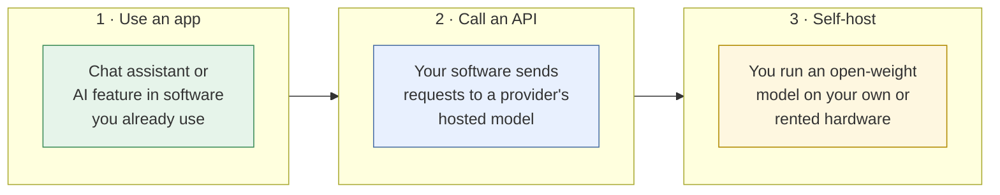
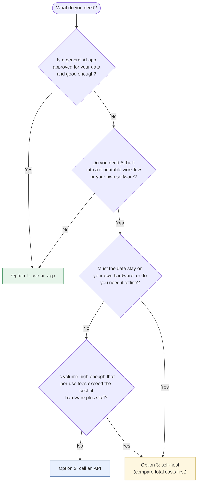

# Running AI
{: .no_toc }

What it takes to run, manage, and operate AI: the hardware, software, infrastructure, and skills behind the tools, explained for business decision-makers and educators.
{: .fs-6 .fw-300 }

  
On this page

  {: .text-delta }
1. TOC
{:toc}

## Why this section exists

Most of this guide is about *using* AI well. But sooner or later someone asks: *Should we run our own model? What would we need? Who would manage it? What will it cost?* You don't need to be an engineer to answer those questions well, but you do need to know what's involved. This section gives you the vocabulary and the rough numbers to have that conversation, and to know when to bring in specialists.

{: .note }
Hardware, prices, and tools change quickly. The *categories* and *ratios* on these pages are durable, but any specific number is illustrative. Check current figures before you budget.

## Three ways to run AI

Almost every AI setup is one of three options, or a mix of them:

| | 1 · Use an app | 2 · Call an API | 3 · Self-host |
|:--|:--|:--|:--|
| **What you run** | Nothing. A browser or an app. | Your own code or workflow that calls the model | The model itself, plus everything around it |
| **Hardware you need** | Any laptop or phone | Any computer or small server | GPUs with enough memory for the model |
| **Skills you need** | AI fluency (this guide) | Plus: scripting, API keys, basic software practices | Plus: infrastructure, model serving, security, monitoring |
| **Data control** | Depends on the provider's terms and your plan | Depends on API terms, often stronger than consumer apps | Highest, since data can stay on your hardware |
| **Cost pattern** | Per user, per month | Pay per use (tokens) | Mostly fixed: hardware plus staff time |
| **Best for** | Individuals and most teams | Repeatable workflows built into your systems | High volume, strict data needs, or offline use |

Moving right on the table gives you more **control** and more **responsibility**. Most organizations should start on the left and move right only for a specific reason.

## Which one fits?

## Pages in this section

- **Hardware requirements:** what computing power each option needs, and how to estimate the memory a model needs.
- **Software and infrastructure:** the layers of an AI system, from model serving to logging and access control.
- **Skills and roles:** who you need to run AI responsibly, at each level of ambition.
- **Operating AI:** keeping AI working day to day through evaluation, monitoring, cost management, and incident response.

These pages connect to the rest of the guide. [Data classification]() decides which option your data allows. [Human-in-the-loop design]() and [Automate or judge?]() decide how much oversight a workflow needs. The [second principles]() apply to whoever operates the system.
