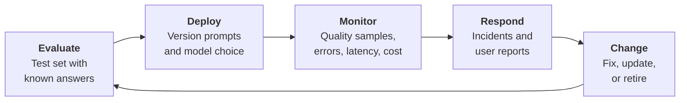
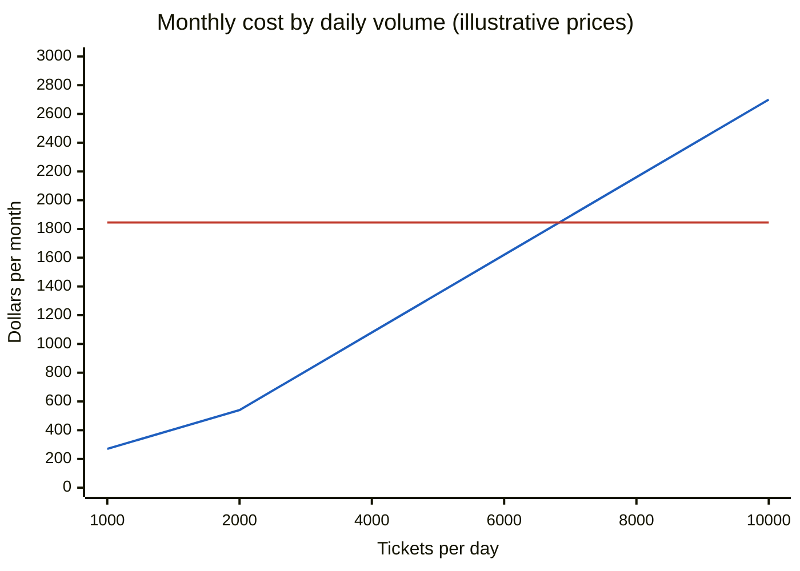
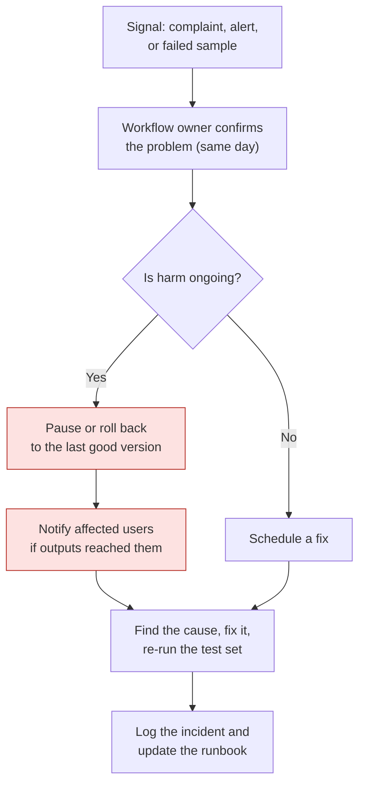

# Operating AI
{: .no_toc }

How to keep an AI system working well after launch: evaluation, monitoring, cost management, change control, and incident response.
{: .fs-6 .fw-300 }

  
On this page

  {: .text-delta }
1. TOC
{:toc}

## Scenario

Brightline's support team uses an API-based workflow that drafts a summary and suggested reply for every incoming ticket, about **2,000 tickets a day**. It launched well. Three months later, the provider releases a new model version, and the team's integration switches to it automatically. Summaries get noticeably shorter, and some leave out the customer's account number. Nobody notices for nine days, until a support agent complains.

Separately, the finance team asks whether running an open-weight model on Brightline's own rented GPU server would be cheaper than paying per use.

## Why it matters

Launching an AI workflow is the easy part. Afterward, the model changes, the inputs drift, costs grow with usage, and the people who built it move on to other things. Without operating discipline, quality erodes without anyone noticing. Operating AI is ordinary IT and quality management, adapted to a system whose outputs vary and whose underlying model can change underneath you.

## Key ideas

### The operating loop

### Five disciplines

| Discipline | What it means | Minimum practice |
|:--|:--|:--|
| **Evaluation** | Check quality against known-good answers | A 30–50 item test set, run before launch and after any change |
| **Monitoring** | Watch the live system | Weekly quality sample, error and latency tracking, monthly cost review |
| **Change control** | Manage changes to prompts, models, and data | Version prompts. Pin the model version where the provider allows it. Re-test before switching. |
| **Cost management** | Keep spending predictable | Budgets and alerts, and per-workflow cost tracking |
| **Incident response** | Act quickly when something goes wrong | A written runbook: who to call, how to pause, how to notify |

### Cost basics: tokens

Hosted models usually charge per **token**, a chunk of text that's often part of a word. As a rough rule for English, 1 token ≈ ¾ of a word. Input (what you send) and output (what the model writes) are usually priced separately, and output usually costs more.

> **Monthly cost ≈ requests per month × (input tokens × input price + output tokens × output price)**

## Worked example

### Part 1: what the ticket workflow costs

{: .warning }
The prices below are **illustrative, not any provider's actual rates.** Real prices vary widely by model and change often. Use your provider's current price sheet.

Assumptions:

- 2,000 tickets a day, 30 days a month
- Each request: about **1,500 input tokens** (the ticket plus instructions, roughly 1,125 words) and **300 output tokens**
- Illustrative prices: **$3 per million input tokens**, **$15 per million output tokens**

Cost per ticket = (1,500 × $3 ÷ 1,000,000) + (300 × $15 ÷ 1,000,000) = $0.0045 + $0.0045 = **$0.009**

- Per day: 2,000 × $0.009 = **$18**
- Per month: $18 × 30 = **$540**

### Part 2: would self-hosting be cheaper?

Illustrative self-hosting costs: a rented GPU server at **$1.50 an hour** × 730 hours a month = **$1,095**, plus about **10 hours a month** of engineering time at **$75 an hour** = **$750**. Total: **$1,845 a month**, whatever the volume (assuming one server can handle the load).

Break-even volume: $1,845 ÷ $0.009 per ticket = **205,000 tickets a month**, or about **6,833 a day**, more than three times Brightline's current volume.

The **blue** line is pay-per-use API cost, and the **red** line is self-hosting (fixed). At 2,000 tickets a day, the API costs **$540 a month** against **$1,845** to self-host. Self-hosting only wins on cost above roughly 6,800 tickets a day, and even then the comparison leaves out quality differences between models and the extra skills required (see [Skills and roles]()). Cost isn't the only reason to self-host: data control or offline needs can justify it at any volume.

### Part 3: the silent model change, and the fix

What went wrong, and what the team put in place:

| Gap | Fix |
|:--|:--|
| The integration used "latest model" and switched automatically | Pin a specific model version. Switch only after re-testing. |
| No test set, so no way to compare versions | A 40-ticket test set with required fields (account number, issue, requested action), checked automatically for missing fields |
| Nobody sampled live output | Weekly review of 20 random summaries by the support lead (the workflow owner) |
| Took 9 days to notice | Automatic alert when the share of summaries missing an account number exceeds 2% |
| No runbook | A one-page runbook: how to roll back to the previous version, who to notify, and how to record the incident |

## Verify checklist

- [ ] A test set with known answers exists and is re-run after every change.
- [ ] Prompts are versioned, and the model version is pinned where possible.
- [ ] Someone samples live output on a schedule, and it's the workflow owner, not only IT.
- [ ] Alerts exist for error rates, missing required fields, latency, and spending.
- [ ] Costs are tracked per workflow, with a budget and an alert threshold.
- [ ] A written runbook says how to pause or roll back and whom to notify.
- [ ] Access to keys and admin settings is reviewed at least quarterly.
- [ ] There's a retirement plan, for when a workflow is no longer worth running.

## Common failure modes

| Failure | What it looks like | How to catch it |
|:--|:--|:--|
| **Silent model updates** | Quality changes after a provider update, and nobody notices | Pin versions. Re-run the test set before switching. |
| **Launch-and-forget** | No quality checks after go-live | Schedule sampling. Name the reviewer. |
| **Surprise bills** | Usage grows or a loop runs away, and the invoice doubles | Set budgets and alerts. Cap requests per workflow. |
| **Comparing the wrong costs** | "Self-hosting is free once we buy the GPU" | Include staff time, power, utilization, and quality. |
| **No rollback** | A bad change can't be undone quickly | Keep the previous prompt and model version ready to restore. |
| **Orphaned workflows** | Nobody remembers who owns an old automation that's still running | Keep a register of workflows and owners, and review it quarterly. |

## Disclose and decide notes

**Disclose:** After an incident, tell affected people what happened and what changed, in plain language. For internal tools, a short note is usually enough: *"Ticket summaries from March 3–12 may be missing account numbers. Please check the original ticket."*

**Decide:** Cost comparisons inform the choice between API and self-hosting, but the decision also weighs control, quality, skills, and risk. Those trade-offs belong to the program owner, with input from the workflow owners who live with the results.

## For educators: turn this into a challenge

Give teams the ticket-workflow assumptions, with one change each: a higher volume, longer tickets, or different illustrative prices. Teams compute monthly API cost and the break-even point for self-hosting, then write a one-paragraph recommendation that names at least one non-cost factor. **Twist:** reveal the silent-model-change incident, and ask teams to draft the runbook. See [Designing an AI-fluency challenge]().
