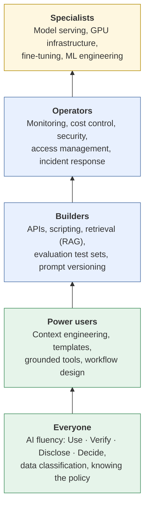
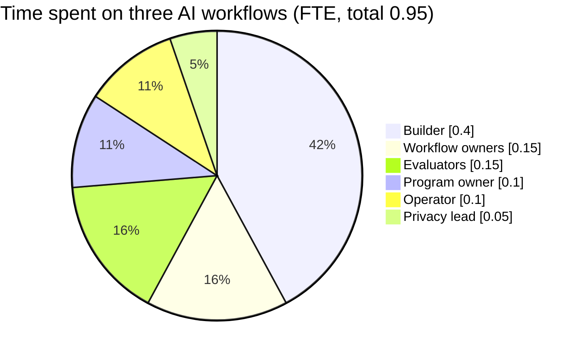

# Skills and roles
{: .no_toc }

Who you need to run AI responsibly at each level of ambition, what skills they need, and how a small organization can cover the roles without hiring a team.
{: .fs-6 .fw-300 }

  
On this page

  {: .text-delta }
1. TOC
{:toc}

## Scenario

After the HR policy assistant pilot (see [Software and infrastructure]()), Brightline's leadership asks: *"If we keep this and build two more AI workflows, who's responsible? Do we need to hire an AI team?"* The company has 200 employees, one IT generalist, and no data scientists.

## Why it matters

AI projects often fail for people reasons, not technology reasons. Nobody owns the workflow, nobody checks quality after launch, or the one person who understood the setup leaves. Clear roles prevent this. And most organizations don't need to hire specialists right away: many roles can be part-time "hats" worn by existing staff, as long as each hat has a name on it.

## Key ideas

### Skills build in layers

Every level depends on the ones below. A builder without AI fluency can produce a technically impressive system that confidently gives wrong answers.

### Which skills each option needs

| Skill area | 1 · App | 2 · API | 3 · Self-host |
|:--|:--:|:--:|:--:|
| AI fluency (everyone) | ● | ● | ● |
| Context engineering and templates | ● | ● | ● |
| Evaluation (test sets, sampling) | ● | ● | ● |
| Data governance and privacy | ● | ● | ● |
| Scripting and API integration | | ● | ● |
| Retrieval and RAG design | | ● | ● |
| Security (keys, access, logging) | ◐ | ● | ● |
| Cost monitoring | ◐ | ● | ● |
| Model serving and GPU infrastructure | | | ● |
| Model selection, quantization, updates | | | ● |

● = required. ◐ = partly needed, because the provider handles some of it.

### Core roles

| Role | Responsible for | Key skills |
|:--|:--|:--|
| **AI program owner** | Which AI uses go ahead, priorities, and the oversight level for each risk tier | Business judgment, risk thinking, communication |
| **Workflow owner** | One AI workflow's quality and outcomes (e.g., HR owns the policy assistant) | Domain expertise, verification, AI fluency |
| **Builder** | Building and changing workflows, prompts, retrieval, integrations | Scripting, APIs, RAG, evaluation |
| **Operator** | Monitoring, costs, access, incidents, updates | IT operations, security basics, cost tracking |
| **Data and privacy lead** | Data classification, vendor terms, retention | Privacy law basics, data governance |
| **Evaluator** | Test sets, sample audits, quality reports | Domain knowledge, attention to detail, basic statistics |

### Who does what: one workflow

For the HR policy assistant (R = responsible, A = accountable, C = consulted, I = informed):

| Activity | Program owner | HR (workflow owner) | Builder | Operator | Privacy lead |
|:--|:--:|:--:|:--:|:--:|:--:|
| Approve the use case | **A** | R | C | C | C |
| Keep policy documents current | I | **A/R** | | | |
| Build and change the assistant | I | C | **A/R** | C | C |
| Monitor uptime, cost, and access | I | I | C | **A/R** | |
| Monthly answer-quality audit | I | **A/R** | C | | |
| Respond to an incident | I | **A** | R | R | C |

## Worked example

Brightline staffs three AI workflows (the HR assistant, a sales-proposal drafting template, and a support-ticket router) with **existing people wearing part-time hats**:

| Role | Who | Approximate time |
|:--|:--|--:|
| AI program owner | COO | 0.1 FTE |
| Workflow owners (×3) | HR lead, sales lead, support lead | 0.05 FTE each = 0.15 FTE |
| Builder | IT generalist, after training on APIs and retrieval | 0.4 FTE |
| Operator | The same IT generalist | 0.1 FTE |
| Data and privacy lead | The finance controller, who already handles vendor contracts | 0.05 FTE |
| Evaluators | One rotating team member per workflow | 0.05 FTE each = 0.15 FTE |
| **Total** | | **0.95 FTE** |

**What this tells leadership:** under one full-time-equivalent of effort, spread across existing staff, covers three API-based workflows. No new hires are needed *at this level*. Two risks stand out:

- **Key-person risk:** the IT generalist holds 0.5 FTE of the work. If they leave, the builder and operator roles go with them. Mitigation: document every workflow as a plain-language spec, and cross-train a second person.
- **Self-hosting would change the picture:** running models on Brightline's own hardware would add infrastructure and model-serving work that the current team doesn't have the skills for. That would mean a specialist hire or a contractor.

## Verify checklist

- [ ] Every AI workflow has a named workflow owner from the business, not just IT.
- [ ] Someone is accountable for evaluation, and it actually happens on a schedule.
- [ ] The data and privacy role is assigned.
- [ ] Time estimates for each role are realistic and agreed with managers.
- [ ] No single person holds all the knowledge for a workflow, and there's a written spec.
- [ ] Everyone who uses AI has basic AI fluency training.
- [ ] Skills gaps for the chosen option (app, API, or self-host) are identified, with a plan to close them.

## Common failure modes

| Failure | What it looks like | How to catch it |
|:--|:--|:--|
| **IT owns everything** | Quality problems routed to IT, which can't judge policy answers | Put a business workflow owner on every workflow. |
| **No evaluator** | "It's live" means nobody checks quality again | Assign evaluation time. Report results monthly. |
| **Hero dependency** | One enthusiast built everything, and nobody else understands it | Write specs, cross-train, and review the code or configuration together. |
| **Hiring too early** | A machine-learning engineer hired for app-level use | Match skills to the option you've actually chosen. |
| **Skipping fluency** | Builders trained on APIs but not on verification | Everyone starts at the bottom of the skills ladder. |

## Disclose and decide notes

**Disclose:** Publish who owns each AI workflow, internally at least, so people know whom to ask and whom to tell when something looks wrong.

**Decide:** Roles make decisions possible, but they don't make them. The program owner still decides which workflows are worth the effort, and workflow owners still make the calls on quality.

## For educators: turn this into a challenge

Give teams a fictional organization and three AI workflows to support. They draft a role table with FTE estimates and a who-does-what matrix for one workflow, then identify the biggest key-person risk. **Twist:** midway through, announce that the organization wants to self-host. Which roles and skills change? Debrief: *What did self-hosting add that the API option didn't need?* See [Designing an AI-fluency challenge]().
