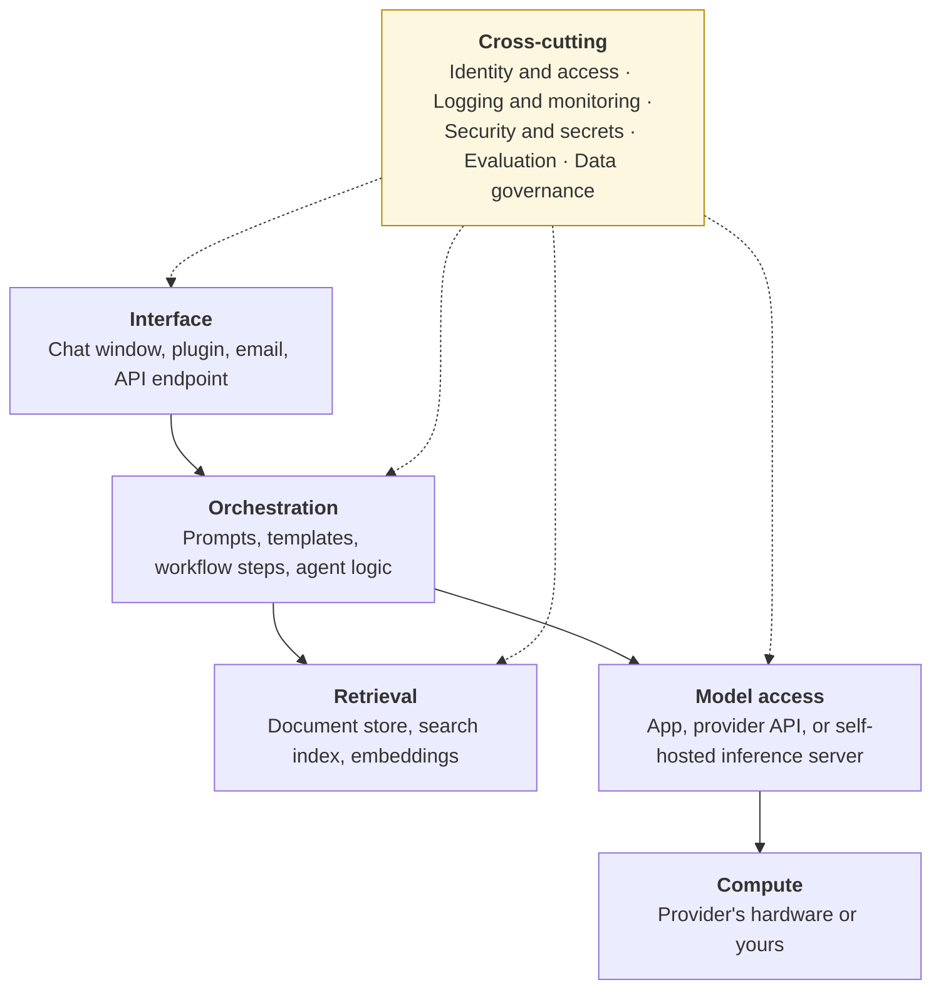
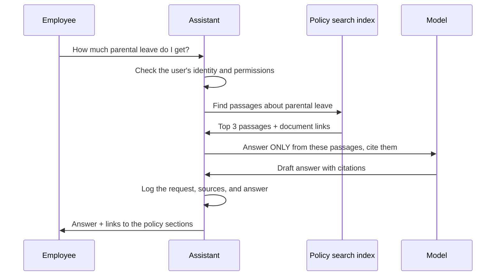

# Software and infrastructure
{: .no_toc }

The layers that make up a working AI system, beyond the model itself, and what you need at each level of ambition.
{: .fs-6 .fw-300 }

  
On this page

  {: .text-delta }
1. TOC
{:toc}

## Scenario

The HR team at **Brightline Software** (fictional, 200 employees) answers the same policy questions every week: *How much parental leave do I get? Can I expense a home-office chair?* The team wants an internal assistant that answers from the company's own policy documents, with a link to the source. A vendor demo makes it look like a single product. The IT lead asks, *"What would we actually need to build and run this?"*

## Why it matters

A model on its own is just one part of a system. A useful, safe AI tool also needs a way to reach your documents, control who can use it, record what it did, and tell you when it's going wrong. Leaving these layers out is how pilots turn into incidents. Knowing them lets you ask vendors the right questions and estimate the real effort.

## Key ideas

### The layers of an AI system

| Layer | What it does | Typical components (generic) |
|:--|:--|:--|
| **Interface** | Where people interact | Chat window, add-in for existing software, internal web page |
| **Orchestration** | Turns a request into the right prompts and steps | Prompt templates, workflow tools, agent frameworks |
| **Retrieval** | Finds relevant passages from your documents | Document store, search index, embeddings and a vector index |
| **Model access** | Generates the response | Hosted app, provider API, or a self-hosted inference server running an open-weight model |
| **Compute** | Runs the model | The provider's data centers, or your GPUs (see [Hardware]()) |
| **Identity and access** | Controls who can use what | Single sign-on, roles, permission checks on documents |
| **Logging and monitoring** | Records what happened | Request logs, quality samples, cost dashboards, alerts |
| **Security** | Protects keys, data, and the system | Secrets management for API keys, network rules, input and output filters |
| **Evaluation** | Checks quality before and after changes | Test sets with known answers, scheduled re-runs |
| **Data governance** | Keeps data use within the rules | Data classification, retention settings, deletion processes |

### Retrieval-augmented generation (RAG)

The most common pattern for "answer from our documents" is **retrieval-augmented generation**: find the relevant passages first, then have the model answer *only* from them.

RAG makes answers more current and traceable, but it doesn't make them correct by itself. Retrieval can find the wrong passage, and the model can still misread the right one (see [How LLMs fail]()).

### What each option requires

| Component | 1 · App | 2 · API | 3 · Self-host |
|:--|:--|:--|:--|
| Interface | Provided | You build or configure | You build or configure |
| Orchestration | Limited (projects, instructions) | You build | You build |
| Retrieval | Built-in file upload, or grounded notebooks | You build or buy | You build or buy |
| Model access | Provided | Provider-hosted | **You run the inference server** |
| Compute | Provided | Provided | **You provide** |
| Identity, logging, security | Mostly provided, so check the admin features | Shared: provider plus you | **All yours** |
| Evaluation and governance | Yours | Yours | Yours |

The last row is the same in every column. **However you run AI, evaluation and data governance stay your responsibility.**

## Worked example

Brightline compares two ways to build the policy assistant:

| Need | Option 1: grounded workspace in an approved AI app | Option 2: API + retrieval |
|:--|:--|:--|
| Answers from the policy documents | Upload documents to a shared project | Build a search index over the policy repository |
| Only employees can use it | The app's single sign-on | The company's single sign-on in front of the assistant |
| Some policies (executive compensation) only for HR | Separate projects per audience | Permission checks on documents at retrieval time |
| Documents change monthly | Someone re-uploads them | Index refreshes automatically when the repository changes |
| Logs for audit | Admin console, if the plan includes it | Full request logs under Brightline's control |
| Effort to launch | Days | Weeks, with a developer |
| Ongoing work | Re-upload, review samples monthly | Maintain code and index, monitor, review samples monthly |

**Decision:** Start with Option 1 for a 6-week pilot with 30 employees, measuring answer accuracy on a 40-question test set. Move to Option 2 only if the pilot shows real value *and* the permission and freshness limits start to hurt. Either way, HR owns the content and reviews a monthly sample of answers.

## Verify checklist

- [ ] I can name the component at every layer, and who's responsible for it.
- [ ] Identity and access rules are defined, including document-level permissions.
- [ ] Requests, sources, and answers are logged, with a defined retention period.
- [ ] API keys and secrets are stored in a secrets manager, never in documents or code.
- [ ] There's a test set with known answers, and it's re-run after any change.
- [ ] The data flows match our [data classification]() rules, including logs and backups.
- [ ] Someone owns keeping the retrieved documents current.

## Common failure modes

| Failure | What it looks like | How to catch it |
|:--|:--|:--|
| **Model-only thinking** | "We'll just plug in a model" | List all ten layers, and assign an owner to each. |
| **Permission leaks** | The assistant quotes an HR-only document to all staff | Check permissions at retrieval time. Test with a non-HR account. |
| **Stale documents** | Answers cite last year's policy | Automate index refreshes, or assign an owner to re-upload. |
| **Keys in the open** | An API key pasted into a shared document or code repository | Use a secrets manager. Rotate any key that leaks. |
| **No logs** | Nobody can tell what the assistant told an employee last week | Log requests and answers from day one, within retention rules. |
| **Treating RAG as truth** | "It cites the policy, so it's right" | Sample answers and check them against the cited passage. |

## Disclose and decide notes

**Disclose:** Label internal assistants clearly, for example: *"AI assistant answering from HR policy documents. Always check the linked policy. Contact HR for decisions."*

**Decide:** Policy *interpretation* in hard cases, such as eligibility disputes or exceptions, stays with HR people. The assistant points to the policy. It doesn't decide.

## For educators: turn this into a challenge

Give teams a short use case, such as a course FAQ assistant or a sales-proposal helper. Teams draw the ten layers for their design, mark who's responsible for each (provider or organization), and identify the single riskiest layer. Debrief: *Which layer did most teams forget? Which one would cause the worst incident if it failed?* See [Designing an AI-fluency challenge]().
