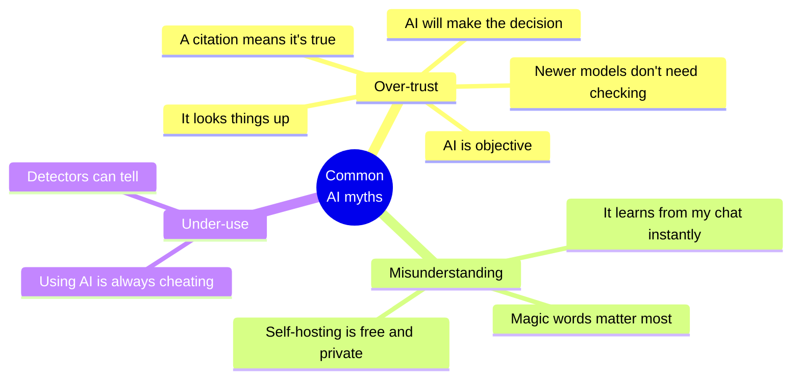
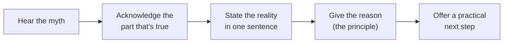

# AI myths and realities
{: .no_toc }

Ten common beliefs about AI that lead to bad decisions, what's actually true, and the principle behind each correction.
{: .fs-6 .fw-300 }

  
On this page

  {: .text-delta }
1. TOC
{:toc}

## Scenario

In a planning meeting at **Northwind Supply** (fictional), three people speak up within ten minutes:

- *"We don't need to check it. It's the newest model."*
- *"It gave us a source, so the number's solid."*
- *"Let's run our own model. Then it's free and private."*

Each of these is a common myth, and each could lead to a costly decision. Being able to correct them calmly, with a reason, is a practical AI-fluency skill.

## Why it matters

Myths spread because they're partly true, or were true for an earlier version of the tools. Acting on them leads to two opposite mistakes: **over-trust** (skipping checks, automating too much) and **under-use** (refusing helpful tools out of fear). The fix is the same in both cases: go back to how the tools actually work.

## Key ideas

### The myths at a glance

### Ten myths, corrected

| # | Myth | Reality | Why (principle) |
|:--|:--|:--|:--|
| 1 | **"AI looks things up."** | Most of the time it generates plausible text from learned patterns. Even tools with search can misread what they find. | [First principle 1](): it predicts, it doesn't know |
| 2 | **"If it cites a source, it's true."** | Citations can be invented, broken, or real but misquoted. | First principle 3: fluency isn't evidence. See [How LLMs fail](). |
| 3 | **"The newest model doesn't need checking."** | Newer models usually make fewer errors, but not zero, and errors still look confident. | First principles 1 and 3. [Second principle A](): verify in proportion to the stakes. |
| 4 | **"AI is objective."** | Models learn from human writing, including its biases. | See [Bias, fairness, and ethics](). |
| 5 | **"AI will make the decision."** | AI can recommend, but only people can be accountable. | First principle 7: a tool can't be accountable |
| 6 | **"The right magic words matter most."** | Context (goal, inputs, constraints) matters far more than phrasing tricks. | First principle 2. See [Context engineering](). |
| 7 | **"It learns from my chat instantly."** | The model itself doesn't change during your conversation. Separately, a tool may *store* your chats or memories, and may use them for training, depending on settings. | First principle 9: shared data leaves your control |
| 8 | **"Running our own model is free and private."** | Self-hosting has hardware, staff, and security costs, and is only private if every component is set up that way. | See [Running AI](). |
| 9 | **"Using AI is always cheating."** | It depends on the assignment's purpose and the stated policy. Many tasks expect AI use with disclosure. | See [Writing a course AI policy](). |
| 10 | **"AI detectors can reliably tell."** | Detection tools can be wrong, including flagging genuine work. A score alone isn't evidence. <!-- TODO: source on AI-text detector reliability --> | See [AI-resilient assessment](). |

### How to correct a myth in a meeting

## Worked example

Back in the Northwind meeting, the ops lead responds to each myth in the same pattern:

| Myth | Acknowledge | Reality and reason | Next step |
|:--|:--|:--|:--|
| "It's the newest model, so no need to check." | "It's much better than last year's." | "But it still predicts rather than looks things up, and its mistakes sound just as confident." | "Let's spot-check the five numbers that go to the client." |
| "It gave us a source." | "Sources are a great start." | "But we've seen real sources cited for things they don't say." | "Let's open the source and find the sentence." |
| "Run our own model: free and private." | "Self-hosting does give the most data control." | "But it costs hardware and staff time, and it's only private if logging is set up that way too." | "Let's compare total costs against an API for our volume first." |

The meeting moves on in five minutes, with three concrete actions instead of an argument.

## Verify checklist

- [ ] When I hear a confident claim about AI, I ask which principle it fits or contradicts.
- [ ] I acknowledge what's partly true before correcting it.
- [ ] I can give the reason in one sentence, without jargon.
- [ ] I end with a practical next step rather than a lecture.
- [ ] I check whether a "myth" has become true for a specific tool, such as a reliable built-in calculator, before dismissing it.

## Common failure modes

| Failure | What it looks like | How to catch it |
|:--|:--|:--|
| **Replacing one myth with another** | "AI is useless because it hallucinates" | Correct toward calibrated use, not toward rejection. |
| **Lecturing** | Ten minutes on how transformers work | One-sentence reason, one next step. |
| **Outdated corrections** | Insisting a tool can't search when this one can | Check current features before correcting. |
| **Winning the argument, losing the room** | People stop sharing how they use AI | Acknowledge first. Keep it practical. |

## Disclose and decide notes

**Disclose:** If you correct a myth with a statistic or a study, make sure it's real and that you can cite it. Otherwise you're starting a new myth.

**Decide:** Clearing up a myth doesn't make the decision. It lets the group decide on accurate information.

## For educators: turn this into a challenge

Run **"Myth or reality?"** Read out 10–12 statements about AI, mixing myths with true statements such as "outputs can vary for the same prompt." Teams vote, then have to justify each answer with a first principle. Award points for the reasoning, not just the vote. Debrief: *Which myth did most people believe? Where did it come from?* Use it as a spaced [knowledge check]() a week later. See [Designing an AI-fluency challenge]().
