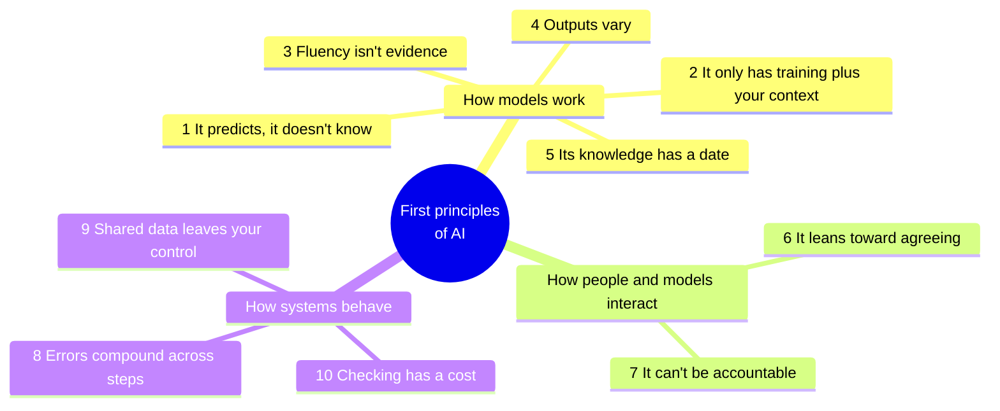
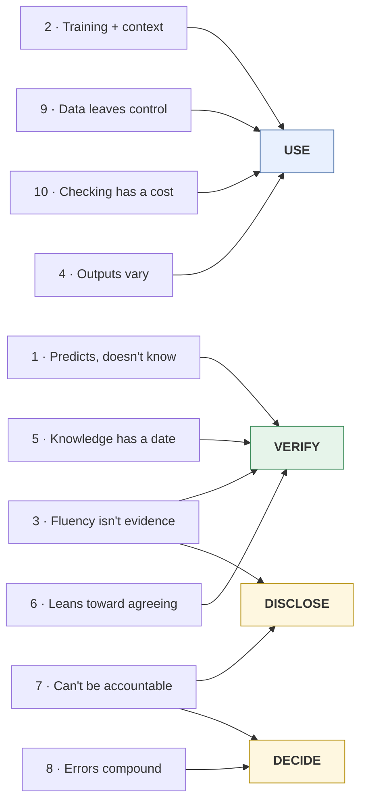
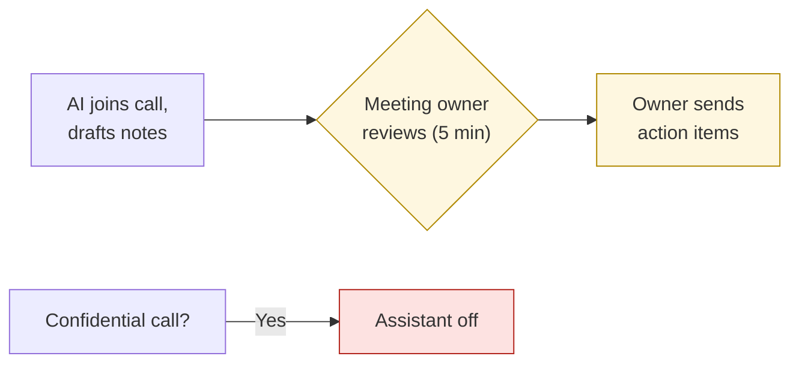

# First principles of AI
{: .no_toc }

Ten truths about how AI tools work that hold true across products, versions, and hype cycles. The rest of this guide follows from them.
{: .fs-6 .fw-300 }

  
On this page

  {: .text-delta }
1. TOC
{:toc}

## Scenario

Every few weeks, a new AI feature arrives: a meeting bot, an "autopilot" for email, an agent that books travel. There will never be a guide for each one. A manager asks you whether the team should turn on the new one. You haven't used it, the vendor's page is all upside, and the meeting is in an hour.

You don't need a guide to that feature. You need a small set of things that are true of **every** AI tool, and the habit of reasoning from them.

## Why it matters

Tool-specific tips go out of date in months. First principles don't. If you understand *why* AI tools behave the way they do, you can:

- Predict where a new tool will fail before it fails.
- Explain your concerns to a manager or a class without jargon.
- Avoid both extremes: trusting everything, and rejecting anything new.

Each principle below states a truth, gives the reason it's true, and says what follows from it. The working rules that follow are collected in [Second principles]().

## Key ideas

### The ten principles at a glance

### How models work

**1. AI predicts; it doesn't know.**
A language model generates the most plausible continuation of the text so far, based on patterns in its training data. It has no built-in step that checks a claim against reality.
*What follows:* Plausible and true usually overlap, but not always, especially for exact numbers, rare facts, and anything specific to you. See [How LLMs fail]().

**2. It only has its training plus the context you give it.**
The model can't see your files, your customers, your course, or your intentions unless they're in the prompt, the attached documents, or a tool it can call.
*What follows:* Most weak outputs come from missing context, not a weak model. See [Context engineering]().

**3. Fluency isn't evidence.**
Models write equally confident, well-structured prose whether they're right or wrong. Tone tells you nothing about accuracy.
*What follows:* You can't judge an output by how it reads. You have to check it against something.

**4. Outputs vary.**
Generation involves probability, so the same prompt can produce different answers, especially for open-ended questions. Tools and models also change over time.
*What follows:* One good result doesn't prove a method works. Anything that must be *exactly* the same every time belongs in a formula or a rule, not a prompt.

**5. Its knowledge has a date.**
A model's training data stops at a cutoff. Unless the tool searches the web or you provide current information, it doesn't know what changed after that date, and it may not say so.
*What follows:* Prices, regulations, people, and "current" anything need a dated source.

### How people and models interact

**6. It leans toward agreeing with you.**
Models trained on human feedback tend to favor answers people like. Researchers have documented models accepting false premises and changing correct answers under pushback (Sharma et al., 2023).
*What follows:* Leading questions get leading answers, and "Are you sure?" isn't a check.

**7. A tool can't be accountable.**
Accountability means answering for an outcome: explaining it, fixing it, and bearing the consequences. Software can't do that. People and organizations can.
*What follows:* Every AI-assisted output needs a named human owner. See [the rubric]().

### How systems behave

**8. Errors compound across steps.**
When one AI step feeds the next, each step's errors carry forward. If each of 5 steps is right 95% of the time, all 5 are right only about 77% of the time (0.955 ≈ 0.774).
*What follows:* Multi-step workflows need checkpoints. See [Automate or judge?]().

**9. Data you share leaves your control.**
Inputs go to the provider's systems, where, depending on the tool and plan, they may be stored, reviewed, or used for training.
*What follows:* What you paste is a decision about data, not just about convenience. See [Data classification]().

**10. Checking has a cost.**
AI saves time only when generating plus verifying is cheaper than doing the work yourself. Verification is real work, and it's often the larger share.
*What follows:* The value of AI depends on the task, not the tool. See [Should you use AI here?]().

### Where the rubric comes from

The four habits in [Use · Verify · Disclose · Decide]() aren't arbitrary. Each one is a response to specific principles:

Principle 3 leads to Disclose as well as Verify: because readers can't tell AI-assisted work from its tone, they rely on you to tell them.

## Worked example

Back to the scenario. The new feature is an **AI meeting assistant**: it joins video calls, records them, writes notes, and **emails action items to all attendees** automatically when the call ends. Reasoning from the principles, with no feature-specific guide:

| Principle | What it predicts about this feature | So the team should... |
|:--|:--|:--|
| 1 · Predicts, doesn't know | Notes will sometimes attribute a statement to the wrong person, or record a decision that was only discussed | Treat the notes as a draft |
| 2 · Training + context | It doesn't know project names, acronyms, or who owns what | Add a glossary and an attendee list if the tool allows it |
| 3 · Fluency isn't evidence | Wrong action items will look just as authoritative as right ones | Have someone who attended check them |
| 4 · Outputs vary | Note quality will vary from meeting to meeting | Judge it over several meetings, not one demo |
| 5 · Knowledge has a date | Less relevant here, since it works from the call itself | (No action) |
| 6 · Leans toward agreeing | Tentative ideas may be written up as agreed decisions | Have the meeting owner confirm decisions |
| 7 · Can't be accountable | If a wrong action item goes out, the tool can't fix the confusion | Make the meeting owner responsible for the summary |
| 8 · Errors compound | Wrong notes become wrong emails, which become wrong tasks in people's lists | Add a checkpoint between the notes and the email |
| 9 · Data leaves control | Recordings of confidential discussions go to the provider | Check data terms. Turn it off for HR, legal, and client-confidential calls. |
| 10 · Checking has a cost | Reviewing notes takes about 5 minutes. Writing them takes about 20. | Worth it, *with* review |

**The recommendation, derived in about 15 minutes:** Turn it on for internal project meetings, with automatic emailing **off**. The meeting owner reviews the notes and sends the action items. Keep it off for confidential calls. Re-evaluate after a month.

## Verify checklist

Use this **first-principles check** on any new AI tool or feature:

- [ ] **1:** Where would a plausible-but-wrong output do damage?
- [ ] **2:** What context does it lack, and can I provide it?
- [ ] **3:** How will I check outputs, since I can't judge them by tone?
- [ ] **4:** Have I seen it work over several runs, not just one demo?
- [ ] **5:** Does it rely on information that may be out of date?
- [ ] **6:** Where might it agree with me, or with a meeting, when it shouldn't?
- [ ] **7:** Who is the named owner of its outputs?
- [ ] **8:** Where do its outputs feed other steps, and where's the checkpoint?
- [ ] **9:** What data does it receive, and is that allowed?
- [ ] **10:** Is generating plus checking cheaper than doing it myself?

## Common failure modes

| Failure | What it looks like | How to catch it |
|:--|:--|:--|
| **Mistaking a feature for a principle** | "This one has web search, so principle 5 doesn't apply" | Search helps, but sources still need dates and checking. Principles get weaker, not cancelled. |
| **Judging by the demo** | One impressive run leads to a team-wide rollout | Principle 4: try it on several real cases first. |
| **Principles as reasons to refuse** | "It can hallucinate, so we'll never use it" | The principles tell you *how* to use a tool safely, not whether to avoid it. |
| **Skipping 9 and 10** | Discussing only accuracy, and never data or cost | Run all ten checks, every time. |
| **Treating the list as complete** | Ignoring a new risk because it isn't on the list | The principles are a starting point. Add to them when the evidence warrants. |

## Disclose and decide notes

**Disclose:** When you recommend for or against an AI tool, show your reasoning against the principles. A table like the one above makes your recommendation easy to check and challenge.

**Decide:** The principles predict *how* a tool behaves. Whether its benefits are worth the risks, for this team and this task, is still a human judgment.

## For educators: turn this into a challenge

Run **"Ten-minute tool review."** Show learners a short description of an AI feature they haven't seen, real or invented. Teams have 10 minutes to fill in the principles table and make a recommendation. Then reveal a fact about the feature, such as "it emails customers directly" or "inputs are used for training," and give them 3 minutes to revise. Debrief: *Which principle did the new fact trigger? Did any team predict it?* See [Designing an AI-fluency challenge]().

---

**References**

- Sharma, M., Tong, M., et al. (2023). Towards understanding sycophancy in language models. *arXiv:2310.13548*. https://arxiv.org/abs/2310.13548
