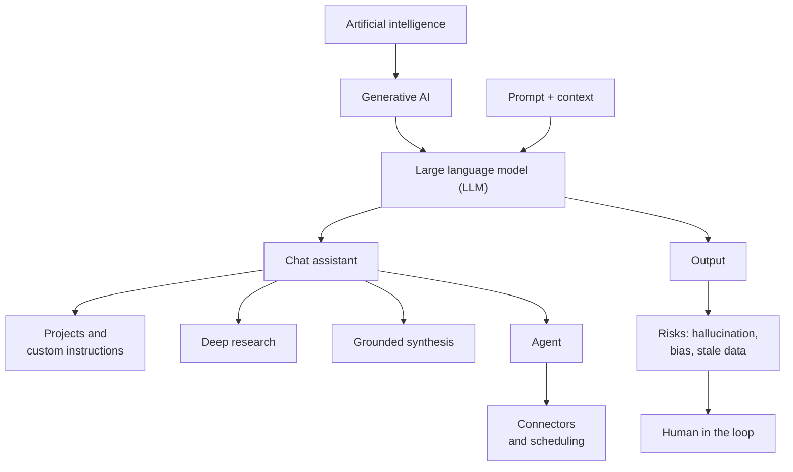

# Glossary
{: .no_toc }

Plain-language definitions of the AI terms used in this guide.
{: .fs-6 .fw-300 }

  
Jump to a letter

  {: .text-delta }
1. TOC
{:toc}

## How the main terms fit together

## A–C

**Agent**
: An AI setup that takes several steps toward a goal, such as searching, reading, writing, or using tools, without being prompted at each step. See [Workflows & Agents]().

**Agreeableness (sycophancy)**
: A model's tendency to agree with the user, accept false premises, or change a correct answer when pushed. See [How LLMs fail]().

**Automation bias**
: Over-trusting automated output, so that reviewers approve it without really checking. See [Human-in-the-loop design]().

**Autonomy level**
: How much an AI step does without human approval, from 0 (a human does it) to 4 (AI acts, monitored by metrics). See [Automate or judge?]().

**Chat assistant**
: An application that lets you talk to a language model in conversation, often with extras like file upload, web search, or code execution.

**Connector**
: A feature that gives an AI tool access to another system, such as your email, calendar, or file storage.

**Context**
: Everything the model can consider when responding: your prompt, files, instructions, and the conversation so far. See [Context engineering]().

**Context window**
: The maximum amount of text a model can consider at once.

**Custom instructions**
: Standing instructions that apply to every conversation or project, such as your role, house style, or recurring rules.

## D–H

**Data classification**
: Sorting data into levels (Public, Internal, Confidential, Restricted) to decide which tools it may go into. See [Data classification]().

**Deep research**
: A tool mode that searches many sources, reads them, and writes a cited report. Every citation still needs checking.

**De-identification**
: Removing or generalizing details that identify people, such as names, emails, and account numbers, before using data.

**Disclosure**
: A clear statement of AI's role in a piece of work: what it did, what you checked, and what you changed. See [the rubric]().

**GPU**
: Graphics processing unit, a chip built for massively parallel arithmetic, which is what running AI models mostly is. See [Hardware requirements]().

**Generative AI**
: AI that produces new content, such as text, images, audio, or code, rather than only classifying or predicting from data.

**Grounding**
: Limiting a model's answers to specific sources you provide, usually with citations to passages. It reduces hallucination but doesn't eliminate it.

**Hallucination**
: A confident, plausible, false output, such as an invented statistic, citation, or quote.

**Human in the loop**
: A process design where people review, approve, or decide at defined points. See [Human-in-the-loop design]().

**First principles**
: Ten basic truths about how AI tools behave, such as "it predicts, it doesn't know." See [First principles of AI]().

## I–P

**Inference**
: Running a trained model to produce an output, as opposed to training it.

**Knowledge cutoff**
: The date after which a model has no training data. Unless the tool searches the web, the model doesn't know about later events.

**Large language model (LLM)**
: A model trained on large amounts of text to predict likely next words. It powers chat assistants.

**Model**
: The trained AI system itself, as distinct from the app or tool you use to access it.

**Open-weight model**
: A model whose weights are published so you can run it yourself, under its license terms.

**Project**
: A workspace in some AI tools where instructions and files persist across conversations.

**Prompt**
: The instructions and input you give a model.

**Proxy (in bias)**
: A detail, such as a zip code or school, that indirectly stands in for a protected characteristic. See [Bias, fairness, and ethics]().

## R–Z

**Quantization**
: Storing a model's weights at lower precision (such as 4-bit) to cut memory needs, usually with some loss of quality.

**RAG (retrieval-augmented generation)**
: Finding relevant passages in your documents first, then having the model answer from them. See [Software and infrastructure]().

**Retention**
: How long a tool's provider keeps your inputs and outputs.

**Second principles**
: Ten working rules derived from the first principles, such as "provide, don't describe." See [Second principles of AI]().

**Scheduling**
: Running an AI task automatically at set times, such as a weekly digest.

**Skill (or template)**
: A saved, reusable set of instructions for a recurring task.

**Socratic tutor**
: An AI set up to ask guiding questions instead of giving answers. See [Socratic tutor prompt]().

**Swap test**
: A bias check: change one detail about a person (name, pronouns) and compare the outputs. See [Bias, fairness, and ethics]().

**Third principles**
: Ten principles for teams and organizations that make good AI habits the default, such as "make the safe path the easy path." See [Third principles of AI]().

**Token**
: A small chunk of text, often part of a word, that a model reads and generates. Context windows and pricing are usually measured in tokens.

**Training (on inputs)**
: When a provider uses your inputs to improve future models. Whether this happens depends on the tool, plan, and settings.

**VRAM**
: Memory on a GPU. A model's weights usually need to fit in it to run quickly.

**Use · Verify · Disclose · Decide**
: The four habits this guide is built on. See [the rubric]().
