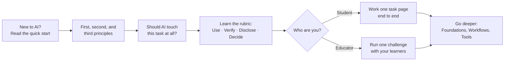
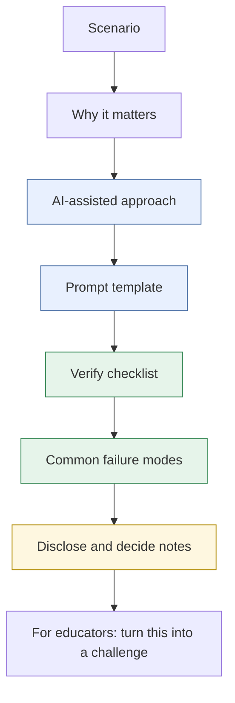

# Start Here
{: .no_toc }

What this guide is, who it's for, and how to get value from it in your first hour.
{: .fs-6 .fw-300 }

  
On this page

  {: .text-delta }
1. TOC
{:toc}

## What this guide is

The Applied AI Field Guide is a practical reference for using AI in real business and teaching work. It is not a list of prompt tricks. Prompts change every few months as tools change. The judgment behind a good prompt does not: knowing what to ask, what to check, what to disclose, and what to decide yourself.

Each page is built around a task you might actually do on a Tuesday afternoon, such as a break-even analysis for a pricing decision, a market scan before a strategy meeting, or a knowledge check for next week's class. Every task page follows the same pattern, so once you've read one you know where to find things in the rest.

The guide is vendor-neutral. It describes kinds of tools ("a chat assistant with file upload", "a source-grounded notebook") rather than specific products, and it prefers approaches that work on free tiers.

## Who it's for

| If you are... | You want to... | Start with |
|:--|:--|:--|
| A business student (undergraduate, MBA, EMBA) | Use AI on coursework and job tasks without outsourcing your thinking | [Break-even analysis]() |
| A faculty member or instructional designer | Design activities that build AI fluency, not AI dependence | [Designing an AI-fluency challenge]() |
| A corporate trainer | Run hands-on AI practice with realistic business scenarios | [Socratic tutor prompt]() |
| Anyone new to AI | Understand what it is and try it safely in 15 minutes | [What is AI? A quick start]() |

## How to use it

1. **If AI is new to you**, read [What is AI? A quick start](). It takes about 10 minutes and ends with a safe first exercise. If you want a structured plan, follow [Your first 30 days](), and skim [AI myths and realities]() to clear up common misconceptions.
2. **Learn the principles.** [First principles]() explain how AI tools behave, and [second principles]() turn that into ten working rules. If you lead a team or a course, [third principles]() show how to make those rules hold for everyone. They last longer than any tool tip.
3. **Before reaching for AI on any task**, run through [Should you use AI here?](). Sometimes the right answer is a spreadsheet formula, and sometimes it's you.
4. **Learn the four habits** in [the rubric](). Everything else in the guide hangs on them.
5. **Work one task page end to end**, with a real tool open. Reading about verification is not the same as catching your first hallucination.
6. **Use [Templates]()** when you just need the copy-paste version, and the [Glossary]() when a term is unfamiliar.

## How every task page is laid out

Every task page uses the same eight sections, in the same order:

The colors line up with the rubric: blue sections are about **Use**, green about **Verify**, and yellow about **Disclose** and **Decide**. The last section is for educators, but students can read it too. It shows how the same task becomes a practice challenge.

## What this guide is not

- **Not a policy.** Your course, school, or employer sets the rules on AI use. This guide helps you work well inside them. When in doubt, ask.
- **Not tool documentation.** Features change monthly. Check the current documentation for whatever tool you use.
- **Not an endorsement.** This is an independent professional reference by [Clark Ngo](https://clarkngo.github.io/). It is not affiliated with or endorsed by any university or employer. All companies in the examples are fictional.
