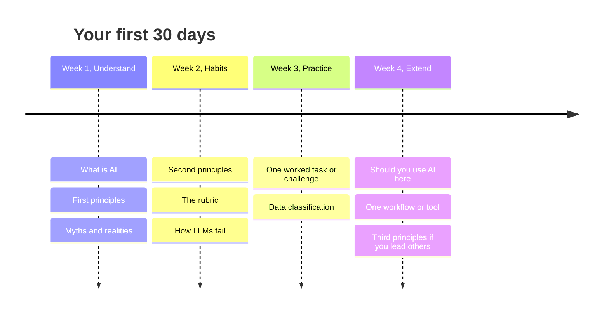
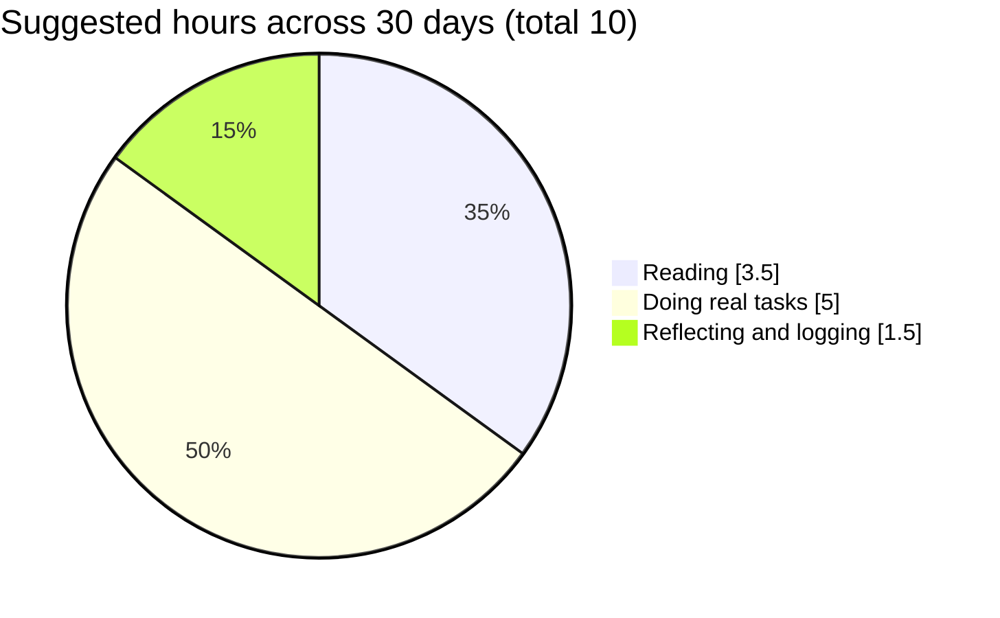

# Your first 30 days
{: .no_toc }

A week-by-week path through this guide, for students and for educators, at about two to three hours a week.
{: .fs-6 .fw-300 }

  
On this page

  {: .text-delta }
1. TOC
{:toc}

## Scenario

You've decided to get serious about AI, but there are more than 50 pages here and a lot of noise elsewhere. You have a few hours a week. Where do you start, and in what order?

## Why it matters

Learning in the right order builds habits on top of understanding. Jumping straight to agents or advanced tools without the basics is like learning to drive on the highway. Spacing the learning over four weeks also helps it stick (see [Scenario knowledge checks]()).

Each week follows the same pattern: **read** a little, **do** one real task, and **reflect** in a short AI-use log.

## Key ideas

### The four weeks

### Student path

| Week | Read | Do | Reflect |
|:--|:--|:--|:--|
| **1** | [What is AI?](), [First principles](), [Myths and realities]() | The 15-minute exercise in *What is AI?* on a real, low-stakes task | Which first principle surprised you? |
| **2** | [Second principles](), [the rubric](), [How LLMs fail]() | Find and fix one error in an AI answer about something you know well | What did you check, and how? |
| **3** | [Data classification](), plus one task page: [Break-even analysis]() is the best first one | Work the task end to end with an AI tool, and keep an [AI-use log](#ai-use-log) | Did you catch the planted trap? |
| **4** | [Should you use AI here?](), plus one task close to your coursework or job | Do that task, with a disclosure statement | Score yourself on the rubric. Which habit is weakest? |

### Educator path

| Week | Read | Do | Reflect |
|:--|:--|:--|:--|
| **1** | What is AI?, First principles, Myths and realities | Try the [Socratic tutor prompt]() on a topic you teach, and try to break it | Would your learners use it well? |
| **2** | Second principles, the rubric, How LLMs fail | Run one of your own assignments through the stress test in [AI-resilient assessment]() | What would an AI-only submission score? |
| **3** | [Designing an AI-fluency challenge](), [Creating cases and data packs]() | Draft one challenge for your course, with a planted trap | Did the trap work when you tested it? |
| **4** | [Writing a course AI policy](), [Third principles]() | Assign an AI level to every assessment in one course | Which assessment was hardest to classify? |

### Time budget

Half the time goes to *doing*. Reading about verification isn't the same as catching your first hallucination.

## Worked example

Priya, an MBA student, follows the student path:

- **Week 1:** She uses the quick-start prompt to draft an email to a project teammate. The AI's list of assumptions shows it guessed the deadline wrong.
- **Week 2:** She asks an AI about her previous employer's industry, and finds an invented market-share figure. Searching for the source turns up nothing.
- **Week 3:** She works the break-even task and gets 2,118 drinks at first. Recomputing the card fee gives 2,126. She logs the error.
- **Week 4:** She uses AI on a real finance assignment, following her course's "AI with disclosure" level, and writes a three-sentence disclosure. Her self-assessment says Verify is strong and Use is weakest, because her prompts lacked context. That's the next thing to work on.

Ten hours in, she has four logged uses, three caught errors, and a clear next step.

## Verify checklist

- [ ] I did at least one real task each week, not just reading.
- [ ] I kept a short AI-use log for each task.
- [ ] I caught and recorded at least one AI error.
- [ ] I followed my course's or employer's AI policy throughout.
- [ ] By week 4, I can explain the four rubric habits and at least three first principles without notes.
- [ ] I know which habit I need to practice next.

## Common failure modes

| Failure | What it looks like | How to catch it |
|:--|:--|:--|
| **Reading only** | Four weeks of pages, no practice | Each week's "Do" column comes first. |
| **Starting too advanced** | Week 1 spent on agents and connectors | Follow the order. Rungs build on each other. |
| **Toy tasks** | Practicing on trivia | Use real, low-stakes tasks from your work or coursework. |
| **No log** | Can't remember what you learned | Two minutes of logging after each task. |
| **Stopping at day 30** | Habits fade | Set a monthly reminder to repeat one week 3 task. |

## Disclose and decide notes

**Disclose:** Your AI-use logs from these four weeks are a good record if you ever need to show how you use AI responsibly, for example in a job interview.

**Decide:** The path is a suggestion. If one area matters more for your work, such as spreadsheets or course policies, spend extra time there.

## For educators: turn this into a challenge

Use the student path as a **four-week module** at the start of a course. Assign each week's "Do" task as an ungraded activity with an AI log, and open the following session with a five-minute share of the best caught error. Close week 4 with a graded [AI-fluency challenge]().
