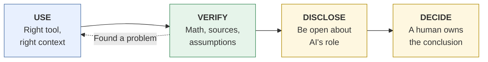
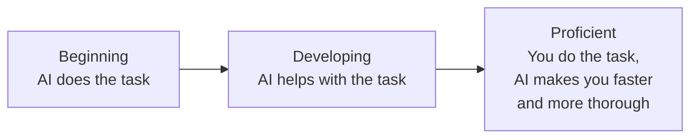

# The rubric: Use · Verify · Disclose · Decide
{: .no_toc }

Four habits that separate AI-fluent work from AI-dependent work. Every task page in this guide is organized around them.
{: .fs-6 .fw-300 }

<details open markdown="block">
  <summary>On this page</summary>
  {: .text-delta }
1. TOC
{:toc}
</details>

## The four habits at a glance



The dotted arrow matters. Verification often sends you back to Use, with better context, a different tool, or a narrower question. Expect to go around that loop more than once.

## Use: pick the right tool and give it the right context

**The question:** *Is AI the right help for this task, and have I given it what it needs to do the job well?*

Using AI well starts before the prompt. First decide whether the task needs AI at all ([Should you use AI here?]()). Then choose the kind of tool: a general chat assistant, a source-grounded notebook, a spreadsheet with a formula, or a deep-research mode. Finally, give it the context a smart new colleague would need:

- **Goal:** what decision or deliverable this feeds.
- **Audience:** who will read the output, and what they already know.
- **Inputs:** the actual data, documents, or notes, not a description of them.
- **Constraints:** length, format, tone, what to avoid, and which data may not be used.
- **Definition of done:** what a good answer looks like, ideally with an example.

More on this in [Context engineering]().

## Verify: check the math, the sources, and the assumptions

**The question:** *What in this output could be wrong, and how would I know?*

AI output is fluent whether or not it is correct, so fluency tells you nothing. Verify in proportion to the stakes:

- **Math:** recompute key numbers yourself, in a spreadsheet or by hand. Models make arithmetic slips and rounding errors.
- **Sources:** open every citation. Does the source exist? Does it say what the output claims it says?
- **Assumptions:** ask the model to list its assumptions, then check each one against your actual situation.
- **Hallucinations:** be most suspicious of specific-sounding details you didn't provide, such as statistics, dates, names, quotes, and legal or policy claims.
- **Omissions:** ask what's missing. What would a skeptical manager or professor ask about?

More on this in [How LLMs fail]().

## Disclose: be open about AI's role

**The question:** *Would the people relying on this work be surprised to learn how AI was involved?*

Disclosure follows the rules where you are. Some courses ban AI on certain assignments, some require a log, and some companies require labeling client-facing content. Where there's no rule, a good default is to disclose whenever AI shaped the substance of the work (analysis, structure, or wording), not just spelling.

Good disclosure is specific. "I used AI" says little. Say which tool type, for which parts, and how you checked it.

**Disclosure statement template**

```text
AI use: I used [TOOL TYPE, e.g. a general-purpose chat assistant] to
[WHAT IT DID, e.g. draft the cost table and suggest sensitivity scenarios].
I verified [WHAT YOU CHECKED AND HOW, e.g. every figure by recomputing it in
a spreadsheet; I corrected one rounding error in the break-even units].
The analysis, conclusions, and recommendation are my own.
```

## Decide: the human owns the conclusion

**The question:** *Can I explain and defend this conclusion without pointing at the AI?*

AI can propose. It cannot be accountable. The person who submits the memo, sends the email, or posts the grade owns it. In practice, that means:

- You can explain the reasoning in your own words.
- You made the judgment calls (the price, the recommendation, the grade), and you can say why.
- You would sign your name to it.

If you can't do those three things, you're not ready to decide. Go back to Verify.

## Proficiency levels

Use this for self-assessment, peer review, or (for educators) as a starting point for a grading rubric.

| Habit | Beginning | Developing | Proficient |
|:--|:--|:--|:--|
| **Use** | Uses the first tool at hand. Prompt has little or no context. | Gives some context. Tool choice is reasonable but not justified. | Chooses the tool (or no AI) deliberately. Provides goal, audience, inputs, constraints, and definition of done. |
| **Verify** | Accepts output as-is. | Spot-checks some facts or numbers. | Recomputes key numbers, opens every source, lists and tests assumptions, and documents what was corrected. |
| **Disclose** | No disclosure, or disclosure only when asked. | Generic disclosure ("AI was used"). | Specific disclosure that follows policy: what AI did, what was checked, and what was changed. |
| **Decide** | Conclusion is the AI's, restated. | Adds own opinion but can't fully defend the reasoning. | States and defends own conclusion, including where they disagreed with the AI and why. |



## Quick self-check

Before you submit or send anything AI-assisted, ask yourself:

1. **Use:** Did I give it the real inputs and tell it what good looks like?
2. **Verify:** What did I check, and what did I fix?
3. **Disclose:** Does my disclosure say what AI did and how I checked it?
4. **Decide:** Could I defend this in a meeting with the AI tab closed?
