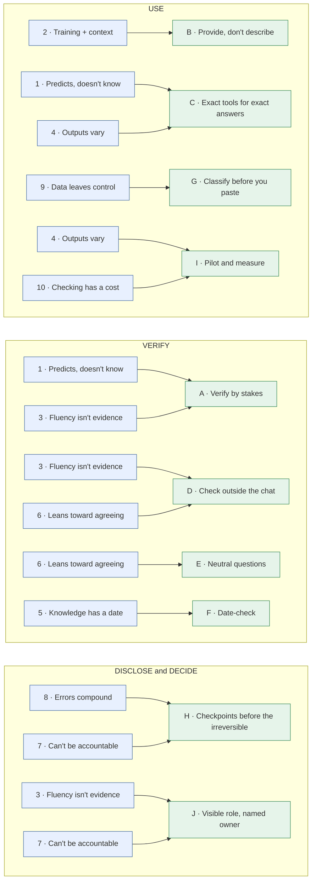
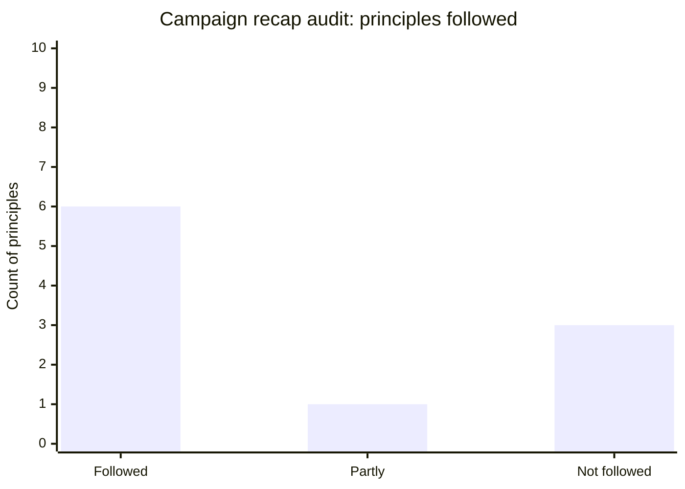

# Second principles of AI
{: .no_toc }

Ten working rules derived from the first principles. These are the habits you apply every day, each with a reason you can explain.
{: .fs-6 .fw-300 }

  
On this page

  {: .text-delta }
1. TOC
{:toc}

## Scenario

A marketing team keeps a shared document called "AI tips." Over a year it has grown to 40 items: "Always say 'think step by step'," "Use the blue model for writing," "Don't paste more than 3 pages," "Start every prompt with 'You are an expert.'" Half of them refer to tool versions that no longer exist. New team members follow them without knowing why, and nobody knows which still matter.

The team doesn't need more tips. It needs a short list of rules that **follow from how AI works**, so each one can be explained, tested, and kept or dropped for a reason.

## Why it matters

[First principles]() describe how AI tools behave. Second principles describe what **you** should do because of that. They're one step removed from the fundamentals, which makes them:

- **Practical:** each one is an action.
- **Explainable:** each one points to the first principles behind it, so "why do we do this?" always has an answer.
- **Durable:** they don't depend on any product's features.
- **Revisable:** if a first principle weakens (say, tools get much better at arithmetic), you know which rules to revisit.

## Key ideas

### The ten second principles

| # | Second principle | Derived from first principles | Rubric habit |
|:--|:--|:--|:--|
| A | **Verify in proportion to the stakes.** Check everything that matters, and check the riskiest claims first. | 1 · Predicts, doesn't know; 3 · Fluency isn't evidence | Verify |
| B | **Provide, don't describe.** Paste the actual data, documents, and examples. | 2 · Training + context | Use |
| C | **Exact answers come from exact tools.** Use formulas, code, and lookups for math, counts, and anything that must be repeatable. | 1 · Predicts, doesn't know; 4 · Outputs vary | Use |
| D | **Check outside the chat.** Verify against a source, a spreadsheet, or a person, never only by asking the model again. | 3 · Fluency isn't evidence; 6 · Leans toward agreeing | Verify |
| E | **Ask neutral questions.** Ask "what are the options?" rather than "isn't X right?", and ask for the strongest counterargument. | 6 · Leans toward agreeing | Use, Verify |
| F | **Date-check anything time-sensitive.** Prices, rules, people, rankings, and "latest" anything need a dated source. | 5 · Knowledge has a date | Verify |
| G | **Classify before you paste.** Decide what kind of data it is before choosing a tool. | 9 · Data leaves control | Use |
| H | **Put checkpoints before the irreversible.** A person reviews before anything is sent, published, paid, or graded, and between chained steps. | 8 · Errors compound; 7 · Can't be accountable | Decide |
| I | **Pilot, then measure the whole loop.** Test on several real cases, and count review and rework time. | 4 · Outputs vary; 10 · Checking has a cost | Use, Decide |
| J | **Make AI's role visible, and name the owner.** Disclose what AI did, and make clear who stands behind the result. | 3 · Fluency isn't evidence; 7 · Can't be accountable | Disclose, Decide |

### How they're derived

Blue boxes are first principles and green boxes are second principles. A first principle appears more than once when it supports several rules.

Every first principle leads to at least one second principle, and every second principle has at least one first principle behind it. A rule that can't be traced back this way (like "always start with 'You are an expert'") is a tip, not a principle. It might help, so test it, but don't make it policy.

### From second principles to the rest of the guide

| Second principle | Where it's put into practice |
|:--|:--|
| A · Verify by stakes | [How LLMs fail]() (claim triage) |
| B · Provide, don't describe | [Context engineering]() |
| C · Exact tools for exact answers | [Spreadsheet and data analysis](), [Customer feedback analysis]() |
| D · Check outside the chat | [Research-to-brief]() (claim-to-source matrix) |
| E · Neutral questions | [Competitive and market analysis]() (the case against) |
| F · Date-check | [Competitive and market analysis]() (source dates) |
| G · Classify before you paste | [Data classification]() |
| H · Checkpoints before the irreversible | [Human-in-the-loop design](), [Automate or judge?]() |
| I · Pilot and measure | [Should you use AI here?]() (time-savings math) |
| J · Visible role, named owner | [The rubric]() (Disclose and Decide) |

## Worked example

The marketing team replaces its 40 tips with the ten second principles, then **audits** a recent AI-assisted deliverable against them: a quarterly campaign recap that went to the leadership team.

| Principle | Followed? | Evidence |
|:--|:--:|:--|
| A · Verify by stakes | Partly | The headline numbers were checked. Two supporting statistics weren't. |
| B · Provide, don't describe | ✓ | The campaign data export was pasted in. |
| C · Exact tools for exact answers | ✗ | Click-through rates were computed by the chat assistant, and one was wrong (4.2% vs. 3.8%). |
| D · Check outside the chat | ✗ | The analyst asked "Are these numbers right?" and the model said yes. |
| E · Neutral questions | ✓ | The analyst asked "What underperformed?" as well as "What worked?" |
| F · Date-check | ✓ | The benchmark came from a dated source. |
| G · Classify before you paste | ✓ | Internal data went into the approved tool. |
| H · Checkpoints before the irreversible | ✓ | The manager reviewed the recap before it went to leadership. |
| I · Pilot and measure | ✗ | This was the first use of a new recap prompt, and it wasn't tested first. |
| J · Visible role, named owner | ✓ | The recap noted AI drafting, and the analyst was named as owner. |

**Score: 6 of 10 followed fully, and 1 partly.** The three misses, C, D, and I, all point at the same gap: the numbers were generated and "checked" inside the chat. The fix is one concrete change to the team's process: *all metrics are calculated in the spreadsheet, and AI writes the narrative around them.*

## Verify checklist

Use this as a **second-principles audit** on any AI-assisted deliverable:

- [ ] **A:** Were the highest-stakes claims checked first and most thoroughly?
- [ ] **B:** Did the AI get the real inputs, or a description of them?
- [ ] **C:** Did math, counts, and lookups come from a formula or code?
- [ ] **D:** Was every check made against something outside the chat?
- [ ] **E:** Were the questions neutral, and was the counterargument considered?
- [ ] **F:** Do time-sensitive facts have dated sources?
- [ ] **G:** Was the data classified before it was pasted?
- [ ] **H:** Did a person review before anything irreversible happened?
- [ ] **I:** Was the method tested on more than one case, with review time counted?
- [ ] **J:** Is AI's role disclosed, and is the owner named?

## Common failure modes

| Failure | What it looks like | How to catch it |
|:--|:--|:--|
| **Tips posing as principles** | "Always use the word 'expert'" written into team policy | Ask which first principle it comes from. If none, label it a tip and test it. |
| **Rules without reasons** | New hires follow the list but can't explain it | Teach each rule with its first principle. |
| **Over-applying A** | Checking a low-stakes brainstorm as carefully as a financial filing | "In proportion" works both ways. Spend checking time where errors cost the most. |
| **Rules that never change** | Keeping C unchanged even after tools reliably run code for calculations | When a first principle weakens, revisit the rules that depend on it. |
| **Auditing only failures** | Using the audit only after something goes wrong | Audit a sample of good deliverables too, to see which habits are working. |

## Disclose and decide notes

**Disclose:** The audit table works well as an appendix to an AI-use disclosure on important work. It shows *how* the work was checked, not just that AI was used.

**Decide:** The principles are defaults, not laws. You may have a good reason to depart from one, for example skipping a pilot for a one-off, low-stakes task. When you do, make it a deliberate decision you could explain, not a shortcut you happened to take.

## For educators: turn this into a challenge

Give learners a list of 15 popular "AI tips" collected from the web or from colleagues. In teams, they sort each tip into one of three groups: **derived** (traceable to a first principle; name it), **testable tip** (might help; design a quick test), or **outdated or harmful**. Then each team runs one quick test on a testable tip and reports back. Debrief: *How many popular tips survived? What made a tip durable?* See [Designing an AI-fluency challenge]().
