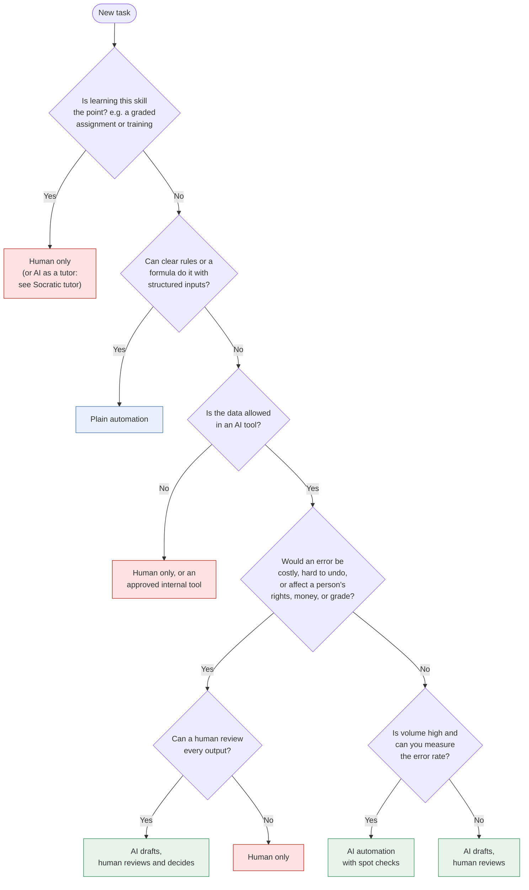
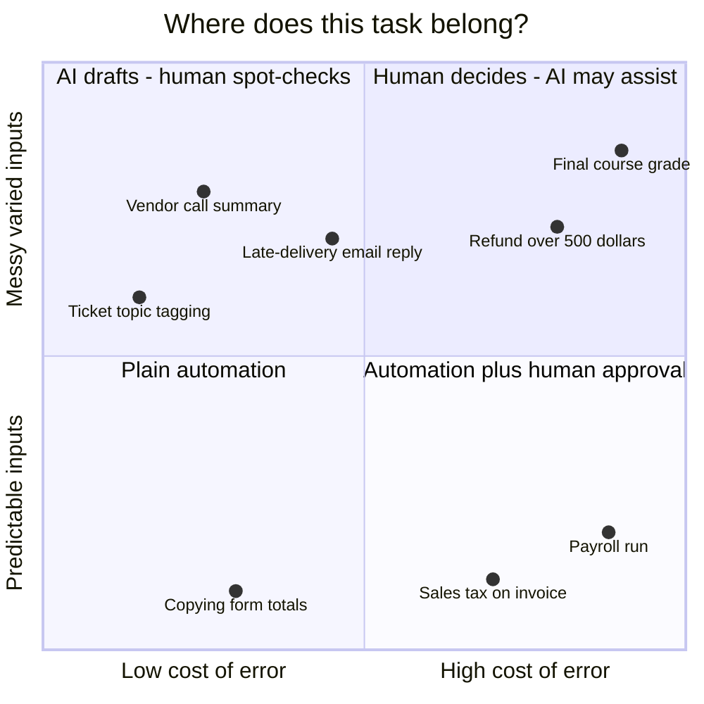

# Should you use AI here?
{: .no_toc }

A quick way to decide whether a task needs AI, plain automation, a human, or a mix of them, before you spend time on prompts.
{: .fs-6 .fw-300 }

  
On this page

  {: .text-delta }
1. TOC
{:toc}

## Scenario

Priya runs a three-person operations team at **Northwind Supply**, a fictional office-supply distributor. Her manager asks her to "use AI to speed things up." Her team's week includes:

- Copying order totals from a standard web form into the accounting system.
- Replying to customer emails about late deliveries.
- Summarizing the weekly vendor call.
- Deciding whether to grant refunds over $500.
- Calculating sales tax on invoices.

"Use AI" is the wrong starting point for all five. The right question is *what kind of help each task needs*. As it turns out, only two of them are good AI tasks.

## Why it matters

Using AI where it doesn't fit costs you three ways:

- **Errors where you can't afford them.** A model that is right most of the time is fine for a first draft, and not fine for a tax calculation.
- **Time you don't save.** If checking the AI's output takes as long as doing the work, you've added a step, not removed one.
- **Accountability gaps.** When a customer, student, or regulator asks "who decided this?", the answer can't be "the model."

Choosing *not* to use AI is part of AI fluency.

## The four options

| Option | What it is | Use it when | Examples |
|:--|:--|:--|:--|
| **1. Human only** | A person does the work and makes the call. | Stakes are high, empathy or ethics matter, someone must be accountable, or *learning the skill is the point*. | Final grades, firing decisions, refunds over a threshold, a graded exam |
| **2. Plain automation** | Rules, formulas, scripts, or workflow tools. Same input, same output, every time. | The task is repetitive, the rules are clear, and inputs are structured. | Sales tax, copying form fields, due-date reminders, spreadsheet totals |
| **3. AI + human in the loop** | AI drafts, sorts, or summarizes. A person reviews every output before it's used. | Inputs are messy (text, documents), the output needs judgment, and errors are catchable in review. | Customer email drafts, meeting summaries, a first-pass market scan |
| **4. AI automation** | AI acts without a person checking each item. People spot-check and monitor. | Stakes are low, mistakes are reversible, volume is high, and you can measure the error rate. | Tagging support tickets by topic, routing internal FAQs |

Notice that plain automation comes *before* AI in this list. If a formula or a rule can do it, that is usually cheaper, faster, and more reliable than a model.

## The decision flowchart

## Where common tasks land

Two questions do most of the work: **How varied are the inputs?** and **What does an error cost?**

For Priya's team:

| Task | Where it lands | Why |
|:--|:--|:--|
| Copying order totals from a web form | Plain automation | Structured input, fixed rules. AI adds risk and cost for no gain. |
| Late-delivery email replies | AI drafts, human reviews | Every email is different. Errors are catchable, and tone matters. |
| Vendor call summary | AI drafts, human spot-checks | Low stakes and messy input. Participants will flag mistakes. |
| Refunds over $500 | Human decides | Money, customer relationships, and accountability. AI can pull the order history. |
| Sales tax | Plain automation | Must be exact. Use the accounting system's tax tables, never a model's arithmetic. |

## Check the math: does AI actually save time?

AI time savings are easy to overestimate because people forget **review time** and **rework**. Estimate the expected time per item:

> **AI time per item = prompt time + review time + (share of drafts needing rework × rework time)**

**Late-delivery emails at Northwind.** Writing one from scratch takes 10 minutes. With AI, prompting takes 1 minute and reviewing takes 4 minutes. About 1 in 5 drafts (20%) is off-base and needs a 10-minute rewrite.

- AI time per item = 1 + 4 + (0.20 × 10) = **7 minutes**
- Saving per item = 10 − 7 = **3 minutes**
- At 200 emails a month: 200 × 3 = 600 minutes = **10 hours saved per month**

That's worth doing. Now suppose the emails involve complex contract terms, review takes 8 minutes, and 40% need a rewrite:

- AI time per item = 1 + 8 + (0.40 × 10) = **13 minutes**, which is **3 minutes slower** than doing it by hand.

Before you commit, run a small pilot of 10 to 20 real items and time it honestly.

## Verify checklist

- [ ] I asked whether a formula, rule, or existing system could do this first.
- [ ] I checked that the data is allowed in the tool I plan to use.
- [ ] I named the cost of an error and whether it can be undone.
- [ ] For anything affecting a person's money, rights, or grade, a human reviews every output.
- [ ] I estimated time saved *including* review and rework, ideally from a small pilot.
- [ ] I know who is accountable for the final result, by name.

## Common failure modes

| Failure | What it looks like | How to catch it |
|:--|:--|:--|
| AI for a formula's job | Asking a chat assistant to total a column or compute tax | Ask: "Would a spreadsheet give the same answer every time?" If yes, use it. |
| Hidden review cost | "AI saves us an hour a day," while the team quietly spends 50 minutes checking | Time the whole loop in a pilot, not just the generation step. |
| Automation creep | A drafting helper slowly becomes "just send it" | Write down which outputs need human sign-off, and audit a sample monthly. |
| Skipping the learning | A student has AI do the exact skill the assignment was meant to build | Check the assignment's learning goal first. Use AI as a tutor, not a substitute. |
| All-or-nothing thinking | Rejecting AI for a whole process because one step is high-stakes | Split the process. AI can gather the refund history while a human makes the refund call. |

## Disclose and decide notes

**Disclose:** When you propose using AI in a team or course process, write down which option you chose (1–4) for each step and why. That note becomes your disclosure: "AI drafts customer replies; an agent reviews and edits each one before sending."

**Decide:** The decision about *where AI goes* is itself a human decision. Revisit it when the tool, the data, or the stakes change.

## For educators: turn this into a challenge

Give learners a list of 8–10 tasks from a fictional organization, and have them place each one on the quadrant chart and justify it in one sentence. Then reveal one hidden fact per task (for example, "this data includes student ID numbers" or "these refunds average $2,000") and ask who would move their placement. The debrief question: *which single fact changed your answer the most, and why?* See [Designing an AI-fluency challenge]() for the full template.
