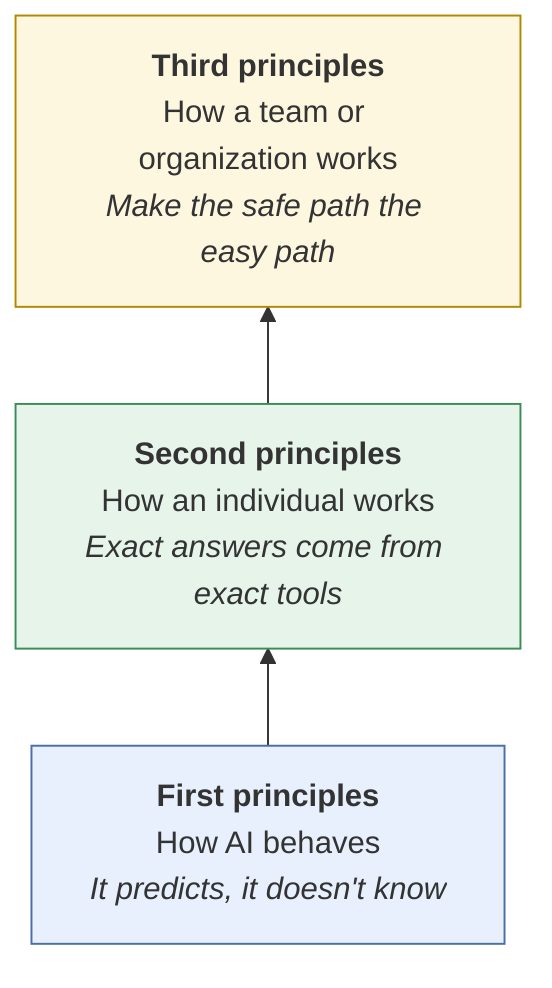
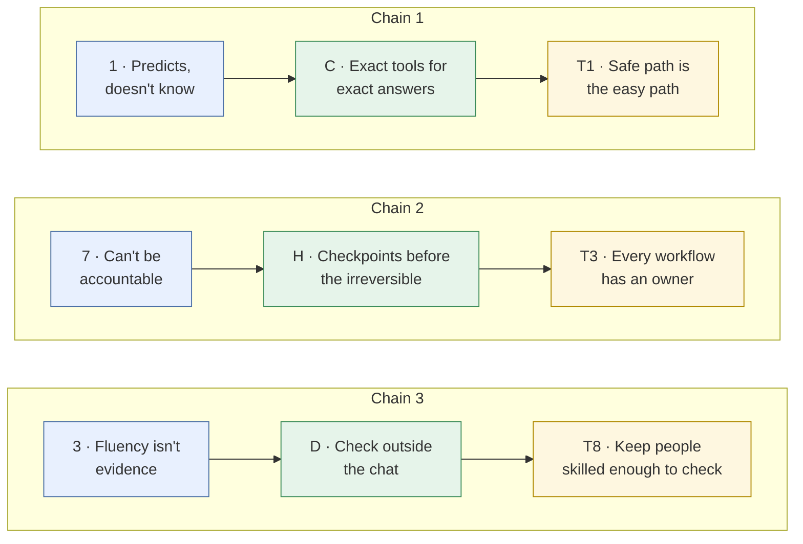
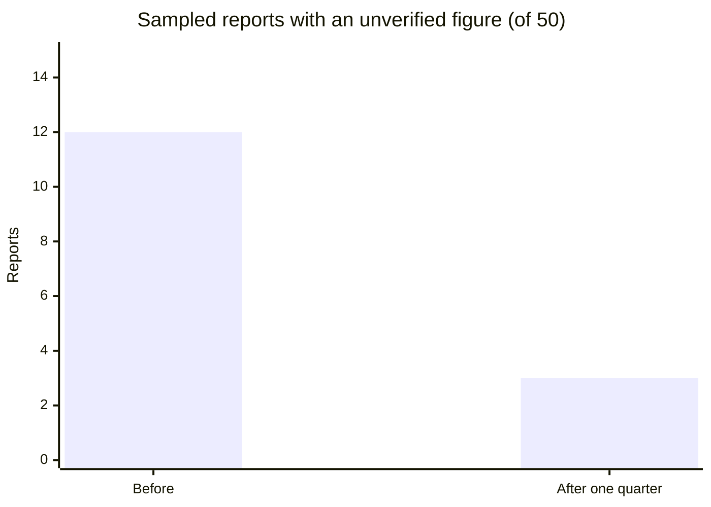

# Third principles of AI
{: .no_toc }

Ten principles for teams, courses, and organizations: how to set things up so that good AI habits hold for everyone, not just the most careful person in the room.
{: .fs-6 .fw-300 }

  
On this page

  {: .text-delta }
1. TOC
{:toc}

## Scenario

The 40-person finance team at **Lakeshore Logistics** (fictional) rolled out an AI assistant six months ago. Leadership is pleased: **90% of staff use it weekly.** Then an internal audit samples 50 AI-assisted reports and finds that **12 of them (24%)** contain at least one figure nobody verified. Two of those figures were wrong and reached the executive team.

Everyone on the team had been trained on good habits. Most of them meant to follow them. But under deadline pressure, with nothing in the process requiring them, the habits slipped.

## Why it matters

The [first principles]() describe how AI behaves. The [second principles]() describe how a careful individual should work with it. But individual care doesn't scale on its own. People get busy, new people join, tools change, and nobody notices that the checks have stopped happening.

Third principles are about the **system around the people**: the defaults, ownership, measures, and culture that make the second principles the normal way of working. They're written for anyone who shapes how a group works, such as managers, team leads, program directors, and instructors running a course or a teaching team.

## Key ideas

### Three levels, each built on the one below

### The ten third principles

| # | Third principle | Derived from second principles | In practice |
|:--|:--|:--|:--|
| T1 | **Make the safe path the easy path.** Approved tools, templates with checks built in, and clear defaults, so that doing it right takes no extra effort. | B · Provide, don't describe; G · Classify before you paste; H · Checkpoints | A shared template where metrics come from the spreadsheet and AI writes only the narrative |
| T2 | **Set data rules before rolling out tools.** Decide which data classes may go into which tools before anyone starts. | G · Classify before you paste | A one-page data-to-tool table, published with the tool |
| T3 | **Give every AI workflow a named owner.** One person is accountable for how it works and what it produces. | H · Checkpoints; J · Named owner | A register listing each workflow, its owner, and its checkpoints |
| T4 | **Match oversight to stakes.** Group uses into risk tiers, and set the review level for each tier. | A · Verify by stakes; H · Checkpoints | Tier 1 (brainstorming): no review. Tier 3 (external or financial): human approval. |
| T5 | **Standardize methods, not tools.** Write workflows as plain-language specs that would work in any tool. | B · Provide, don't describe; C · Exact tools; I · Pilot and measure | A research-to-brief spec that survives a change of vendor |
| T6 | **Measure outcomes, not usage.** Track error rates and time saved (including review), not how many people use AI. | I · Pilot and measure; A · Verify by stakes | A quarterly sample audit, instead of a "weekly active users" dashboard |
| T7 | **Re-check on a schedule.** Tools, models, and terms change, so re-test workflows regularly and after major updates. | I · Pilot and measure; F · Date-check | A test set re-run every quarter |
| T8 | **Keep people skilled enough to check.** You can't verify what you can no longer do yourself. Practice and assess the core skills without AI. | A · Verify by stakes; D · Check outside the chat | Quarterly no-AI practice on core calculations, and no-AI assessments of core skills in courses |
| T9 | **Disclose by default.** Make disclosure routine and blame-free, so it never feels like a confession. | J · Visible role, named owner | A standard one-line disclosure in every report template |
| T10 | **Share caught errors openly.** Treat a caught AI error as a win for the process, and learn from it as a group. | A · Verify by stakes; D · Check outside the chat; E · Neutral questions | A shared "caught it" log, reviewed monthly |

### How the three levels connect

Here are three complete chains, from how AI behaves to how a team works:

Blue boxes are first principles, green are second, and yellow are third. Every third principle in the table traces back the same way. A team rule that can't be traced back, such as "everyone must use AI daily", is a mandate, not a principle, and it's worth questioning.

### The one that's easiest to miss: T8

AI makes it tempting to stop practicing the skills it automates. But every verification habit in this guide, such as recomputing a break-even point or checking a growth rate, depends on people who can still do the work themselves. If a team or a class loses that ability, its checks stop working, and nobody notices. For educators this is the strongest case for keeping some assessments AI-free (see [Writing a course AI policy]()). For managers, it's the case for occasional no-AI practice on core skills.

## Worked example

Lakeshore's finance lead applies the third principles over one quarter:

| Third principle | What Lakeshore changed |
|:--|:--|
| T1 · Safe path | New report template: figures link to the spreadsheet, and AI drafts only the narrative |
| T2 · Data rules first | Published which data classes go into the approved tool, and none into personal accounts |
| T3 · Named owners | Each recurring report now has an owner who signs off on its AI-assisted parts |
| T4 · Oversight by stakes | Three tiers. Executive and external reports need a second reviewer. |
| T5 · Methods, not tools | Wrote the monthly-recap method as a one-page spec |
| T6 · Outcomes, not usage | Dropped the "weekly users" metric, and started a 50-report sample audit each quarter |
| T7 · Scheduled re-checks | The template and spec are re-tested every quarter, and after any tool update |
| T8 · Keep skills | A 30-minute monthly no-AI practice on variance calculations |
| T9 · Disclose by default | A standard disclosure line in every report |
| T10 · Share caught errors | A "caught it" log, with errors reviewed as a team every month |

**Result at the next audit:** 3 of 50 sampled reports (6%) had an unverified figure, down from 12 of 50 (24%). Weekly AI use stayed about the same. The team didn't use AI less. It used AI inside a better system.

A caution about this example: it's a single team over one quarter, with no comparison group, so other changes during the quarter could have contributed. That's why T6 and T7 call for measuring *continuously*, not just once.

## Verify checklist

Use this as a **third-principles check** for a team, course, or organization:

- [ ] **T1:** Is the approved, checked way of working also the easiest way?
- [ ] **T2:** Were data rules published before or with the tools?
- [ ] **T3:** Does every recurring AI workflow have a named owner?
- [ ] **T4:** Are uses grouped by risk, with review levels set for each tier?
- [ ] **T5:** Are key methods written as specs that would survive a change of tool?
- [ ] **T6:** Do we measure error rates and real time saved, not just usage?
- [ ] **T7:** Is there a schedule for re-testing workflows and re-reading tool terms?
- [ ] **T8:** Do people still practice, and get assessed on, the core skills without AI?
- [ ] **T9:** Is disclosure routine, built into templates, and free of blame?
- [ ] **T10:** Do caught errors get shared and learned from?

## Common failure modes

| Failure | What it looks like | How to catch it |
|:--|:--|:--|
| **Training without systems** | Everyone attends a workshop, then the process is unchanged | Ask what *defaults* changed after the training (T1). |
| **Usage as success** | "Adoption is 90%!" in the leadership update | Report audited error rates and net time saved instead (T6). |
| **Policy without owners** | A long AI policy that nobody is responsible for applying | Name an owner for each workflow (T3). |
| **One-size oversight** | Every use needs approval, so people route around the process | Group uses into tiers, and keep low-risk uses easy (T4). |
| **Quiet deskilling** | Nobody on the team can do the calculation without AI anymore | Schedule no-AI practice, and keep core assessments AI-free (T8). |
| **Blame culture** | Errors get hidden because admitting AI use feels risky | Make disclosure routine and celebrate caught errors (T9, T10). |
| **Set and forget** | Last year's approved workflow, running on this year's model and terms | Re-test on a schedule (T7). |

## Disclose and decide notes

**Disclose:** At the team or organization level, disclosure means publishing how AI is used and governed: the tiers, the owners, the data rules, and the audit results. People inside and outside the team can then judge whether the system deserves their trust.

**Decide:** Third principles shape the system, but people still make the calls inside it. Leaders decide the tiers, the trade-offs, and what to do when an audit goes badly. That accountability can't be delegated to the system any more than it can to the tool.

## For educators: turn this into a challenge

Give teams a short case: a fictional organization or teaching team that adopted AI quickly and now has a problem, such as unverified figures, a privacy incident, or learners who can't do core calculations without AI. Teams diagnose which third principles were missing, trace each one back to its second and first principles, and propose a one-quarter plan with one measurable outcome. Debrief: *Which missing principle caused the most damage? Which fix is cheapest? How would you know in three months whether it worked?* See [Designing an AI-fluency challenge]().
