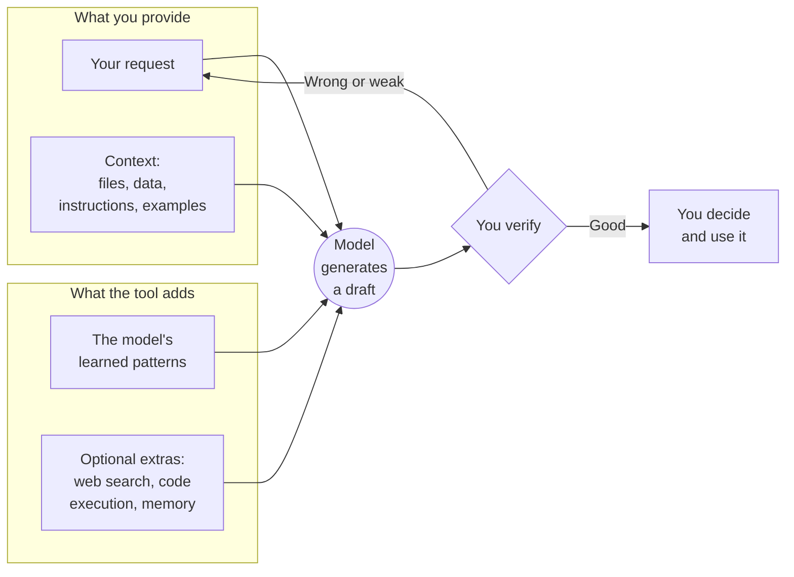
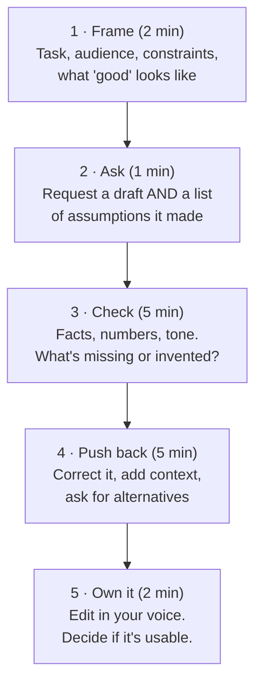

# What is AI? A quick start
{: .no_toc }

Everything you need to know to start using AI on real work today, in about 10 minutes.
{: .fs-6 .fw-300 }

<details open markdown="block">
  <summary>On this page</summary>
  {: .text-delta }
1. TOC
{:toc}
</details>

## The short version

"AI" is a broad term. It covers everything from spam filters to self-driving cars. This guide is about **generative AI**, and specifically **large language models (LLMs)**: the systems behind chat assistants that write, summarize, analyze, and answer questions in plain language.

An LLM learned patterns from a very large amount of text. When you give it a message, it produces a response one small piece (a *token*) at a time, each time predicting what is most likely to come next given everything so far. That is why it is so fluent. It is also why it can be **fluently wrong**: it produces what *sounds* right, and that isn't always what *is* right.

A useful mental model:

> **AI is a fast, widely read assistant who has never met your company, can't see anything you don't show it, and will sometimes state a guess as if it were a fact.**

Treat it that way and most things in this guide follow: give it context, check its work, say you used it, and make the final call yourself.

## What happens when you ask an AI a question



Two points follow from this diagram:

1. **The model only knows what it learned plus what you give it.** It doesn't know your company's numbers, your professor's expectations, or last week's news, unless you provide them or the tool searches for them.
2. **The draft is the start, not the end.** The loop back from "You verify" is where most of the value, and most of the skill, lives.

## What AI is good at, and what it's bad at

| Usually good at | Often bad at |
|:--|:--|
| First drafts of emails, memos, outlines, announcements | Exact arithmetic done "in its head" (ask it to use a spreadsheet or code instead) |
| Summarizing and restructuring text you provide | Facts it wasn't given: it may invent plausible-looking numbers, quotes, or citations |
| Explaining a concept several ways, at different levels | Recent events, unless the tool searches the web |
| Brainstorming options, objections, and questions | Knowing your context: your company, your customers, your policies |
| Turning messy notes into a table or checklist | Judgment calls that need accountability, empathy, or ethics |
| Writing formulas, simple code, and spreadsheet logic | Telling you when it's unsure (it rarely volunteers this) |

## Five terms worth knowing

**Prompt**
: What you type. A good prompt includes the task, the context, the audience, the constraints, and the format you want.

**Context window**
: How much text the model can consider at once: your prompt, any files, and the conversation so far. Long conversations can push early details out, or dilute them.

**Hallucination**
: A confident, plausible, false output: a made-up statistic, citation, or quote. It's the most important failure to watch for. See [How LLMs fail]().

**Grounding**
: Tying the model's answer to specific sources you provide ("answer only from these three reports, and cite the page"). Grounding reduces hallucination but doesn't eliminate it.

**Agent**
: An AI setup that takes several steps on its own, such as searching, reading, writing, and calling tools, toward a goal. More power, and more to check. See [Workflows & Agents]().

## Your first 15 minutes

Pick a **real but low-stakes** task: an email you've been putting off, notes you need to turn into a summary, or a concept from class you half-understand. Then run this loop once.



Here is a starter prompt you can adapt:

```text
I need to [TASK, e.g. write a two-paragraph email to a client explaining a
one-week project delay].

Context: [WHO YOU ARE, WHO IT'S FOR, WHAT THEY ALREADY KNOW, KEY FACTS].
Constraints: [LENGTH, TONE, ANYTHING TO AVOID].

Please give me:
1. A draft.
2. A short list of any assumptions you made or facts you weren't sure about.
3. One question you'd ask me to make this better.
```

The second and third requests are the habit that matters. They make the tool show you where to look.

## Three rules before you start

{: .warning }
> 1. **Don't paste in anything you wouldn't post publicly** (customer data, student records, grades, passwords, unreleased financials) unless your organization has approved that tool for that data. See [Data classification]().
> 2. **Check anything that matters.** Numbers, names, dates, quotes, and citations are the usual suspects.
> 3. **Follow your course or company policy on disclosure.** If you're not sure whether AI use is allowed, ask before, not after.

## Where to go next

- [Should you use AI here?](): decide when AI helps, when plain automation is better, and when a human has to own it.
- [The rubric: Use · Verify · Disclose · Decide](): the four habits the rest of the guide is built on.
- [Break-even analysis](): a complete worked example, including the mistakes AI tends to make.
