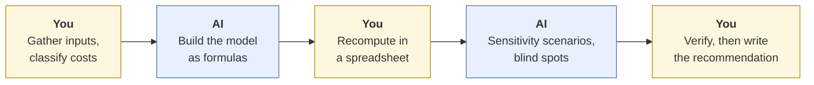
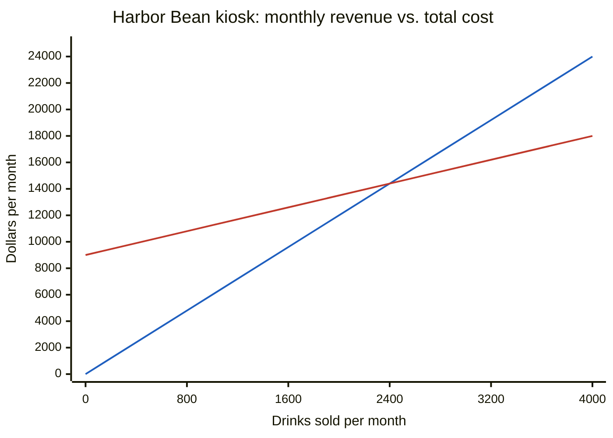
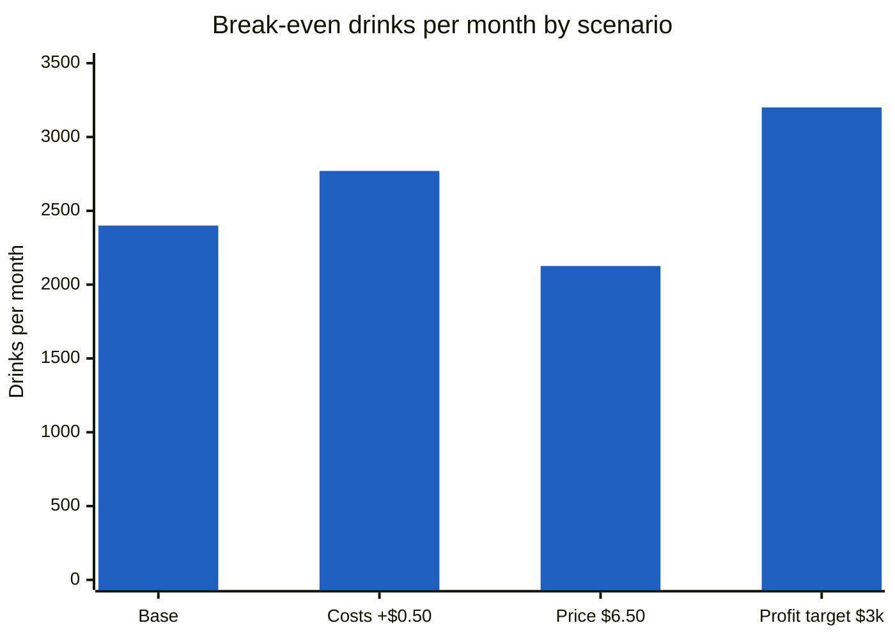

# Break-even analysis
{: .no_toc }

Use AI to set up, stress-test, and explain a break-even analysis, while you keep control of the numbers and the recommendation.
{: .fs-6 .fw-300 }

<details open markdown="block">
  <summary>On this page</summary>
  {: .text-delta }
1. TOC
{:toc}
</details>

## Scenario

**Harbor Bean Co.** (fictional) runs a coffee kiosk and is deciding whether to open a second one inside an office building. The owner asks you for a one-page memo by Friday: *How many drinks a month does the new kiosk need to sell to break even, and how sensitive is that number to prices and costs?*

You have these monthly estimates for the new kiosk:

| Item | Amount | Type |
|:--|--:|:--|
| Rent | $2,400 / month | Fixed |
| Staff wages | $6,000 / month | Fixed |
| Insurance and software | $600 / month | Fixed |
| Average price per drink | $6.00 | — |
| Ingredients (coffee, milk, syrup) | $1.62 / drink | Variable |
| Cup, lid, and sleeve | $0.45 / drink | Variable |
| Card processing fee | 3% of price | Variable |

The landlord expects about **2,800 drinks a month** based on building foot traffic. The kiosk would be open **26 days a month**.

## Why it matters

Break-even is often the first number a decision-maker asks for, and it is easy to get subtly wrong. A mistake here can mean signing a lease on a location that can't pay for itself, or passing on one that could. The arithmetic is simple. What causes most errors is the setup: which costs are fixed and which are variable, which period you're using, and how you round.

## AI-assisted approach



1. **Classify the costs yourself first (Use).** Decide which costs are fixed and which vary per drink. This is the judgment step, so don't delegate it. Note that the card fee is a *percentage of price*. That will matter later.
2. **Ask AI to set up the model as formulas, not answers (Use).** Have it show the formula for every figure and list its assumptions. Ask for spreadsheet formulas you can paste, rather than numbers it computed.
3. **Recompute the core numbers yourself (Verify).** Build the calculation in a spreadsheet. The core math:

   - Variable cost per drink = $1.62 + $0.45 + (3% × $6.00) = $1.62 + $0.45 + $0.18 = **$2.25**
   - Contribution margin per drink = $6.00 − $2.25 = **$3.75**
   - Monthly fixed costs = $2,400 + $6,000 + $600 = **$9,000**
   - **Break-even volume** = $9,000 ÷ $3.75 = **2,400 drinks per month**
   - **Break-even revenue** = 2,400 × $6.00 = **$14,400 per month**. As a cross-check, the contribution margin ratio is $3.75 ÷ $6.00 = 62.5%, and $9,000 ÷ 0.625 = $14,400. ✓
   - Per day: 2,400 ÷ 26 = 92.3, so **93 drinks a day** (always round break-even *up*: 92 drinks a day would leave you short)

4. **Use AI to stress-test (Use).** Ask for sensitivity scenarios and the questions a skeptical owner would ask. AI is good at coming up with "what if" questions. You still check every number it produces.
5. **Verify the scenarios (Verify).** Recompute each one. This is where the most instructive error in this example shows up (see [Common failure modes](#common-failure-modes)).
6. **Write the recommendation yourself (Decide).** The memo's conclusion (open, don't open, or negotiate the rent) is yours.

### The picture

The break-even point is where the revenue line crosses the total-cost line. In this chart, the steeper **blue** line is **revenue** ($6.00 × drinks) and the flatter **red** line is **total cost** ($9,000 + $2.25 × drinks). They meet at 2,400 drinks and $14,400.



| Drinks / month | Revenue | Total cost | Profit (loss) |
|--:|--:|--:|--:|
| 0 | $0 | $9,000 | ($9,000) |
| 800 | $4,800 | $10,800 | ($6,000) |
| 1,600 | $9,600 | $12,600 | ($3,000) |
| **2,400** | **$14,400** | **$14,400** | **$0** |
| 2,800 (expected) | $16,800 | $15,300 | $1,500 |
| 3,200 | $19,200 | $16,200 | $3,000 |
| 4,000 | $24,000 | $18,000 | $6,000 |

### Margin of safety

At the landlord's estimate of 2,800 drinks, the kiosk is 400 drinks above break-even.

- Margin of safety = (2,800 − 2,400) ÷ 2,800 = 400 ÷ 2,800 = **14.3%**
- In dollars: $16,800 − $14,400 = **$2,400**

In plain terms, if sales come in more than about 14% below the landlord's estimate, the kiosk loses money. Whether that is comfortable depends on how much you trust a landlord's foot-traffic estimate. That is a judgment call, and it belongs to you.

### Sensitivity scenarios

| Scenario | Variable cost | Contribution margin | Break-even drinks / month |
|:--|--:|--:|--:|
| Base case | $2.25 | $3.75 | **2,400** |
| Milk and coffee up $0.50 per drink | $2.75 | $3.25 | 2,769.2 → **2,770** |
| Price raised to $6.50 (fee rises too) | $2.265 | $4.235 | 2,125.1 → **2,126** |
| Target $3,000 monthly profit (base costs) | $2.25 | $3.75 | ($9,000 + $3,000) ÷ $3.75 = **3,200** |



Notice that a $0.50 cost increase moves break-even up by 370 drinks, which is more than 90% of the 400-drink margin of safety. That is the insight worth putting in the memo.

## Prompt template

```text
I'm preparing a break-even analysis for [BUSINESS / DECISION].
Audience: [WHO WILL READ IT]. They need: [THE DECISION IT FEEDS].

Here are my inputs. I've already classified each cost as fixed or variable:
[PASTE TABLE: item, amount, fixed/variable, period]

Please:
1. Set up the break-even model. Show every formula symbolically first
   (e.g., BE units = Fixed costs / (Price − Variable cost per unit)),
   then as spreadsheet formulas I can paste, referencing cells A1, B1, etc.
2. List every assumption you are making, including about time periods,
   rounding, and whether any cost depends on price.
3. Propose 4 sensitivity scenarios a skeptical owner would ask about,
   and show how each input change flows through the formulas.
4. Tell me which of my inputs you would double-check first, and why.

Do not round intermediate values. Round break-even units UP to the next
whole unit. If anything in my inputs is ambiguous, ask before calculating.
```

**Adapting it:** For a product business, change "drinks" to units. For a service business, the "unit" might be a billable hour or a client. Decide that before prompting, because it changes which costs are variable.

## Verify checklist

- [ ] Every cost is classified as fixed or variable, and **I** made that call, not the AI.
- [ ] All costs are in the **same period** (all monthly, or all annual).
- [ ] Costs that depend on price (card fees, commissions, royalties) were recalculated when the price changed.
- [ ] I recomputed break-even units and revenue in a spreadsheet, and they match.
- [ ] Break-even units are rounded **up**, not to the nearest whole number.
- [ ] Break-even revenue cross-checks: units × price = fixed costs ÷ contribution margin ratio.
- [ ] Every scenario number was recomputed, not copied from the AI.
- [ ] Any benchmark or industry figure the AI mentioned has a real source I opened, or it's been removed.

## Common failure modes

| Failure | What it looks like | How to catch it |
|:--|:--|:--|
| **Price-linked cost held constant** | AI raises the price to $6.50 but keeps variable cost at $2.25, giving 9,000 ÷ 4.25 = 2,117.6 → 2,118. The card fee rose to 3% × $6.50 = $0.195, so the correct answer is **2,126**. | Ask: "Which costs change when the price changes?" Recompute from the component costs. |
| **Wrong rounding** | "Break-even is 2,769 drinks" (rounded down from 2,769.2). At 2,769 drinks the kiosk still loses a little money. | Always round break-even units up. |
| **Mixed periods** | Annual fixed costs ($108,000) divided by a per-drink margin gives 28,800, which gets reported as a monthly target. | Label every number with its period. Sanity-check against daily volume: 28,800 ÷ 26 is over 1,100 drinks a day at a kiosk. |
| **Semi-variable cost misfiled** | Hourly staff treated as purely variable, or a card fee treated as fixed | Decide classifications yourself before prompting, and state them in the prompt. |
| **Invented benchmarks** | "Coffee kiosks typically achieve 70% gross margins (Industry Report, 2023)." | Treat any statistic you didn't provide as unverified until you find and open the source. |
| **Mental-math slips** | A plausible-looking figure that's off by a few percent | Never use a model's arithmetic for the final numbers. Use a spreadsheet, or ask the tool to run code and show it. |

## Disclose and decide notes

**Disclose:** A good disclosure for this task:

> *AI use: I used a chat assistant to generate spreadsheet formulas and suggest sensitivity scenarios. I classified all costs myself and recomputed every figure in a spreadsheet. I corrected one AI error: it held variable cost constant when the price changed, which ignored the percentage-based card fee. The recommendation is my own.*

**Decide:** The AI can tell you break-even is 2,400 drinks. It can't tell you whether a 14% margin of safety is enough, whether the landlord's estimate is credible, or whether to negotiate the rent down instead. Those calls, and the recommendation in the memo, are yours.

## For educators: turn this into a challenge

- **Setup:** Give students the Harbor Bean inputs (or your own) and allow any AI tool. Time: 45 minutes in class, or as a short homework task.
- **Deliverables:** A one-page memo, the spreadsheet, and a short AI log: prompts used, what was checked, and what was corrected.
- **Planted twist:** Ask for the $6.50 price scenario. Most unverified AI answers will miss the card-fee change and report 2,118. Students who verify will find 2,126.
- **Debrief questions:** Who got 2,118, and why? Which costs in *your* industry are secretly tied to price? What margin of safety would make you comfortable, and why?
- **Assessment:** Use the [rubric]() and weight Verify and Decide most heavily. See [Designing an AI-fluency challenge]().
