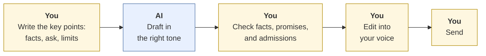
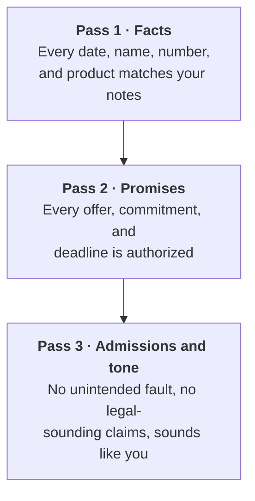

# Business writing
{: .no_toc }

Use AI to draft emails and memos faster, without sending invented facts, accidental promises, or someone else's voice.
{: .fs-6 .fw-300 }

<details open markdown="block">
  <summary>On this page</summary>
  {: .text-delta }
1. TOC
{:toc}
</details>

## Scenario

You're an account coordinator at **Summit Print Co.** (fictional). A client's order of 2,000 event brochures will arrive **two days late**: Thursday instead of Tuesday, because a paper shipment was delayed. The client's event is Saturday. You need to email them in the next hour.

You ask an AI tool to "write an email to a client about a delayed order." The draft is polished and polite. It also says *"we will of course refund your shipping costs"*, an offer your manager never approved, and *"this was due to an unforeseen error on our part"*, which isn't true and could matter if there's ever a dispute.

## Why it matters

Business writing is where AI saves the most time and creates some of the most avoidable risk. Once an email is sent, it's on the record. AI drafts can:

- **Invent facts:** dates, names, amounts.
- **Make commitments** you aren't authorized to make: refunds, discounts, deadlines.
- **Admit fault**, or use legal-sounding language you didn't intend.
- **Sound like a template**, which readers notice, and which erodes trust.

## AI-assisted approach



1. **Write the key points yourself first (Use).** The facts, what you're asking for or offering, and what you *can't* say. This takes 2 minutes and prevents most problems.
2. **Have AI draft for tone and structure (Use).** That's what it's good at: clear, well-organized, appropriately warm.
3. **Check every fact, promise, and admission (Verify).** Use the three-pass check below.
4. **Edit into your voice (Decide).** Cut phrases you'd never say. Readers can tell.
5. **You press Send.** Never let a tool send business email without your review.

### The three-pass check



### The example, fixed

Your key points:

- Order: 2,000 brochures, order #4471.
- New delivery: Thursday by noon (was Tuesday). Event is Saturday.
- Cause: the paper supplier's shipment was delayed. Not our error, but no need to blame anyone.
- Offer: free upgrade to express delivery on Thursday (approved by your manager). **No refunds.**
- Ask: confirm Thursday works, or call if not.

The email after the three-pass check:

> **Subject:** Order #4471 — new delivery Thursday by noon
>
> Hi Maria,
>
> I wanted to let you know right away that your 2,000 brochures (order #4471) will arrive **Thursday by noon** instead of Tuesday. A paper shipment to our shop was delayed.
>
> That still gives you two full days before Saturday's event. We've upgraded you to express delivery at no charge to make sure Thursday holds.
>
> Could you confirm Thursday works for you? If it doesn't, call me at 555-0142 and we'll work out a plan.
>
> Thanks for your patience,
> [Your name]

The unauthorized refund and the false admission of fault are gone. The date and order number match your notes. The body is about 80 words, so it's short enough to read on a phone.

## Prompt template

```text
Draft a [EMAIL / MEMO] to [RECIPIENT AND RELATIONSHIP].

Key points (use ONLY these facts):
- [FACT 1]
- [FACT 2]
What I'm offering: [OFFER, or "nothing beyond the facts"].
What I'm asking: [ASK].
Do NOT: [e.g., offer refunds or discounts, admit fault, guess at dates,
mention [TOPIC]].

Tone: [e.g., warm, direct, professional]. Length: under [N] words.
Subject line: specific, with the key fact.

After the draft, list every factual claim and every commitment you included,
so I can check them.
```

The last line turns Pass 1 and Pass 2 into a quick checklist.

## Verify checklist

- [ ] I wrote the key points before prompting.
- [ ] Every date, name, number, and order or account detail matches my notes.
- [ ] Every offer and commitment is one I'm authorized to make.
- [ ] Nothing admits fault or makes legal-sounding claims I didn't intend.
- [ ] Recipient names and titles are correct.
- [ ] It sounds like me, and I deleted phrases I'd never use.
- [ ] I reviewed the final version myself before sending.

## Common failure modes

| Failure | What it looks like | How to catch it |
|:--|:--|:--|
| **Unauthorized promises** | "We'll refund...", "We guarantee...", "By Friday at the latest..." | Pass 2. State in the prompt what you can't offer. |
| **Invented details** | A wrong date, a made-up order number, a placeholder like [Client Name] left in | Pass 1, against your notes. Search for brackets before sending. |
| **Accidental admissions** | "Due to an error on our part..." | Pass 3. Describe the cause factually. |
| **Over-apologizing** | Three apologies in four sentences | Edit down to one, or none if the situation doesn't call for it. |
| **Template voice** | "I hope this email finds you well" in every message | Cut it. Write the first line yourself. |
| **Too long** | 300 words for a one-fact update | Set a word limit, and put the key fact in the subject line. |

## Disclose and decide notes

**Disclose:** Routine business email usually doesn't carry an AI disclosure, but your organization may have a policy, especially for client-facing or regulated communication. Follow it. For coursework, follow your course policy, for example: *"I drafted key points, used AI for an initial draft, and edited the final version."*

**Decide:** What to offer, what to admit, and what tone to take with a client are judgment calls about the relationship. They're yours, and so is the Send button.

## For educators: turn this into a challenge

Give learners a tense business situation (a delay, a price increase, a declined request) with a facts sheet that includes one **limit**, such as "no refunds are authorized." They prompt any AI tool, then submit the raw draft, their marked-up three-pass check, and the final email. Most raw drafts will offer something unauthorized or blur the facts. Debrief: *What did the AI add that you didn't give it? Which would have caused the most trouble if you'd sent it?* See [Designing an AI-fluency challenge]().
