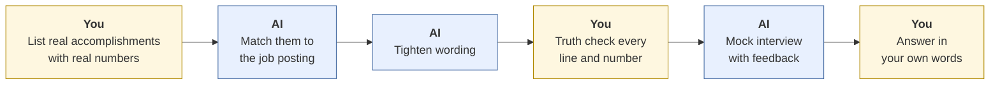
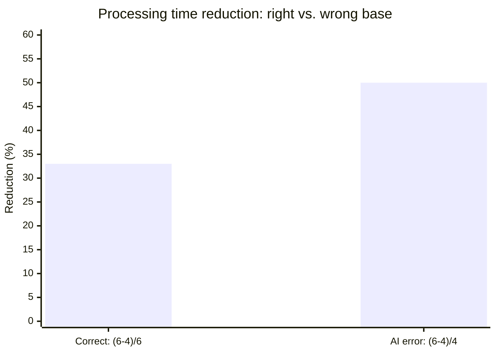

# Career prep: résumés, cover letters, and interviews
{: .no_toc }

Use AI to tailor applications and practice interviews, without inventing accomplishments or sounding like every other applicant.
{: .fs-6 .fw-300 }

<details open markdown="block">
  <summary>On this page</summary>
  {: .text-delta }
1. TOC
{:toc}
</details>

## Scenario

Jordan is applying for an operations analyst role at **Harborview Advisory** (fictional). They paste their résumé and the job posting into an AI tool and ask it to "make my résumé stronger." The result is polished. It also says Jordan *"led a cross-functional team of 12"* (Jordan coordinated with three people), *"cut processing time by 50%"* (it went from 6 days to 4), and uses the posting's exact phrases so heavily it reads like an echo.

## Why it matters

Applications are claims made under your name. An invented accomplishment can cost you the job in the interview, or later, if it surfaces after you're hired. AI is good at tailoring, tightening, and practicing, but it treats your experience as raw material and will happily improve it beyond the truth. Employers are also increasingly alert to applications that all sound the same.

## AI-assisted approach



1. **Write a "facts file" first (Use).** For each role: what you did, for whom, the results, with real numbers, and who could confirm it. This is your source of truth.
2. **Match to the posting (Use).** Ask AI which of your real accomplishments best fit the job's requirements, and what's missing.
3. **Tighten the wording (Use).** Ask for stronger verbs and shorter lines, using only the facts file.
4. **Truth check every line (Verify).** Use the three checks below.
5. **Practice interviews (Use).** Have AI play the interviewer, one question at a time, with feedback.
6. **Answer in your own words (Decide).** In the interview it's just you.

### The three truth checks

| Check | Ask yourself | Jordan's example |
|:--|:--|:--|
| **Scope** | Did I really do this, at this scale? | "Led a team of 12" becomes "Coordinated with 3 teammates across two departments" |
| **Numbers** | Is the math right, from real figures? | 6 days to 4 days is (6 − 4) ÷ 6 = **33%** faster, not 50%. 50% is (6 − 4) ÷ 4, the wrong base. |
| **Voice** | Could I say this sentence out loud in an interview? | Cut the copied posting phrases. Keep one or two key terms. |



Percentage change is always measured against the **starting** value.

## Prompt template

**Tailoring**

```text
Here is my facts file — everything in it is true and verifiable: [PASTE].
Here is the job posting: [PASTE].

1. Which 4–5 accomplishments from my facts file best match this role? Why?
2. What does the posting ask for that my facts file doesn't show? (Don't
   invent anything to fill gaps — just list them.)
3. Rewrite those 4–5 accomplishments as résumé bullets: strong verb, what I
   did, measurable result. Use ONLY facts and numbers from my file. Don't
   increase scope, titles, team sizes, or results.
```

**Mock interview**

```text
Act as an interviewer for [ROLE] at a company like [DESCRIPTION].
Ask me one question at a time — a mix of behavioral, technical, and
"why this role" questions. After each answer, give brief feedback: what was
strong, what was vague, and one follow-up question a real interviewer might
ask. Don't write answers for me.
```

## Verify checklist

- [ ] Every bullet traces to my facts file.
- [ ] No inflated scope, titles, team sizes, or results.
- [ ] Every percentage uses the starting value as its base.
- [ ] I can tell the story behind every bullet in an interview.
- [ ] Wording sounds like me, with only a few posting keywords.
- [ ] I didn't paste anyone else's personal information (references' contacts, colleagues' details).
- [ ] I checked whether the employer has stated rules about AI use in applications or assessments.

## Common failure modes

| Failure | What it looks like | How to catch it |
|:--|:--|:--|
| **Scope inflation** | "Led," "managed," "spearheaded" for supporting roles | The scope check. Would your former manager agree? |
| **Wrong-base percentages** | 6 days to 4 days reported as "50% faster" | Change ÷ *starting* value. |
| **Keyword stuffing** | Bullets that copy the posting word for word | Use keywords naturally, a few times. |
| **Same-as-everyone letters** | "I am excited to leverage my passion..." | Write the first and last paragraphs yourself. |
| **Rehearsed AI answers** | Memorized AI-written answers that crack under follow-up questions | Practice with your own answers, and use AI for feedback only. |
| **Undisclosed AI in assessments** | Using AI in a take-home test where it's not allowed | Read the instructions. Ask if unsure. |

## Disclose and decide notes

**Disclose:** Résumés and cover letters don't usually carry AI disclosures, but you must follow any employer instructions about AI in applications, tests, or take-home assignments. Being honest if asked is part of the job.

**Decide:** Which accomplishments to lead with, what to leave out, and how to present yourself are your decisions. AI can suggest options. Only you know what's true and what matters to you.

## For educators: turn this into a challenge

Learners bring their own résumé and a real posting. They use the tailoring prompt, then swap with a partner who runs the three truth checks on the AI-revised bullets *against the original facts file*. **Planted twist:** give everyone one before-and-after metric to convert into a percentage. Debrief: *How often did the AI inflate scope? Who caught a wrong-base percentage?* See [Designing an AI-fluency challenge]().
