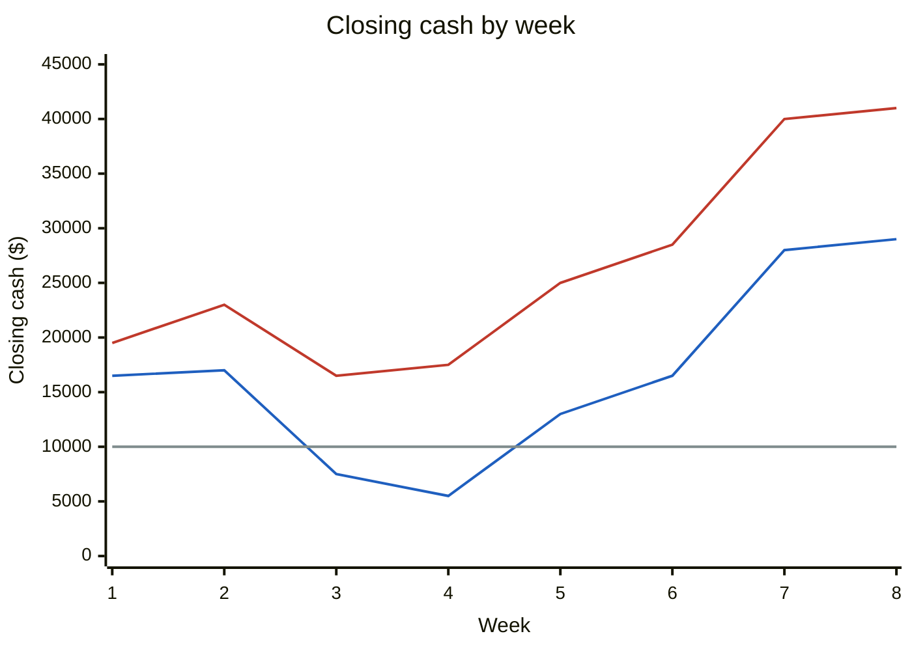

# Cash-flow analysis
{: .no_toc }

Use AI to build and stress-test a short-term cash-flow forecast, and catch the timing errors it tends to make.
{: .fs-6 .fw-300 }

<details open markdown="block">
  <summary>On this page</summary>
  {: .text-delta }
1. TOC
{:toc}
</details>

## Scenario

**Summit Print Co.** (fictional), a small commercial print shop, wants to buy an $18,000 printer three weeks from now. The owner asks you: *Can we afford it then without dropping below our $10,000 minimum cash balance?*

Here is what you know for the next 8 weeks:

| Item | Amount | Timing |
|:--|--:|:--|
| Opening cash | $12,000 | Start of week 1 |
| Sales invoiced | $15,000 / week | Every week (up from $12,000 / week last month) |
| Customer payment terms | 30 days | Cash arrives about **4 weeks after invoicing** |
| Payroll | $8,000 | Every 2 weeks (weeks 2, 4, 6, 8) |
| Rent | $4,000 | Weeks 1 and 5 |
| Supplies | $3,500 / week | Every week, paid on delivery |
| Loan payment | $2,500 | Weeks 4 and 8 |
| Printer | $18,000 | Week 3 (proposed) |
| Minimum cash policy | $10,000 | Any week |

## Why it matters

Profitable businesses still fail when they run out of cash. A profit forecast tells you whether the business makes money. A **cash-flow** forecast tells you whether you can pay the bills *this week*. The key question is timing: when cash actually arrives and leaves. That's exactly where AI tools often slip, because they treat sales as cash, or spread costs evenly when they're actually lumpy.

## AI-assisted approach


1. **List every cash movement with its timing (Use).** The critical judgment here: invoiced sales aren't cash yet. With 30-day terms, this month's collections come from *last* month's invoices, which were $12,000 a week.
2. **Have AI build the model as spreadsheet formulas (Use).** Ask for one row per item, one column per week, and formulas you can check.
3. **Check timing and totals (Verify).** Does each collection line up with the invoice from 4 weeks earlier? Does the closing balance reconcile with opening cash, plus total inflows, minus total outflows?
4. **Run scenarios (Use).** AI is good at suggesting realistic stress tests. Recompute each one yourself.
5. **Make the call (Decide).** Buy, delay, or borrow, and explain why.

### The forecast

| Week | Opening | Cash in | Cash out | Net | Closing |
|--:|--:|--:|--:|--:|--:|
| 1 | $12,000 | $12,000 | $7,500 | +$4,500 | $16,500 |
| 2 | $16,500 | $12,000 | $11,500 | +$500 | $17,000 |
| 3 | $17,000 | $12,000 | **$21,500** | −$9,500 | **$7,500** ⚠️ |
| 4 | $7,500 | $12,000 | $14,000 | −$2,000 | **$5,500** ⚠️ |
| 5 | $5,500 | $15,000 | $7,500 | +$7,500 | $13,000 |
| 6 | $13,000 | $15,000 | $11,500 | +$3,500 | $16,500 |
| 7 | $16,500 | $15,000 | $3,500 | +$11,500 | $28,000 |
| 8 | $28,000 | $15,000 | $14,000 | +$1,000 | $29,000 |

Cash out per week: week 1 = rent $4,000 + supplies $3,500. Week 2 = payroll $8,000 + supplies $3,500. Week 3 = supplies $3,500 + printer $18,000. Week 4 = payroll $8,000 + supplies $3,500 + loan $2,500.

**Reconciliation:** $12,000 opening + $108,000 total in − $91,000 total out = **$29,000**, which matches the week 8 closing balance. ✓

**Finding:** Buying the printer in week 3 pushes cash below the $10,000 minimum in weeks 3 and 4. The low point is **$5,500**, which is **$4,500 short**.

### The timing error that hides the problem

Many AI-built forecasts (and many first-time analysts) put $15,000 of sales in as cash every week, starting immediately. That forecast never drops below **$16,500**, and the printer looks easily affordable.



The **blue** line is the correct forecast and the **red** line is the forecast that treats invoices as cash. The **gray** line is the $10,000 minimum. The error overstates cash by $3,000 a week in weeks 1–4, and by **$12,000** by the end of the forecast.

### Scenarios

| Scenario | Lowest closing cash | Weeks below $10,000 | Takeaway |
|:--|--:|:--|:--|
| Base: buy printer in week 3 | $5,500 (week 4) | 3, 4 | Short by $4,500 |
| Largest customer pays 2 weeks late ($4,000/week of collections in weeks 5–6 arrive in weeks 7–8) | $5,500 (week 4) | 3, 4, 5, 6 | Shortfall lasts two weeks longer |
| **Delay printer to week 7** | $16,500 (week 1) | None | Stays above minimum throughout |
| Buy in week 3, draw $5,000 on a credit line in week 3 | $10,500 (week 4) | None | Works, but adds interest and a repayment |

Check for the delay scenario: weeks 3–6 close at $25,500, $23,500, $31,000, and $34,500. Week 7 = $34,500 + $15,000 − $3,500 − $18,000 = $28,000. Week 8 = $29,000, the same ending cash as the base case, just without the dip.

## Prompt template

```text
Build a weekly cash-flow forecast for [BUSINESS] for [N] weeks.

Here are all cash movements with their timing. Note that sales are
INVOICED in one week and COLLECTED [X] weeks later:
[PASTE TABLE: item, amount, which weeks]

Please:
1. Lay it out as a spreadsheet: rows = items, columns = weeks, with
   Opening, Total in, Total out, Net, Closing rows. Give me formulas
   (e.g., Closing = Opening + Total in − Total out), not just values.
2. Make collections lag invoices by [X] weeks. State which invoice
   week each collection comes from.
3. Flag any week where closing cash falls below [MINIMUM].
4. Add a reconciliation check: Opening + total in − total out = final closing.
5. Suggest 3 realistic stress scenarios for this business and show their
   effect week by week.

List every assumption you make about timing.
```

## Verify checklist

- [ ] Collections lag invoices by the payment terms. No sales are counted as cash in the week they're invoiced.
- [ ] Lumpy costs (payroll, rent, loan payments, purchases) appear in the actual weeks they're paid, not spread evenly.
- [ ] Every week's closing balance becomes the next week's opening balance.
- [ ] The reconciliation check passes: opening + total in − total out = final closing.
- [ ] I recomputed the lowest-cash week and the shortfall myself.
- [ ] Every scenario was recomputed, not copied from the AI.
- [ ] Each assumption, such as "customers pay on time", is stated in the memo.

## Common failure modes

| Failure | What it looks like | How to catch it |
|:--|:--|:--|
| **Invoices treated as cash** | Collections equal this week's sales from week 1 | Ask: "Which invoice week is this collection from?" |
| **Smoothing lumpy costs** | Payroll shown as $4,000 every week instead of $8,000 every other week | Check that the cash-out rows match the actual payment calendar. |
| **Broken roll-forward** | Week 4's opening doesn't equal week 3's closing | Add a check row: Opening(t) − Closing(t−1) = 0. |
| **Profit vs. cash confusion** | Including depreciation, or leaving out the loan principal | Cash forecasts track money moving in and out, not accounting entries. |
| **Optimistic collections** | Every customer assumed to pay on day 30 | Run a late-payer scenario every time. |
| **Silent formula errors** | A SUM range that skips a row | Spot-check the totals for two weeks by hand. |

## Disclose and decide notes

**Disclose:** *"I used AI to lay out the forecast structure and suggest stress scenarios. I set the collection timing myself and recomputed every balance in a spreadsheet. I corrected the AI's first draft, which counted invoiced sales as cash immediately and overstated cash by $3,000 a week in weeks 1–4."*

**Decide:** The numbers show that buying in week 3 breaks the cash policy. Whether to delay, borrow, or negotiate supplier terms depends on things the forecast can't see: how urgently the printer is needed, the cost of the credit line, and the relationship with the largest customer. That recommendation is yours.

## For educators: turn this into a challenge

Give learners the Summit Print inputs and any AI tool. Ask for a forecast, a recommendation, and an AI log. **Planted twist:** the 30-day terms, mentioned once in the inputs. Learners who verify timing will find the week 3–4 breach; those who don't will say the printer is affordable. Debrief: *How did the AI handle collection timing? What other timing gaps exist in businesses you know?* See [Designing an AI-fluency challenge]().
