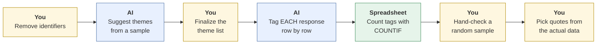
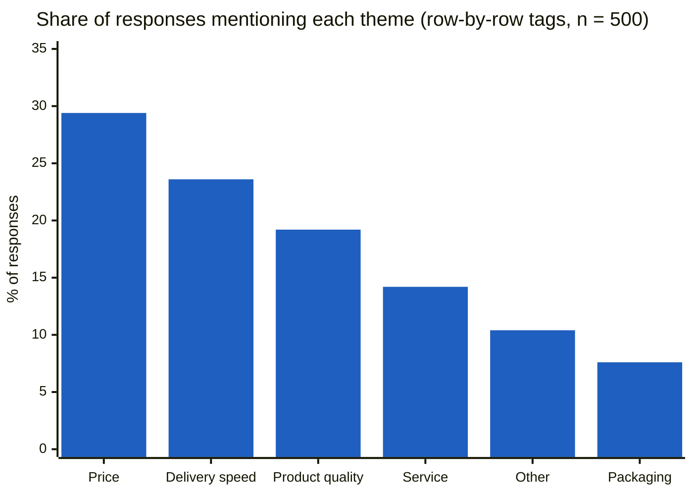

# Customer feedback analysis
{: .no_toc }

Use AI to find themes in open-ended survey responses or reviews, and check its counts and quotes so the findings hold up.
{: .fs-6 .fw-300 }

<details open markdown="block">
  <summary>On this page</summary>
  {: .text-delta }
1. TOC
{:toc}
</details>

## Scenario

**Pinecrest Pet Supply** (fictional) ran a customer survey that ended with *"What's one thing we could do better?"* It got **500 open-ended responses**. The marketing lead asks for the top themes, how common each one is, and a few representative quotes, by Friday.

You paste all 500 responses into a chat assistant and ask for themes. It returns a tidy summary, and its headline finding is "**42% of customers mention price.**" It also includes three vivid quotes.

On checking, the real figure is closer to **29%**, and one of the three "quotes" doesn't appear anywhere in the data.

## Why it matters

Customer feedback drives product, pricing, and service decisions. AI is excellent at the slow part, reading hundreds of comments and suggesting themes. It's unreliable at two things that matter a lot here:

- **Counting.** Language models estimate counts instead of tallying them, especially across long inputs.
- **Quoting.** They may paraphrase or merge comments and present the result as a direct quote.

A wrong percentage in a slide can redirect a budget. A fabricated customer quote can embarrass the team.

## AI-assisted approach



1. **Remove identifiers (Use).** Strip names, emails, and order numbers from the responses. See [Data classification]().
2. **Get candidate themes (Use).** Have AI propose 5–8 themes from a sample of about 100 responses, with a one-line definition each.
3. **Finalize the theme list yourself (Decide).** Merge, split, or rename themes so they're useful for decisions. Add "Other."
4. **Tag row by row, then count with a formula (Use).** Ask AI to output one row per response with yes/no columns for each theme. A response can have several themes. Then count the tags with `COUNTIF`, not by asking the AI "how many?".
5. **Hand-check a random sample (Verify).** Read and code 50 random responses yourself, and compare with the AI's tags.
6. **Pick quotes from the data itself (Verify).** Search the original responses for each quote you use.

### Checking the AI's headline number

You hand-code a random sample of 50 responses. **14 of 50** mention price, which is **28%**.

A sample of 50 is small, so allow for uncertainty. A standard 95% confidence interval for 28% from 50 responses runs from about **16% to 40%**. The AI's 42% falls *outside* that range, which is a strong sign it's wrong. The row-by-row tagging, counted with a formula, finds **147 of 500 = 29.4%**: inside the range, and consistent with the hand check.



| Theme | Responses | Share of 500 |
|:--|--:|--:|
| Price | 147 | 29.4% |
| Delivery speed | 118 | 23.6% |
| Product quality | 96 | 19.2% |
| Customer service | 71 | 14.2% |
| Other | 52 | 10.4% |
| Packaging | 38 | 7.6% |

Shares add up to more than 100% because many responses mention more than one theme.

## Prompt template

**Step 1: themes from a sample**

```text
Here are [N] de-identified customer responses to "[SURVEY QUESTION]".
Propose 5–8 themes. For each: a name, a one-line definition, and 2 example
response IDs. Don't estimate how common each theme is.
[PASTE SAMPLE WITH IDs]
```

**Step 2: row-by-row tagging** (in batches if the tool struggles with all 500)

```text
Themes (use these definitions exactly): [THEME LIST WITH DEFINITIONS].
For EACH response below, output one row:
ID | Price (Y/N) | Delivery (Y/N) | ... | Other (Y/N)
A response can have several Y values. Output every ID, in order,
and nothing else.
[PASTE RESPONSES WITH IDs]
```

Then paste the table into a spreadsheet, check that the row count matches, and count each column with `=COUNTIF(B:B,"Y")`.

## Verify checklist

- [ ] Responses were de-identified before going into the AI tool.
- [ ] I finalized the theme list and definitions myself.
- [ ] Counts come from row-level tags counted with a formula, not from the AI's estimate.
- [ ] The tagged table has the same number of rows as the original data.
- [ ] I hand-coded a random sample of at least 50, and the AI's tags broadly agree.
- [ ] Every quote I use appears word for word in the original data.
- [ ] I reported percentages with the sample size (n = 500), and noted that themes overlap.

## Common failure modes

| Failure | What it looks like | How to catch it |
|:--|:--|:--|
| **Estimated counts** | "About 42% mention price" | Count row-level tags with a formula. Compare with a hand-coded sample. |
| **Fabricated quotes** | A vivid "quote" that doesn't appear in the data | Search the original file for every quote. |
| **Dropped rows** | The tagged table has 463 rows, not 500 | Check row counts. Tag in batches. |
| **Vivid-comment bias** | The summary overweights a few angry, colorful comments | Use the counts, not the summary's emphasis. |
| **Vague themes** | "Experience" covers half the data | Write tight definitions, and split themes that are too broad. |
| **Survey bias ignored** | Treating responses as representative of all customers | Note who responded and who didn't. |

## Disclose and decide notes

**Disclose:** *"Themes were proposed by AI from a sample and finalized by me. AI tagged each response, and counts were calculated in a spreadsheet. A hand-coded random sample of 50 broadly agreed. All quotes were checked against the original responses."*

**Decide:** Price is the most common theme, but whether Pinecrest should cut prices, explain its value better, or improve delivery speed (the second theme, and maybe a cheaper fix) is a business judgment. The data tells you what customers said, not what to do.

## For educators: turn this into a challenge

Give learners 200–500 short, fictional customer comments with one theme planted at a known rate (for example, exactly 30% mention delivery). Learners use AI to analyze the comments however they like, and report the theme percentages. Compare their answers to the known rate. Debrief: *Whose method got closest, and why? What happened when people asked the AI to count directly?* See [Designing an AI-fluency challenge]().
