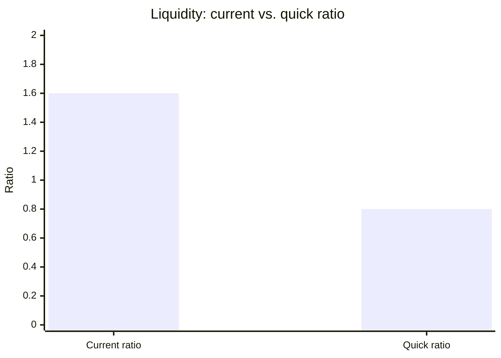
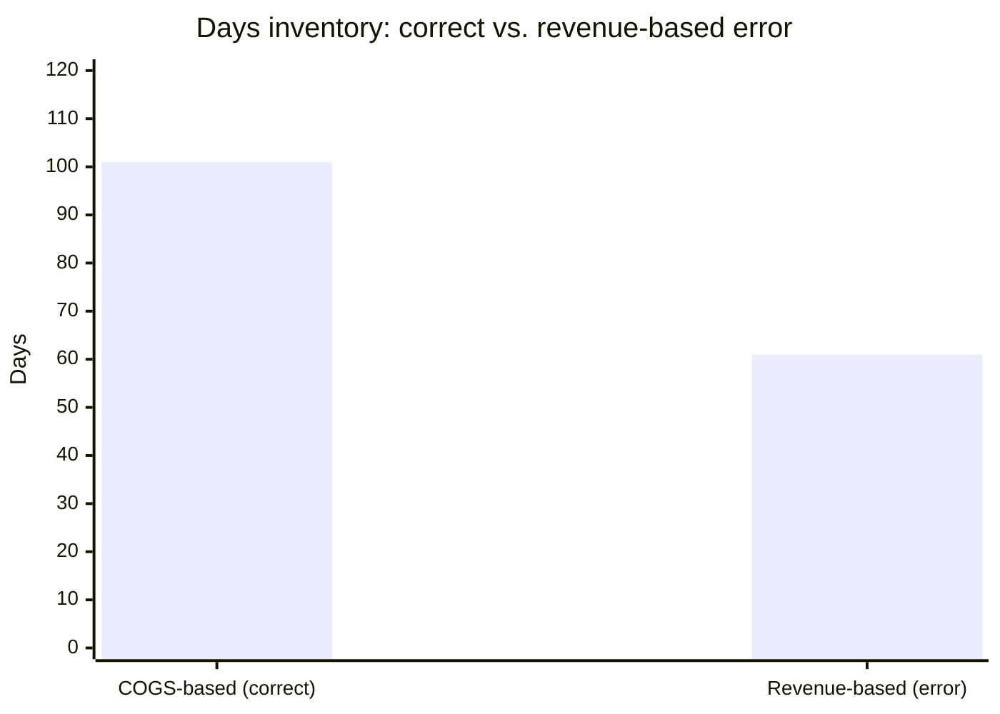

# Financial statement analysis
{: .no_toc }

Use AI to calculate and interpret financial ratios, while you make sure the definitions are right and the story fits the numbers.
{: .fs-6 .fw-300 }

<details open markdown="block">
  <summary>On this page</summary>
  {: .text-delta }
1. TOC
{:toc}
</details>

## Scenario

You're preparing a one-page credit memo on **Cascade Outfitters** (fictional), a regional outdoor-gear retailer that has asked your bank for a $1 million inventory loan. You have its latest annual figures (in thousands of dollars):

| Income statement | $000s | | Balance sheet (year end) | $000s |
|:--|--:|:--|:--|--:|
| Revenue | 12,000 | | Cash | 600 |
| Cost of goods sold (COGS) | 7,200 | | Accounts receivable | 1,400 |
| Operating expenses | 3,600 | | Inventory | 2,000 |
| Interest expense | 200 | | **Total current assets** | **4,000** |
| Tax rate | 25% | | Total assets | 9,000 |
| | | | Current liabilities | 2,500 |
| | | | Total liabilities | 5,400 |

## Why it matters

Ratios turn financial statements into answers to questions like *Can this company pay its bills? Is it profitable? Is inventory piling up?* AI can calculate a full ratio set in seconds and write a fluent interpretation. But ratio **definitions vary**, AI tools mix them up, and a single wrong denominator can change a lending decision.

## AI-assisted approach


1. **Define the ratios yourself (Use).** Write each formula down before prompting. Your textbook or your bank's credit policy is the authority, not the AI.
2. **Have AI calculate, showing every formula (Use).**
3. **Recompute in a spreadsheet (Verify).**
4. **Have AI draft the interpretation and the questions a credit officer would ask (Use).**
5. **Write the recommendation yourself (Decide).**

### The income statement, built up

- Gross profit = 12,000 − 7,200 = **4,800** (40.0% margin)
- Operating income = 4,800 − 3,600 = **1,200** (10.0% margin)
- Pre-tax income = 1,200 − 200 = **1,000**
- Tax = 25% × 1,000 = **250**
- Net income = 1,000 − 250 = **750** (6.25% net margin)
- Equity = total assets − total liabilities = 9,000 − 5,400 = **3,600**

### The ratios

| Ratio | Definition used | Calculation | Result |
|:--|:--|:--|--:|
| Current ratio | Current assets ÷ current liabilities | 4,000 ÷ 2,500 | **1.6** |
| Quick ratio | (Current assets − inventory) ÷ current liabilities | 2,000 ÷ 2,500 | **0.8** |
| Debt-to-equity | Total liabilities ÷ equity | 5,400 ÷ 3,600 | **1.5** |
| Return on equity (ROE) | Net income ÷ equity | 750 ÷ 3,600 | **20.8%** |
| Return on assets (ROA) | Net income ÷ total assets | 750 ÷ 9,000 | **8.3%** |
| Inventory turnover | **COGS** ÷ inventory | 7,200 ÷ 2,000 | **3.6×** |
| Days inventory | 365 ÷ inventory turnover | 365 ÷ 3.6 | **101 days** |
| Days sales outstanding | Receivables ÷ revenue × 365 | 1,400 ÷ 12,000 × 365 | **43 days** |

This uses year-end balances. Many analysts use the *average* of opening and closing balances. Either is fine, as long as you say which.



**What the numbers say:** Cascade is profitable (20.8% ROE), but half its current assets are inventory. Without inventory, it has only $0.80 of liquid assets for every $1 of short-term obligations. Inventory sits for about 101 days. The loan request is *for more inventory*, which is exactly the question a credit officer should probe.

### The definition trap

A common AI error is computing inventory turnover with **revenue** instead of COGS:

- Wrong: 12,000 ÷ 2,000 = 6.0×, which gives 365 ÷ 6.0 ≈ **61 days**
- Right: 7,200 ÷ 2,000 = 3.6×, which gives **101 days**



The wrong version makes inventory look 40 days faster-moving than it is, which is exactly the opposite of the risk you need to flag.

## Prompt template

```text
I'm analyzing [COMPANY] for [PURPOSE, e.g. a credit memo on a $1M inventory loan].
Figures (in [UNITS]): [PASTE INCOME STATEMENT AND BALANCE SHEET].

Calculate these ratios using EXACTLY these definitions:
- [RATIO]: [FORMULA]
- ...
For each: show the formula with the numbers substituted, then the result.
Use year-end balances [or: average balances].

Then:
1. In 4–5 sentences, interpret what the ratios suggest for [PURPOSE].
2. List the 5 questions a skeptical [CREDIT OFFICER / INVESTOR] would ask.
3. Flag any ratio where common definitions differ, and say which one you used.
Don't make a recommendation.
```

## Verify checklist

- [ ] I wrote down every ratio definition before prompting, from an authoritative source.
- [ ] I recomputed every ratio in a spreadsheet.
- [ ] Turnover ratios use the right numerator (COGS for inventory, revenue for receivables).
- [ ] I said whether I used year-end or average balances.
- [ ] Units are consistent (all in thousands, all annual).
- [ ] The interpretation matches the numbers. No "strong liquidity" with a 0.8 quick ratio.
- [ ] Any industry benchmark the AI mentioned has a real source, or has been removed.

## Common failure modes

| Failure | What it looks like | How to catch it |
|:--|:--|:--|
| **Wrong numerator** | Inventory turnover using revenue | Write the definitions first, and compare against them. |
| **Quick ratio includes inventory** | Quick ratio equals the current ratio | If they're equal, inventory was probably left in. |
| **Invented benchmarks** | "The retail average current ratio is 1.9" | Find a real, dated source, or delete it. |
| **Equity miscalculated** | ROE divides by total assets | Equity = assets − liabilities. Check it. |
| **Story ignores numbers** | "Healthy liquidity" alongside a 0.8 quick ratio | Read the interpretation against the ratio table line by line. |
| **Mixed units** | Some figures in thousands, others in dollars | State units once, and check every input. |

## Disclose and decide notes

**Disclose:** *"Ratios were calculated by AI using my stated definitions, and recomputed in a spreadsheet. I corrected the inventory turnover (COGS-based, not revenue-based). The credit recommendation is my own."*

**Decide:** Whether to lend, how much, and with what conditions (collateral, covenants, a smaller first tranche) is a credit judgment. The ratios frame it, and the decision is yours.

## For educators: turn this into a challenge

Give learners the Cascade figures and ask for a one-page credit memo with a ratio table. **Planted trap:** the inventory-turnover definition. Many AI drafts use revenue. Ask learners to state their definitions explicitly. Debrief: *Who got 61 days? How would that have changed the recommendation?* See [Designing an AI-fluency challenge]().
