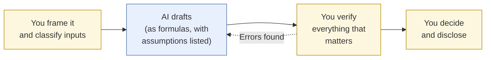

# For Students: AI in Business Tasks

Worked business tasks, each with a scenario, an AI-assisted approach, a verification checklist, and the ways things commonly go wrong.
{: .fs-6 .fw-300 }

These pages are for undergraduate, MBA, and EMBA students, and for anyone early in a business career. Each one is a complete task you can work through with an AI tool open beside you. The numbers are worked out and checked, so you can compare your results against them.

**Before you start:** check your course's AI policy. If an assignment is meant to build a skill on its own, use AI as a [tutor]() rather than a substitute.

## How every task works

## Suggested order

Start with **Break-even analysis**. It's the fully worked model for every other task page, and it contains the most common AI mistake in business math: holding a cost constant when it actually depends on price.

| If you need to... | Go to |
|:--|:--|
| Work with costs, prices, and volumes | Break-even analysis |
| Plan around timing of cash | Cash-flow analysis |
| Size a market or compare competitors | Competitive and market analysis |
| Synthesize many sources | Research-to-brief |
| Write an email or memo | Business writing |
| Build formulas or summarize a spreadsheet | Spreadsheet and data analysis |
| Make sense of survey comments or reviews | Customer feedback analysis |
