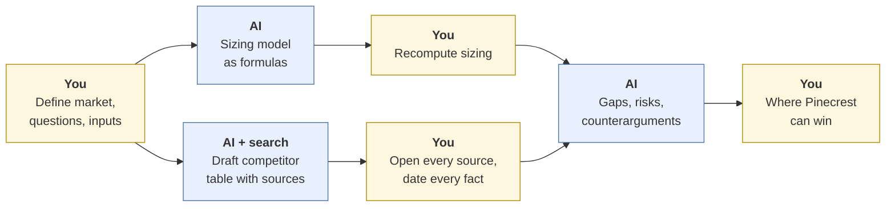
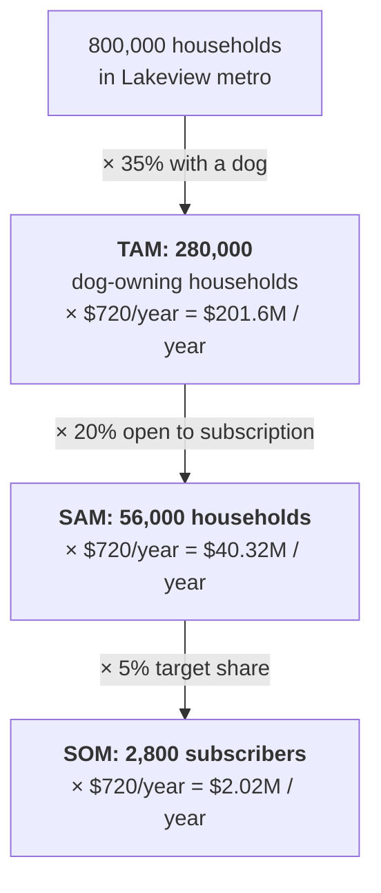
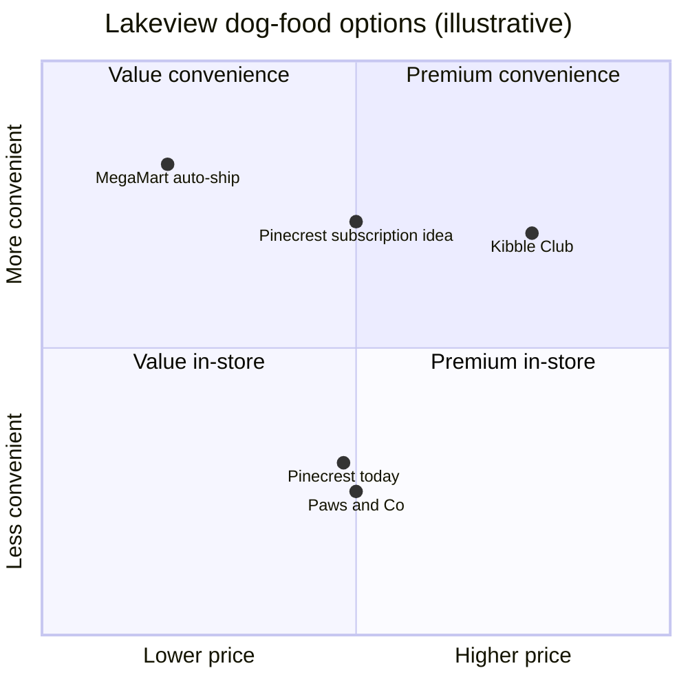

# Competitive and market analysis
{: .no_toc }

Use AI to scan a market, size it, and compare competitors, while verifying every claim against a real source.
{: .fs-6 .fw-300 }

<details open markdown="block">
  <summary>On this page</summary>
  {: .text-delta }
1. TOC
{:toc}
</details>

## Scenario

**Pinecrest Pet Supply** (fictional), a regional pet-store chain, is considering a dog-food subscription service in the **Lakeview metro area** (also fictional). The strategy lead asks for a market scan before Thursday's planning meeting. She wants to know how big the opportunity is, who's already there, and where Pinecrest could win.

Your inputs, from the client's own market research:

| Input | Value | Source |
|:--|--:|:--|
| Households in metro | 800,000 | Client research (from regional census data) |
| Share of households with a dog | 35% | Client consumer survey |
| Share of dog owners open to a food subscription | 20% | Client consumer survey |
| Average dog-food spend per household | $60 / month | Client consumer survey |
| Pinecrest's target share by year 3 | 5% of serviceable market | Strategy team's goal |

## Why it matters

Market scans shape where companies invest. Two errors are common and costly: a market size inflated by bad math or vague top-down assumptions, and a competitor table full of "facts" (prices, funding, store counts) that the AI made up or that are out of date. In a planning meeting, a wrong number repeated with confidence can steer the whole discussion.

## AI-assisted approach



### 1. Size the market bottom-up

Bottom-up sizing (households × share × spend) is easier to check than top-down sizing ("the national market is $X, and we're Y% of the population"). Every step is a number you can question.



- Annual spend per household = $60 × 12 = **$720**
- Total market (TAM) = 800,000 × 35% = **280,000 dog-owning households**, or 280,000 × $720 = **$201.6 million a year**
- Serviceable market (SAM) = 800,000 × 35% × 20% = **56,000 households**, or 56,000 × $720 = **$40.32 million a year**
- Obtainable market (SOM) by year 3 = 56,000 × 5% = **2,800 subscribers**, or 2,800 × $720 = **$2.016 million a year**

### 2. Draft the competitor table, with a source and date for every fact

Use a tool with web search, and require a source link and date for every cell. Then open each one. Here's how the verified table looked after checking:

| Competitor (fictional) | Model | Price signal | Delivery | Source and date | Status |
|:--|:--|:--|:--|:--|:--|
| National online brand "Kibble Club" | Subscription only | Premium | 2–3 days, national | Company pricing page, checked this week | ✓ Verified |
| Big-box retailer "MegaMart" | Auto-ship on standard brands | Low | Same or next day | Retailer website, checked this week | ✓ Verified |
| Local chain "Paws & Co." | In-store, no subscription | Mid | In store | AI said "launched subscriptions in 2023". **No source found.** | ✗ Removed |
| Startup "FreshHound" | Fresh-cooked meals | Premium | Weekly, metro only | AI cited a funding announcement. The article exists but is **2 years old**, and the service has since paused in Lakeview. | ✗ Corrected |

### 3. Map the positioning



The chart is a thinking tool, not data. The positions are judgments. Mid-price convenience, with local delivery and in-store pickup, looks open. Whether Pinecrest can deliver it profitably is the next question.

### 4. Ask for the counterargument

Ask the AI: *"Argue that Pinecrest should NOT launch this. What are the strongest reasons?"* Typical good answers include MegaMart's price advantage, delivery costs eating into margin, and the risk of survey intent overstating real behavior. That last point matters: the 20% "open to subscription" figure is stated intent, not purchases.

## Prompt template

```text
I'm preparing a market scan for [COMPANY] considering [OFFERING] in
[MARKET]. Audience: [WHO]. Decision it feeds: [DECISION].

Part 1: Sizing. Using ONLY these inputs, build a bottom-up model
(TAM → SAM → SOM) as spreadsheet formulas. State units and time
period (monthly vs. annual) on every line.
[PASTE INPUTS WITH SOURCES]

Part 2: Competitors. Search for current competitors in [MARKET].
For each: business model, price positioning, delivery/convenience,
and one differentiator. EVERY fact needs a source link and the date
of that source. If you can't find a source, write "unverified" —
don't fill the gap.

Part 3: Give me the 3 strongest arguments AGAINST entering this market.
```

## Verify checklist

- [ ] Every sizing input has a named source, and the survey figures are labeled as stated intent.
- [ ] Every line of the sizing model states its units and time period.
- [ ] I recomputed TAM, SAM, and SOM myself.
- [ ] I opened every competitor source and checked its date.
- [ ] Claims without a source were removed, not softened.
- [ ] Time-sensitive facts (prices, locations, launches) were checked against a current source.
- [ ] The positioning chart is labeled as judgment, not data.
- [ ] I read the strongest case against the idea and addressed it.

## Common failure modes

| Failure | What it looks like | How to catch it |
|:--|:--|:--|
| **Monthly reported as annual** | "SAM is $3.36 million." That's 56,000 × $60, one *month* of spending, reported as the yearly market. | Label the period on every number. Check that annual = monthly × 12. |
| **Invented competitor facts** | "Paws & Co. launched subscriptions in 2023," with no source | Require a source link for every cell. Remove anything unsourced. |
| **Stale facts** | A real but outdated funding round or price | Check the source's date. Look for newer news. |
| **Top-down inflation** | "The national pet-food market is $X, so Lakeview is X × population share" | Prefer bottom-up sizing. If you use top-down, check it against the bottom-up figure. |
| **Intent treated as behavior** | Survey "open to subscription" treated as likely buyers | Label it intent. Ask what share actually converts. |
| **Double counting** | Counting dog owners and dogs, or households and individuals | Fix the unit (households) and keep it consistent. |

## Disclose and decide notes

**Disclose:** *"AI with web search drafted the competitor table and the sizing structure. I recomputed all sizing figures, opened and dated every source, removed one unsourced claim, and corrected one outdated claim. Positioning judgments are my own."*

**Decide:** A $40 million serviceable market sounds attractive. Whether a 5% share is realistic against a big-box retailer's prices, and whether Pinecrest should compete on convenience at all, are strategy calls. Make the recommendation, and say how confident you are.

## For educators: turn this into a challenge

Give learners the sizing inputs and a short list of real or fictional competitors, and allow AI with web search. **Planted twist:** monthly spend is given, but the question asks for an annual market. Many AI drafts mix the two. Require a source and date for every competitor fact. Debrief: *How many "facts" did you remove? What does that tell you about using unverified AI market research?* See [Designing an AI-fluency challenge]().
