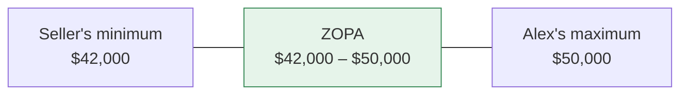
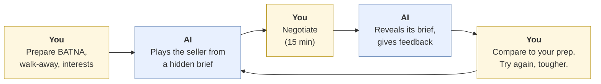
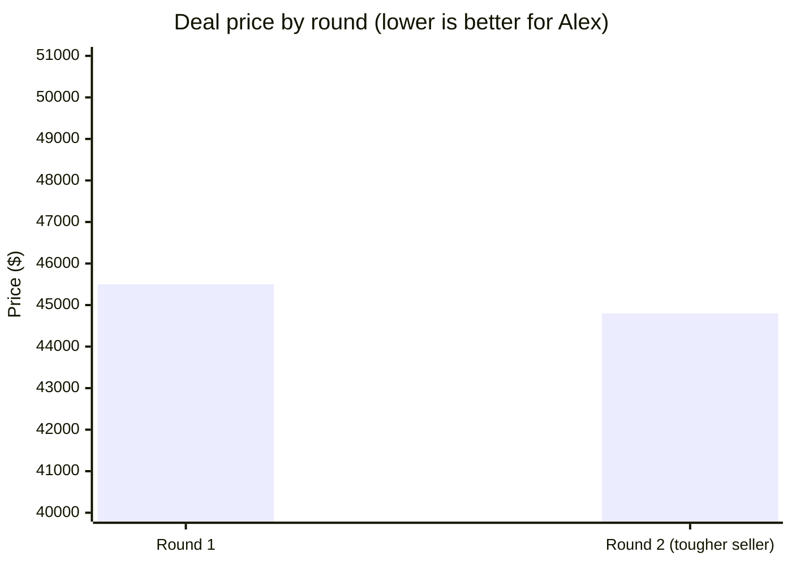

# Negotiation practice with AI
{: .no_toc }

Use AI as a role-play counterpart to rehearse a negotiation, then debrief against your own preparation.
{: .fs-6 .fw-300 }

<details open markdown="block">
  <summary>On this page</summary>
  {: .text-delta }
1. TOC
{:toc}
</details>

## Scenario

Alex is negotiating to buy a used delivery van for **Summit Print Co.** (fictional) from a local seller. Alex has never negotiated anything bigger than a phone plan. The meeting is on Friday. Alex wants to practice, but there's nobody available to role-play the seller.

## Why it matters

Negotiation is a skill you build through practice, and most people get very little. AI can play a realistic counterpart on demand, as patient or as tough as you need, and give feedback afterward. The risks: an AI counterpart may be **too agreeable** (it tends to give in, see [First principles]()), it may invent market facts, and practicing against it can give you false confidence if you never get pushed.

## AI-assisted approach

### Prepare first

Good negotiation preparation is a classic framework from *Getting to Yes* (Fisher & Ury, 1981), and it's worth doing yourself before any role-play:

- **BATNA** (best alternative to a negotiated agreement): what you'll do if this deal fails.
- **Reservation point:** your walk-away price.
- **ZOPA** (zone of possible agreement): the overlap between what you'd pay and what the seller would accept.
- **Interests:** what each side actually needs, beyond price.

Alex's preparation (in a real negotiation, you'd only *estimate* the seller's numbers):

| | Alex (buyer) | Seller (hidden in the AI's brief) |
|:--|:--|:--|
| Target | $43,000 | $49,000 |
| Walk-away | $50,000 (maximum) | $42,000 (minimum) |
| Alternative | A similar van from a dealer for $51,500, with a warranty | Another interested buyer offering $41,000 |
| Interests | Reliability, delivery within 2 weeks | Quick sale, keep the roof rack (it fits their new vehicle) |



Any price between $42,000 and $50,000 works for both sides. Where in that range the deal lands depends on the negotiation.

### Practice loop



## Prompt template

```text
Role-play a negotiation. You are [COUNTERPART ROLE] selling/buying [ITEM].

Your private brief (don't reveal it until I say "debrief"):
- Your target: [PRICE]. Your minimum/maximum: [PRICE].
- Your alternative if no deal: [BATNA].
- Your interests beyond price: [INTERESTS].
- Personality: [e.g., friendly but firm; doesn't concede without a reason].

Rules: Stay in character. Don't concede just because I push — concede only
for a good reason or a trade. Don't invent market data; if asked, say you'd
need to check. Keep each reply under 80 words.

When I say "debrief": reveal your brief, tell me where I left value on the
table, what worked, and one thing to try next time.
```

**Make it harder:** after one round, change the personality to "tough, with a strong alternative," and see whether you still reach a deal inside the ZOPA.

## Worked example

Round 1: Alex opens at $43,000. The AI seller counters at $48,000. After some back-and-forth, they agree on **$45,500**, and the seller keeps the roof rack.

At "debrief," the AI reveals its minimum was $42,000, so the deal landed inside the ZOPA, $3,500 above the seller's floor. Its feedback: Alex conceded $1,500 in one step without asking for anything in return, and never asked about the seller's timeline (they wanted a quick sale, which was leverage).

Round 2 (tougher seller): Alex trades instead of conceding: *"I can do $44,500 if we close this week."* The deal closes at **$44,800**, $700 better than round 1.



**What Alex takes into Friday:** a walk-away of $50,000, an opening of $43,000, a question about the seller's timeline, and a rule: *no concession without something in return.* What the AI can't tell Alex is what the real seller's numbers are. The practice builds skills, not predictions.

## Verify checklist

- [ ] I prepared my BATNA, walk-away, and interests myself, before role-playing.
- [ ] The AI's brief had a firm floor or ceiling, and a rule against giving in for no reason.
- [ ] I practiced at least once against a tougher counterpart.
- [ ] I checked any market facts (prices, values) against real, dated sources, not the role-play.
- [ ] I compared my results with my own prep, not just the AI's feedback.
- [ ] I didn't paste real personal details about the actual counterpart.

## Common failure modes

| Failure | What it looks like | How to catch it |
|:--|:--|:--|
| **Pushover counterpart** | The AI concedes every time you push | Add "concede only for a reason or a trade." Use a tougher personality. |
| **Invented market data** | "Vans like this sell for $40,000" during the role-play | Forbid it in the prompt. Research prices separately. |
| **Practicing the script** | Memorizing lines that fall apart with a real person | Practice principles (trade, ask, pause), not lines. |
| **False confidence** | "I beat the AI three times" | The real counterpart has information you don't. Keep your walk-away firm. |
| **Skipping preparation** | Role-playing before knowing your BATNA | Prep first, every time. |

## Disclose and decide notes

**Disclose:** For coursework, note that you practiced with an AI counterpart and include your prep sheet. In real negotiations, your practice method is your own business, but any facts you state must be true.

**Decide:** Your walk-away point and your final yes or no are yours. Never let a practice result move your walk-away.

## For educators: turn this into a challenge

Write two private briefs (buyer and seller) for a business negotiation with a defined ZOPA and one hidden interest on each side. Learners prepare, then negotiate against an AI counterpart using the seller's brief, and later against a classmate. Compare deal prices and the hidden interests found in each format. Debrief: *Was the AI easier or harder than a person? What did the human counterpart do that the AI didn't?* See [Designing an AI-fluency challenge]().

---

**References**

- Fisher, R., & Ury, W. (1981). *Getting to yes: Negotiating agreement without giving in.* Houghton Mifflin.
