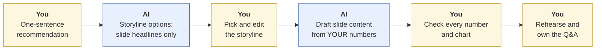
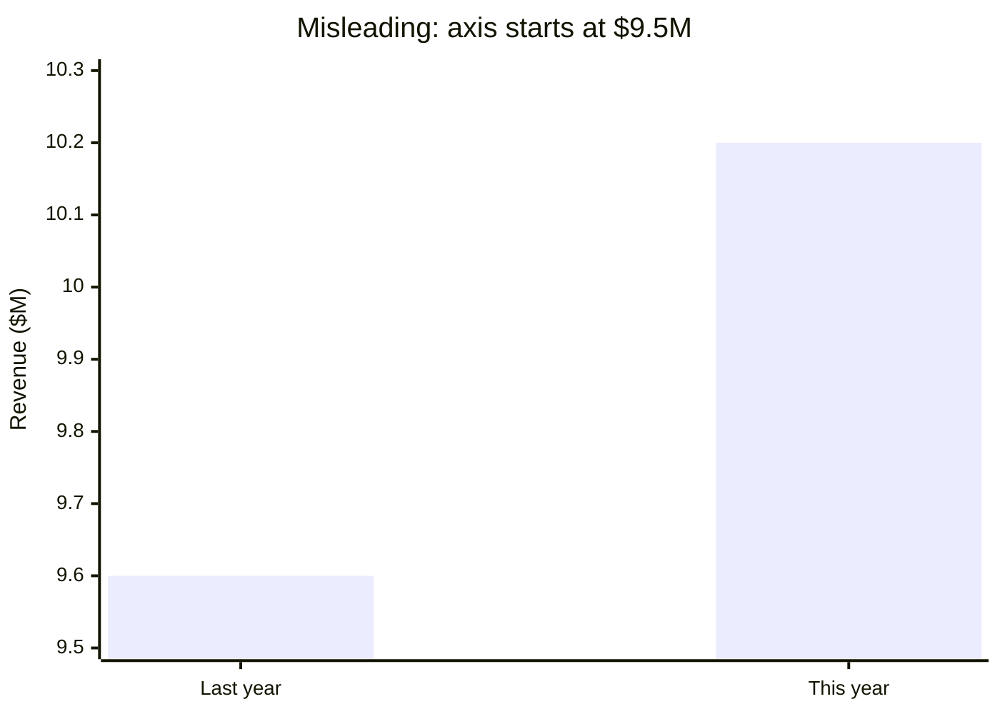
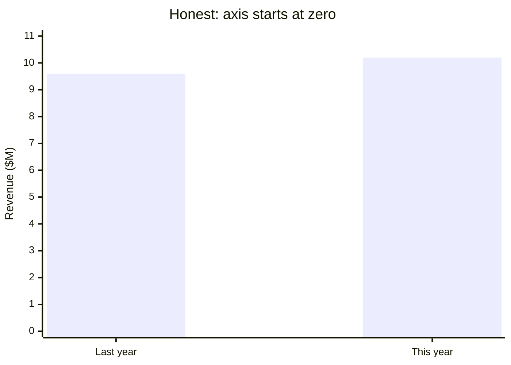

# Presentations and pitch decks
{: .no_toc }

Use AI to structure your storyline and draft slides, without misleading charts, invented numbers, or a deck that sounds like everyone else's.
{: .fs-6 .fw-300 }

<details open markdown="block">
  <summary>On this page</summary>
  {: .text-delta }
1. TOC
{:toc}
</details>

## Scenario

Your team has a 10-minute slot to pitch a recommendation to the (fictional) leadership team of **Ridgeway Coffee Roasters**: expand wholesale sales into the Pacific region. You have the analysis: revenue grew from **$9.6 million to $10.2 million**, and a market scan supports the region. You ask an AI tool to "make a pitch deck." It produces 14 slides with bullet lists, a stock title on each slide, and a bar chart that makes the revenue growth look enormous.

## Why it matters

Presentations are where analysis turns into decisions. Leaders often remember the headline and one chart. AI is helpful for structure and first drafts, but it tends to produce **topic titles instead of messages**, **too many bullets**, and **charts that exaggerate**, sometimes with numbers it made up to fill a slide.

## AI-assisted approach



1. **Write your recommendation in one sentence (Decide).** Do this before anything else. For example: *"Ridgeway should enter the Pacific wholesale market in Q2, starting with 20 café accounts."*
2. **Ask AI for storyline options: headlines only (Use).** Each slide headline should be a full-sentence message, so that reading the headlines alone tells the story. This follows the well-known "pyramid principle" approach of leading with the answer (Minto, *The Pyramid Principle*).
3. **Pick and edit the storyline (Decide).**
4. **Draft slide content from your numbers only (Use).** Paste your data. Forbid invented figures.
5. **Check every number and every chart (Verify).**
6. **Rehearse, and prepare for questions yourself (Decide).** You'll be answering them, not the AI.

### Message headlines vs. topic headlines

| Topic headline (AI default) | Message headline (better) |
|:--|:--|
| "Revenue Overview" | "Revenue grew 6% last year, with wholesale leading" |
| "Market Analysis" | "The Pacific region has 3× our current café density" |
| "Recommendation" | "Start with 20 accounts in Q2 to test demand at low risk" |

### The chart that exaggerates

Revenue rose from $9.6M to $10.2M, an increase of 10.2 ÷ 9.6 = 1.0625, or **6.25%**. If the AI's chart starts its y-axis at $9.5M instead of zero, the bars become 0.1 and 0.7 above the axis, so the second bar looks **7 times taller** than the first:





Bar charts should start at zero. If you need to show a small change clearly, label the percentage change ("+6.25%") instead of stretching the axis.

## Prompt template

```text
I'm presenting to [AUDIENCE] for [LENGTH] minutes.
My recommendation: [ONE SENTENCE].
My evidence (use ONLY these facts and numbers): [PASTE].

Step 1: Propose 2 storyline options of [N] slides each. For each slide give
only a full-sentence headline that states the message (not a topic).
Reading the headlines in order should tell the whole story.

Step 2 (after I choose): For each slide, suggest one visual (chart type and
what it shows) and at most 3 short supporting points.
Rules: bar charts start at zero; no numbers that aren't in my evidence;
mark any placeholder as [NEEDS DATA].

Step 3: List the 5 toughest questions [AUDIENCE] is likely to ask.
```

## Verify checklist

- [ ] My one-sentence recommendation came first, and it's mine.
- [ ] Every headline states a message, and the headlines alone tell the story.
- [ ] Every number on every slide traces back to my evidence.
- [ ] No [NEEDS DATA] placeholders remain.
- [ ] Bar charts start at zero, and axes and units are labeled.
- [ ] The deck fits the time: roughly one slide per minute or fewer.
- [ ] I've rehearsed answers to the toughest questions without the AI.

## Common failure modes

| Failure | What it looks like | How to catch it |
|:--|:--|:--|
| **Topic headlines** | "Market Analysis," "Financials," "Next Steps" | Rewrite each as a full-sentence message. |
| **Invented numbers** | A market-size figure nobody on the team found | Trace every number. Delete anything unsourced. |
| **Truncated axes** | Small changes made to look dramatic | Start bar charts at zero, and label the change. |
| **Bullet walls** | Eight bullets per slide | At most three points. Move detail to the appendix. |
| **Generic voice** | "Leveraging synergies to unlock value" | Cut jargon. Say it the way you'd say it to the CEO. |
| **AI-dependent Q&A** | The team can't answer "Why Q2?" | Rehearse questions without notes or tools. |

## Disclose and decide notes

**Disclose:** For coursework, follow your course policy, for example: *"AI suggested storyline options and drafted slide text from our analysis. We chose the storyline, checked every figure and chart, and wrote the recommendation."* In business settings, follow your organization's norms.

**Decide:** The recommendation, the emphasis, and what to leave out are your choices. So are the answers in the room.

## For educators: turn this into a challenge

Give teams the same evidence pack and 30 minutes to build a 5-slide storyline with AI. **Planted twist:** the evidence includes a small percentage change. See whose chart exaggerates it. Teams then swap decks and read *only the headlines*. Can they state the recommendation? Debrief: *Which headlines carried the story? Whose charts were honest?* See [Designing an AI-fluency challenge]().
