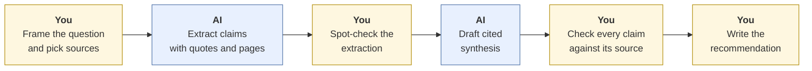

# Research-to-brief
{: .no_toc }

Turn many sources into one short, accurately cited brief, where every claim traces back to a source you've checked.
{: .fs-6 .fw-300 }

<details open markdown="block">
  <summary>On this page</summary>
  {: .text-delta }
1. TOC
{:toc}
</details>

## Scenario

The COO of **Cascade Outfitters**, a fictional 300-person outdoor-gear retailer, asks you for a two-page brief: *What does the evidence say about a four-day work week for our distribution center and head-office staff?* You've collected six sources:

| ID | Source type | Length |
|:--|:--|:--|
| S1 | Peer-reviewed study of a multi-company trial | 40 pages |
| S2 | Think-tank report advocating the four-day week | 25 pages |
| S3 | Business-press article on a company that dropped its trial | 3 pages |
| S4 | Industry association survey of warehouse employers | 12 pages |
| S5 | Academic review of working-hours research | 30 pages |
| S6 | Internal HR memo with Cascade's overtime and staffing data | 4 pages |

That's over 110 pages. The brief is due in two days.

## Why it matters

Briefs drive decisions. Executives often read only the brief, not the sources, so its accuracy *is* the evidence they act on. AI is very good at the slow part: reading and extracting. It's also prone to the most damaging brief errors: citing a source for something it doesn't say, smoothing real disagreement into false consensus, and over-generalizing from a study that doesn't match your situation.

## AI-assisted approach



1. **Frame the question and choose the sources yourself (Use).** Write the decision question in one sentence and note what matters for *this* company: a distribution center with shift work, and a head office. Judge each source's credibility and bias before AI sees it. S2 is an advocacy report, and S3 is a single anecdote.
2. **Check the data first (Use).** S6 is internal HR data, so it's at least Internal and possibly Confidential. Use only an approved tool for it. See [Data classification]().
3. **Extract before you synthesize (Use).** Use a source-grounded tool (one that answers only from uploaded documents) to build a **claims table**: each claim, its source, a direct quote, the page, and any conditions or caveats. Separating extraction from writing makes errors much easier to find.
4. **Spot-check the extraction (Verify).** Pick at least 5 claims at random and find each quote on the stated page.
5. **Draft the synthesis from the claims table (Use).** Ask for agreement, disagreement, and gaps, and require an inline citation on every factual sentence.
6. **Check every claim in the draft (Verify).** Use a claim-to-source matrix (below). Every factual sentence needs a source that actually supports it.
7. **Write the "so what" yourself (Decide).** What should Cascade do? Pilot, wait, or decline? That's your call.

### The claim-to-source matrix

Building a simple grid makes coverage and gaps visible at a glance. Here's part of the one for this brief:

| Claim in the brief | S1 | S2 | S3 | S4 | S5 | S6 | Status |
|:--|:--:|:--:|:--:|:--:|:--:|:--:|:--|
| Office productivity held steady in trials | ✓ | ✓ | | | ✓ | | Supported |
| Employee burnout fell | ✓ | ✓ | | | | | Supported (S2 is advocacy, so lean on S1) |
| Shift-based operations found scheduling harder | | | ✓ | ✓ | | | Supported, but only by weaker sources: flag it |
| "Works equally well in warehouses" | | ✗ | | | | | **Removed**: S2 doesn't say this about warehouses |
| Cascade's overtime would rise in peak season | | | | | | ✓ | Supported by internal data |

In this example, checking the full draft found **18 factual claims**: 15 were supported, 2 were cited to the wrong source and corrected, and 1 was overstated and removed. Without the matrix, that last one would likely have reached the COO.

## Prompt template

**Step 1: extraction** (in a source-grounded tool, with the sources uploaded)

```text
I'm researching: [DECISION QUESTION].
Context that matters: [YOUR ORGANIZATION'S SITUATION].

From the uploaded sources ONLY, build a table with columns:
Claim | Source ID | Direct quote (verbatim) | Page/section | Conditions or caveats
| Population studied

Rules:
- Use only the uploaded documents. If something isn't in them, don't include it.
- Quotes must be verbatim. Don't paraphrase inside the quote column.
- Include claims that cut AGAINST the idea as well as for it.
- Note when a source is advocacy, opinion, or a single case.
```

**Step 2: synthesis**

```text
Using ONLY the claims table below, draft a [LENGTH] brief for [AUDIENCE].

Structure: (1) Bottom line in 2 sentences, (2) Where sources agree,
(3) Where they disagree or evidence is thin, (4) How well the evidence fits
our situation: [CONTEXT], (5) Open questions.

Every factual sentence needs an inline citation like [S1, p. 12].
If the claims table doesn't support a sentence, don't write it.
Do NOT make a recommendation. I will write that section.

[PASTE CLAIMS TABLE]
```

Keeping the recommendation out of the AI's draft is deliberate. It keeps the judgment with you and makes your reasoning visible.

## Verify checklist

- [ ] I chose the sources and noted each one's type and possible bias.
- [ ] Internal data went only into an approved tool.
- [ ] I spot-checked at least 5 extracted quotes against the original pages.
- [ ] Every factual sentence in the brief has a citation.
- [ ] I opened the source for **every** citation and confirmed it supports the sentence as written.
- [ ] Caveats from the sources (population, setting, time period) carried through to the brief.
- [ ] Real disagreements between sources appear in the brief, not just the consensus.
- [ ] Claims from advocacy or single-case sources are labeled as such.
- [ ] The recommendation is mine, and it's clearly separate from the evidence summary.

## Common failure modes

| Failure | What it looks like | How to catch it |
|:--|:--|:--|
| **Citation drift** | A real claim with the wrong source ID or page | Claim-to-source matrix. Open every source. |
| **Overgeneralization** | Office-worker findings presented as true for warehouses | Keep a "population studied" column, and compare it to your situation. |
| **False consensus** | "Research shows..." when two sources disagree | Ask explicitly for disagreements. Check the matrix for claims with mixed support. |
| **Dropped caveats** | "Productivity rose" without "in self-selected companies" | Compare the caveats column to the brief's wording. |
| **Source laundering** | An advocacy report's claim presented as neutral evidence | Label source types in the brief. |
| **Outside knowledge creeping in** | A statistic that isn't in any of your sources | In a grounded tool, ask "Which document says this?" If none does, cut it. |

## Disclose and decide notes

**Disclose:** *"I used a source-grounded AI tool to extract claims from six sources and draft the evidence summary. I verified every citation against the original documents. Two citations were corrected and one claim was removed. The recommendation section is my own."*

**Decide:** The evidence summary describes what's known. The recommendation weighs it against Cascade's specific situation, risk appetite, and peak-season constraints. That weighing is the part the COO is paying you for.

## For educators: turn this into a challenge

Give learners five or six short sources on a business question, including one advocacy piece and one that doesn't fit the scenario's setting. Ask for a one-page cited brief, plus the claim-to-source matrix. **Planted twist:** one source contains a caveat that reverses its headline finding for the scenario's industry. Debrief: *Did the AI carry the caveat through? How did you find it?* Weight the matrix heavily when grading. See [Designing an AI-fluency challenge]().
