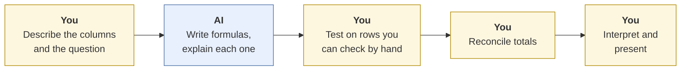
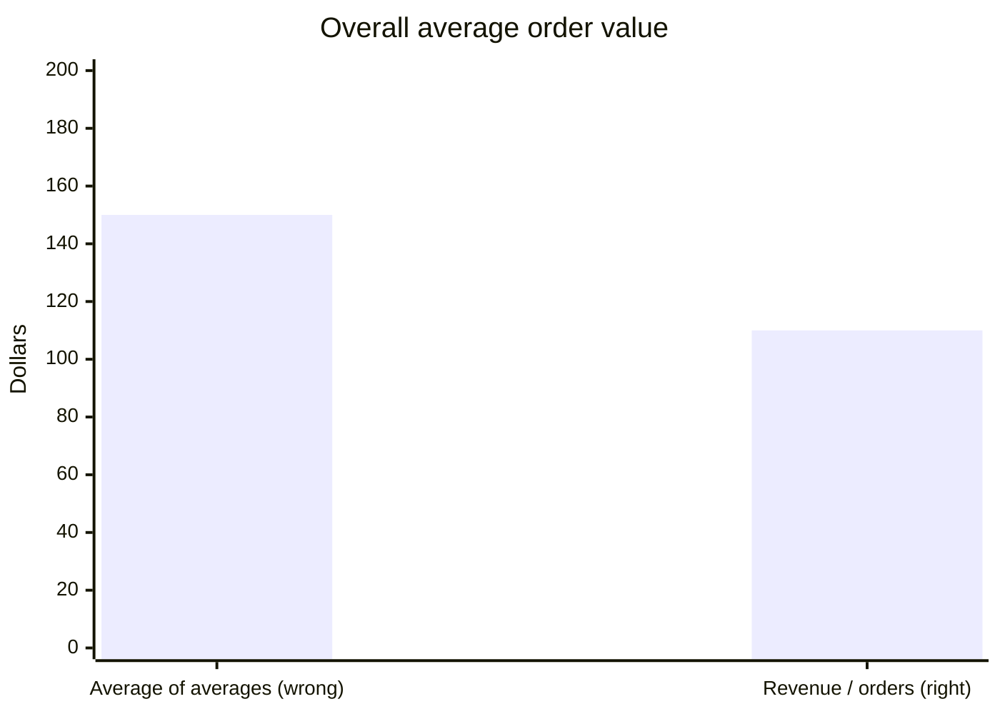
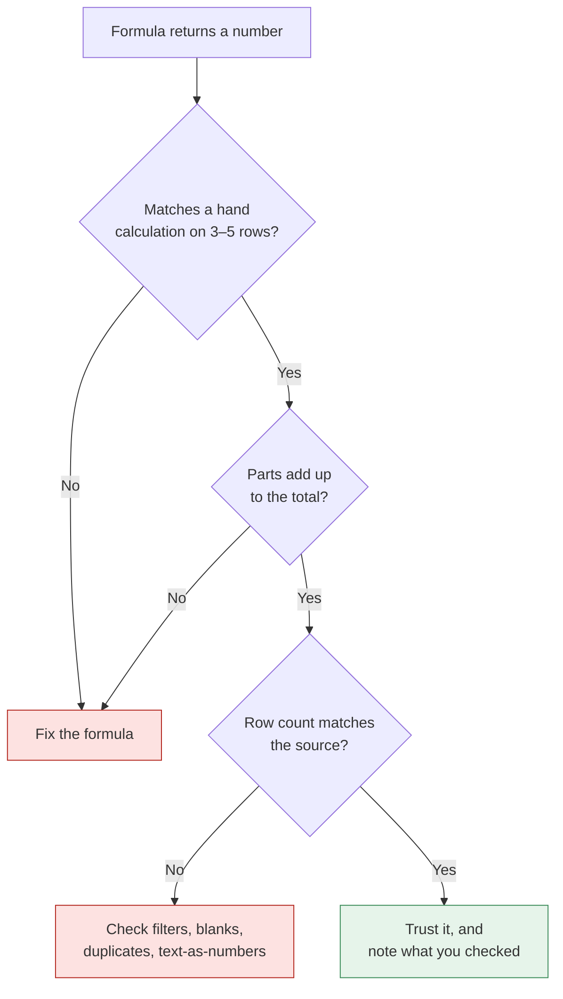

# Spreadsheet and data analysis
{: .no_toc }

Use AI to write formulas, clean data, and summarize a spreadsheet, and catch the quiet errors that give wrong answers without any warning.
{: .fs-6 .fw-300 }

<details open markdown="block">
  <summary>On this page</summary>
  {: .text-delta }
1. TOC
{:toc}
</details>

## Scenario

The sales manager at **Ridgeway Coffee Roasters** (fictional) sends you last quarter's wholesale order export: **100 orders** across two regions, with columns for order ID, date, region, product code, quantity, and amount. She wants to know the **average order value overall and by region**, and the top three products by revenue, for a meeting tomorrow.

You ask an AI tool for the formulas. They run, the numbers look reasonable, and two of them are wrong.

## Why it matters

Spreadsheet errors are dangerous because they look finished. A formula that returns a number doesn't raise a flag, even when it's using the wrong range, the wrong kind of average, or a lookup that silently grabs the wrong row. AI writes formulas quickly and usually correctly, but "usually" isn't good enough for numbers that go into decisions.

## AI-assisted approach



1. **Describe the data structure, not the data (Use).** Column names, data types, and a few made-up example rows are usually enough to get formulas. You may not need to paste real customer data at all. See [Data classification]().
2. **Ask for formulas with explanations (Use).** For example: "Explain what each part does, and what could make it return a wrong answer."
3. **Test on a few rows you can check by hand (Verify).** Pick 3–5 rows and compute the expected result manually.
4. **Reconcile totals (Verify).** Revenue by region should add up to total revenue. The count of orders by region should add up to 100.
5. **Interpret (Decide).** What do the numbers mean for the meeting?

### Trap 1: the average of averages

The AI builds a summary by region, then calculates the overall average as the average of the two regional averages:

| Region | Orders | Average order value | Revenue |
|:--|--:|--:|--:|
| North | 10 | $200 | $2,000 |
| South | 90 | $100 | $9,000 |
| **Average of the two averages** | | **$150** ✗ | |
| **True overall average** (total revenue ÷ total orders) | 100 | **$110** ✓ | $11,000 |



The average of averages gives North's 10 orders the same weight as South's 90. The correct formula is `=SUM(Amount)/COUNT(Amount)`, or simply `=AVERAGE(Amount)` over all 100 rows. A 36% overstatement ($150 vs. $110) could easily change a pricing discussion.

### Trap 2: the approximate-match lookup

To bring in product names from a price list, the AI writes:

```text
=VLOOKUP(D2, Products!A:B, 2)
```

The fourth argument is missing. In both Excel and Google Sheets, `VLOOKUP` then defaults to **approximate match**, which assumes the lookup column is sorted and can return the wrong product **without any error** if it isn't. The fix:

```text
=VLOOKUP(D2, Products!A:B, 2, FALSE)
```

Or use `XLOOKUP` (Excel, or Google Sheets), which defaults to exact match.

### Checks that catch most problems



## Prompt template

```text
I have a spreadsheet with these columns: [COLUMN: TYPE, e.g. Amount: currency].
Here are 3 example rows (made up, same format): [ROWS].
I'm using [EXCEL / GOOGLE SHEETS].

Question: [WHAT YOU NEED TO CALCULATE].

Please:
1. Give the formula(s), with the exact cell ranges for [N] data rows.
2. Explain what each part of the formula does.
3. Name anything that could make it return a wrong answer silently
   (blanks, text-formatted numbers, duplicates, sorting, mixed units).
4. Suggest one reconciliation check I can do to confirm the result.
Use exact-match lookups, and don't average averages.
```

## Verify checklist

- [ ] I tested each formula against a hand calculation on 3–5 rows.
- [ ] Averages are weighted correctly: totals divided by counts, not averages of averages.
- [ ] Lookups use exact match (`FALSE` in VLOOKUP, or XLOOKUP).
- [ ] Ranges cover every data row, and none are cut off at row 99 or include the header.
- [ ] Parts reconcile to totals (regions add up to the company, and counts add up to the row count).
- [ ] I checked for blanks, duplicates, and numbers stored as text.
- [ ] I described the data structure instead of pasting sensitive data, where that was enough.

## Common failure modes

| Failure | What it looks like | How to catch it |
|:--|:--|:--|
| **Average of averages** | Overall average = mean of group averages | Compute total ÷ count and compare. |
| **Approximate lookups** | VLOOKUP without `FALSE` returns plausible but wrong matches | Check 3 lookups by hand. Always use exact match. |
| **Truncated ranges** | `SUM(E2:E99)` on 100 data rows | Check the count: `COUNTA` should match the number of rows. |
| **Text that looks like numbers** | SUM ignores amounts imported as text | Use `ISNUMBER` checks, or look for left-aligned numbers. |
| **Relative references that drift** | A copied formula points to the wrong cells | Check the formula in the last row, not just the first. |
| **Hidden filters** | Totals exclude filtered-out rows without warning | Clear filters before summarizing, or use filter-aware functions on purpose. |

## Disclose and decide notes

**Disclose:** *"Formulas drafted with AI and tested against hand calculations. I corrected an average-of-averages error (the overall average is $110, not $150) and changed one lookup to exact match."*

**Decide:** The spreadsheet says the average order is $110 and North's orders are twice the size of South's. Whether that means North deserves more sales attention, or that South needs a minimum order size, is the question for the meeting, and your recommendation.

## For educators: turn this into a challenge

Give learners a small dataset (50–200 rows, with unequal group sizes and an unsorted lookup table) and ask three summary questions. They use AI for the formulas, then submit the results, their hand-check rows, and a reconciliation. **Planted twist:** group sizes are deliberately unequal, so averaging averages gives a very different answer. Debrief: *Who got $150-style answers? What check caught it?* See [Designing an AI-fluency challenge]().
