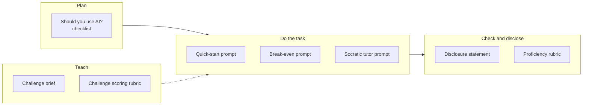

# Templates

Every copy-paste template and rubric in the guide, in one place. Each link goes to the template in context, so you can see how it's used.
{: .fs-6 .fw-300 }

## For everyone

| Template | What it's for | Where |
|:--|:--|:--|
| Quick-start prompt | A first prompt that asks for a draft, its assumptions, and a follow-up question | [What is AI?](#your-first-15-minutes) |
| "Should you use AI?" checklist | Decide between human only, automation, AI with review, or AI automation | [Should you use AI here?](#verify-checklist) |
| Time-savings formula | Check whether AI actually saves time once review is included | [Should you use AI here?](#check-the-math-does-ai-actually-save-time) |
| Disclosure statement | A specific, honest note on AI's role | [Rubric](#disclose-be-open-about-ais-role) |
| Use · Verify · Disclose · Decide proficiency levels | Self-assessment or peer review | [Rubric](#proficiency-levels) |

## For students

| Template | What it's for | Where |
|:--|:--|:--|
| Break-even analysis prompt | Set up a break-even model as formulas, with assumptions and scenarios | [Break-even analysis](#prompt-template) |
| Break-even verify checklist | Eight checks before you trust the numbers | [Break-even analysis](#verify-checklist) |

## For educators

| Template | What it's for | Where |
|:--|:--|:--|
| Challenge brief | A ready-to-fill brief for an AI-fluency challenge | [Designing an AI-fluency challenge](#prompt-template) |
| Challenge scoring rubric | 100-point rubric weighted toward Verify and Decide | [Designing an AI-fluency challenge](#scoring-rubric) |
| Socratic tutor prompt | Turns a chat assistant into a question-asking tutor | [Socratic tutor prompt](#prompt-template) |
| Tutor test checklist | Red-team the tutor prompt before learners use it | [Socratic tutor prompt](#verify-checklist) |

## Coming soon

Templates for cash-flow forecasts, market scans, research briefs, scenario knowledge checks, and course-operations prompts will be added as those pages are written.

## Page templates for contributors

New pages follow one of two templates in the repository:

- [Task page template](https://github.com/clarkngo/applied-ai-field-guide/blob/main/docs/_templates/task-page.md): Scenario → Why it matters → AI-assisted approach → Prompt template → Verify checklist → Common failure modes → Disclose and decide notes → For educators.
- [Concept page template](https://github.com/clarkngo/applied-ai-field-guide/blob/main/docs/_templates/concept-page.md): the same shape, for Foundations and Tools pages that explain an idea rather than a single task.
