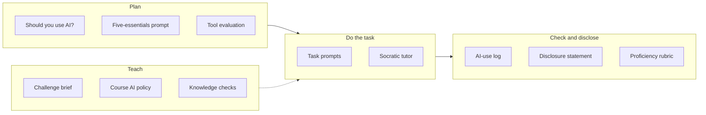

# Templates

Every copy-paste template and rubric in the guide, in one place. Each link goes to the template in context, so you can see how it's used.
{: .fs-6 .fw-300 }



## AI-use log

Several pages ask for an AI log. Here's a simple one. Keep it as you work, not afterward.

```markdown
# AI-use log: [TASK / ASSIGNMENT]

Tool(s): [KIND OF TOOL, e.g. chat assistant with file upload; plan/account type]
Data used: [WHAT YOU SHARED, and its class: Public / Internal / Confidential]

| # | What I asked (summary or paste) | What it produced | What I checked, and how | What I changed or rejected |
|---|---|---|---|---|
| 1 | | | | |
| 2 | | | | |
| 3 | | | | |

Errors I caught: [LIST, e.g. "held card fee constant when price changed"]
What I decided myself: [THE JUDGMENT CALLS THAT WERE MINE]
Disclosure statement: [2–4 SENTENCES]
```

## For everyone

| Template | What it's for | Where |
|:--|:--|:--|
| Quick-start prompt | A first prompt that asks for a draft, its assumptions, and a follow-up question | [What is AI?](#your-first-15-minutes) |
| "Should you use AI?" checklist | Decide between human only, automation, AI with review, or AI automation | [Should you use AI here?](#verify-checklist) |
| Time-savings formula | Check whether AI actually saves time once review is included | [Should you use AI here?](#check-the-math-does-ai-actually-save-time) |
| Disclosure statement | A specific, honest note on AI's role | [Rubric](#disclose-be-open-about-ais-role) |
| Use · Verify · Disclose · Decide proficiency levels | Self-assessment or peer review | [Rubric](#proficiency-levels) |
| Five-essentials prompt | Goal, audience, inputs, constraints, definition of done | [Context engineering](#worked-example) |
| Claim triage | Which parts of an AI output to check first | [How LLMs fail](#triage-which-claims-to-check-first) |
| Data-class rules | Which data can go into which tools | [Data classification](#four-data-classes) |
| Checkpoint types | Approve each, exception, sample, or escalate | [Human-in-the-loop design](#four-kinds-of-checkpoint) |
| Swap test | A quick bias check for people-related output | [Bias, fairness, and ethics](#the-swap-test) |
| Tool evaluation scorecard | Gates and weighted criteria for choosing a tool | [Evaluating an AI tool](#weighted-criteria) |

## For students

| Template | What it's for | Where |
|:--|:--|:--|
| Break-even prompt | Set up a break-even model as formulas, with assumptions and scenarios | [Break-even analysis](#prompt-template) |
| Cash-flow forecast prompt | Weekly forecast with collection timing and a reconciliation check | [Cash-flow analysis](#prompt-template) |
| Market scan prompt | Bottom-up sizing plus a sourced competitor table | [Competitive and market analysis](#prompt-template) |
| Extraction and synthesis prompts | Many sources into one cited brief | [Research-to-brief](#prompt-template) |
| Business writing prompt | Drafts that use only your facts, then list every claim and commitment | [Business writing](#prompt-template) |
| Spreadsheet formula prompt | Formulas with explanations, silent-failure risks, and a reconciliation check | [Spreadsheet and data analysis](#prompt-template) |
| Theme and tagging prompts | Open-ended feedback, tagged row by row and counted by formula | [Customer feedback analysis](#prompt-template) |

## For educators

| Template | What it's for | Where |
|:--|:--|:--|
| Challenge brief | A ready-to-fill brief for an AI-fluency challenge | [Designing an AI-fluency challenge](#prompt-template) |
| Challenge scoring rubric | 100-point rubric weighted toward Verify and Decide | [Designing an AI-fluency challenge](#scoring-rubric) |
| Socratic tutor prompt | Turns a chat assistant into a question-asking tutor | [Socratic tutor prompt](#prompt-template) |
| Tutor test checklist | Red-team the tutor prompt before learners use it | [Socratic tutor prompt](#verify-checklist) |
| Knowledge-check item prompt | Scenario questions with distractors built from real mistakes | [Scenario knowledge checks](#prompt-template) |
| Feedback and announcement prompts | Draft course communications for human review | [AI in course operations](#prompt-template) |
| Syllabus AI policy | Assignment-by-assignment AI levels, disclosure, and instructor use | [Writing a course AI policy](#prompt-template) |
| Assignment stress test | See how an AI-only submission would score, then redesign | [AI-resilient assessment](#prompt-template) |

## For workflows

| Template | What it's for | Where |
|:--|:--|:--|
| Autonomy planner | Assign an autonomy level and minimum access to each step | [Automate or judge?](#prompt-template) |
| Research-to-brief pipeline spec | A repeatable agent pipeline with STOP checkpoints | [Research-to-brief pipeline](#prompt-template) |
| Benchmarking extraction and mapping | Evidence-based coverage matrices from public pages | [Curriculum-benchmarking copilot](#prompt-template) |

## Page templates for contributors

New pages follow one of two templates in the repository:

- [Task page template](https://github.com/clarkngo/applied-ai-field-guide/blob/main/docs/_templates/task-page.md): Scenario → Why it matters → AI-assisted approach → Prompt template → Verify checklist → Common failure modes → Disclose and decide notes → For educators.
- [Concept page template](https://github.com/clarkngo/applied-ai-field-guide/blob/main/docs/_templates/concept-page.md): the same shape, for Foundations and Tools pages that explain an idea rather than a single task.
