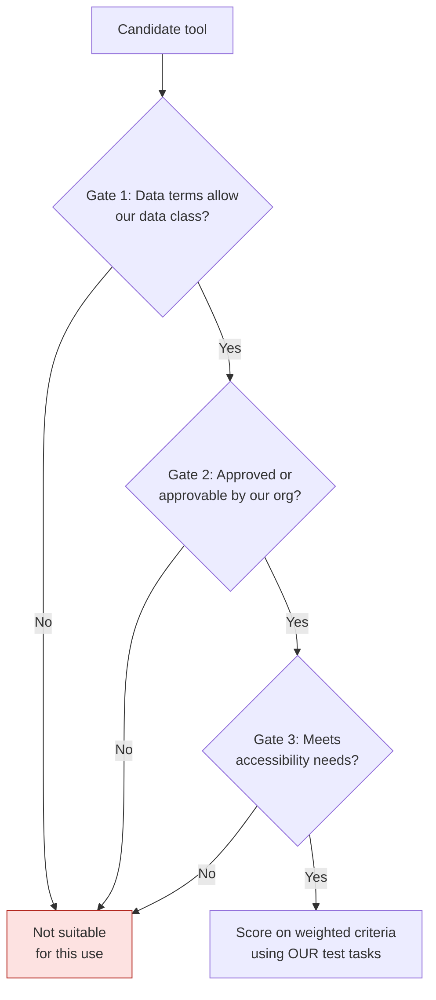
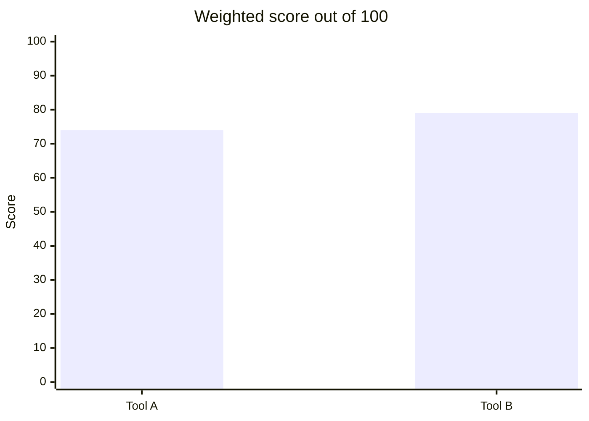

# Evaluating an AI tool
{: .no_toc }

A vendor-neutral way to decide whether an AI tool is right for your team or course: test it on your own tasks, and check the data terms before the features.
{: .fs-6 .fw-300 }

  
On this page

  {: .text-delta }
1. TOC
{:toc}

## Scenario

A small finance team at **Northwind Supply** (fictional) is choosing between two AI assistants for drafting variance commentary and summarizing internal reports. **Tool A** has the more impressive demo and a generous free tier. **Tool B** is less polished but comes with an organization plan. The team lead asks you to recommend one.

## Why it matters

Tool choices tend to stick. Once templates, habits, and connected data build up around a tool, switching is costly. Teams often choose on demo impressions and price, then discover later that the data terms don't allow the work they meant to do, or that the tool struggles with *their* tasks. A short, structured evaluation avoids both problems.

## Key ideas

### Gates first, then scores

Some criteria are **gates**: if a tool fails one, it's out, however good its features. Only tools that pass every gate get scored.

### Weighted criteria

| Criterion | Weight | What to check |
|:--|--:|:--|
| **Data terms** | 25 | Training on inputs (and whether you can opt out), retention, staff access, deletion. See [Data classification](). |
| **Accuracy on our tasks** | 25 | Results on 5–10 real test tasks with known answers. |
| **Fit** | 20 | Does it support the rungs you need (projects, grounding, templates)? See [The learning ladder](). |
| **Cost** | 10 | Total cost for the team, including paid tiers you'd realistically need. Is the free tier enough? |
| **Accessibility and usability** | 10 | Screen-reader support, keyboard use, and how easy it is for the least technical person on the team. |
| **Exit** | 10 | Can you export your chats, templates, and files if you leave? |

Score each criterion from 1 to 5. Then weighted score = Σ(weight × score) ÷ 5, which gives a score out of 100.

### Build a test set from your own work

A vendor's demo shows what the tool does well. Your test set shows what it does with *your* work. Use 5–10 tasks you've already done, so you know what a good answer looks like:

- 2–3 routine tasks (summaries, drafts)
- 2–3 tasks with numbers to check
- 1–2 tasks where a known trap exists, such as a price-linked cost or a period mismatch
- 1 task using your actual document types, with test or Public data only

## Worked example

Northwind's team runs the same 8 test tasks in both tools, then scores them:

| Criterion | Weight | Tool A score | Tool A weighted | Tool B score | Tool B weighted |
|:--|--:|--:|--:|--:|--:|
| Data terms | 25 | 2 | 50 | 5 | 125 |
| Accuracy on our tasks | 25 | 4 | 100 | 4 | 100 |
| Fit | 20 | 5 | 100 | 3 | 60 |
| Cost | 10 | 5 | 50 | 3 | 30 |
| Accessibility and usability | 10 | 4 | 40 | 4 | 40 |
| Exit | 10 | 3 | 30 | 4 | 40 |
| **Total ÷ 5** | | | **74** | | **79** |

Tool B scores a little higher, but the more important finding comes **before** scoring. The team's internal reports are **Internal** data, and Tool A's free tier may use inputs for training, with no organization agreement available. **Tool A fails Gate 1** for this use, however well it scores. It could still be fine for work with Public data only.

Both tools scored 4 on accuracy, and both missed the same trap task, a period mismatch. That's a reminder that verification habits matter whichever tool you choose.

## Verify checklist

- [ ] I identified the data class I'll use the tool for, before looking at features.
- [ ] I read the data terms for the specific plan we'd use, not just the product's marketing page.
- [ ] I checked whether my organization has approved, or can approve, the tool.
- [ ] I tested on 5–10 of our real tasks with known answers, including at least one trap.
- [ ] I scored using weights agreed in advance, not chosen after seeing the results.
- [ ] I checked accessibility with the people who'll actually use it.
- [ ] I know how we'd export our work if we leave.
- [ ] I've set a date to re-evaluate, because tools change quickly.

## Common failure modes

| Failure | What it looks like | How to catch it |
|:--|:--|:--|
| **Demo-driven choice** | Picking the tool that impressed in a 10-minute demo | Run your own test set. |
| **Terms for the wrong plan** | Reading the enterprise terms, then using a personal free account | Check the terms for the exact plan and account type you'll use. |
| **Moving weights** | Changing weights after scoring so the favorite wins | Agree on the weights before testing. |
| **Feature overload** | Choosing the tool with the most features you'll never use | Score fit against the rungs you actually need. |
| **Lock-in** | Templates and history that can't be exported | Check export before committing. |
| **One-time evaluation** | The tool changed its terms or models six months ago, and nobody noticed | Re-evaluate on a schedule, and after major updates. |

## Disclose and decide notes

**Disclose:** Share the evaluation with the team, including the gates, weights, scores, and test tasks, so the choice can be understood and revisited.

**Decide:** The recommendation is yours. "Tool B for internal work, and either tool for Public-data drafting" is a perfectly good answer. Tool decisions don't have to be all-or-nothing.

## For educators: turn this into a challenge

Teams evaluate two freely available AI tools for a defined business use, such as "summarizing public annual reports for an investment club." They agree on gates and weights *before* testing, build a 5-task test set with known answers, and present a recommendation. Debrief: *Did any team change its weights after seeing results? Which gate mattered most?* See [Designing an AI-fluency challenge]().
