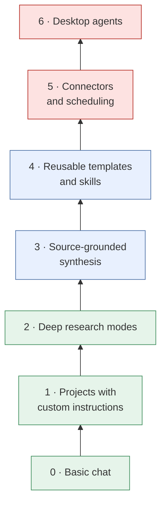

# Tools

A vendor-neutral way to grow your AI toolkit one rung at a time. Features change monthly. The kinds of tools change much more slowly.
{: .fs-6 .fw-300 }

This guide describes **kinds of tools** rather than products, and it prefers approaches that work on free tiers. Climb the ladder only as far as your work needs. Each rung adds capability, and each adds something new to verify.

| Rung | What it adds | New thing to verify |
|:--|:--|:--|
| 1 · Projects with custom instructions | Standing context, so you stop repeating yourself | Are the instructions still current? |
| 2 · Deep research modes | Multi-source web research with citations | Does every citation exist and say what's claimed? |
| 3 · Source-grounded synthesis | Answers limited to documents you upload | Did it stay inside the sources? |
| 4 · Reusable templates and skills | Repeatable quality across tasks and people | Does the template still fit this case? |
| 5 · Connectors and scheduling | Access to your files, email, and calendar; runs on a timer | What data can it reach? Who reviews scheduled output? |
| 6 · Desktop agents | Acts on your computer: clicks, types, files | What can it change, and can you undo it? |

Colors show rising risk: green rungs mostly produce text for you to read, while red rungs can reach your data or take actions. Check [Data classification]() before connecting anything. To understand what runs *behind* these tools, and what it takes to build or host your own, see [Running AI]().
