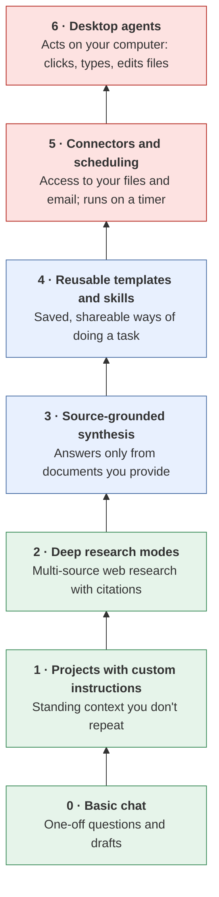
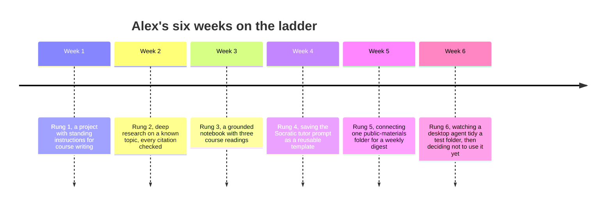

# The learning ladder
{: .no_toc }

A vendor-neutral path from basic chat to desktop agents, one rung at a time, favoring free tiers.
{: .fs-6 .fw-300 }

  
On this page

  {: .text-delta }
1. TOC
{:toc}

## Scenario

Alex, an instructional designer, has used a chat assistant for a few months: quick emails, the occasional summary. A colleague mentions "deep research", "grounded notebooks", and "agents that run on a schedule." Alex isn't sure which of these matter, what order to learn them in, or whether any are worth the risk.

## Why it matters

AI tools add features faster than anyone can follow. Learning them in a sensible order means each new capability builds on habits you already have, especially verification. Jumping straight to agents that can act on your files and email, without the habits from the lower rungs, is how people get hurt.

Each rung adds **capability** and also adds **something new to verify**.

## Key ideas

### The six rungs

Features and names vary by product, and many products offer several rungs. Check what your tool's free tier includes. Many offer the lower rungs at no cost.

### Each rung in brief

| Rung | What it is | Try this first | New thing to verify | Climb when... |
|:--|:--|:--|:--|:--|
| **1 · Projects with custom instructions** | A workspace where standing instructions and files apply to every chat | Write instructions with your role, audience, and house style, plus "always show formulas" | Are the instructions still current? Do they leak into tasks where they don't fit? | You catch yourself repeating the same context |
| **2 · Deep research** | The tool searches many sources, reads them, and writes a cited report | Research a question you already know the answer to, and compare | Does every citation exist, and does it say what's claimed? | You need breadth across many web sources |
| **3 · Source-grounded synthesis** | Upload your documents, and answers come only from them, with citations to passages (see the [product landscape]() for current examples) | Upload 3 readings and ask for points of disagreement | Did it stay inside the sources? Are the quoted passages accurate? | You have the sources and need to synthesize them |
| **4 · Templates and skills** | Saved prompts, project templates, or "skills" that package a repeatable method | Save your best prompt from this guide as a template | Does the template still fit this case? Who maintains it? | You do the same task more than twice a month |
| **5 · Connectors and scheduling** | The tool reads your drive, email, or calendar, and can run tasks on a schedule | Connect one low-risk folder, and schedule a weekly summary of it | What can it access? Who reviews scheduled output before it's used? | A repeating task needs your own files, and you have the habits from rungs 1–4 |
| **6 · Desktop agents** | An agent that operates your computer or browser to complete tasks | Watch it do a harmless task, such as renaming files in a test folder | What can it change? Can you undo it? Is every action logged? | Rungs 1–5 can't do the task, and the stakes are low or well-checked |

### Risk rises with access

Lower rungs produce **text you read**. Upper rungs **reach your data** and **take actions**. That's why the ladder colors shift from green to red, and why [Data classification]() and [Automate or judge?]() matter more the higher you go.

## Worked example

Alex climbs over six weeks, spending about an hour a week:

What Alex learned:

- **Week 2:** Deep research returned a confident report with 14 citations. Two were broken links, and one real source didn't support the claim it was cited for. Alex now checks every citation, every time.
- **Week 3:** The grounded notebook was the most useful tool for course design, because every answer pointed to a passage.
- **Week 6:** Alex stopped at rung 5 for real work. Nothing on the to-do list needed a desktop agent yet, and the review overhead wasn't worth it. **Choosing not to climb is a valid outcome.**

## Verify checklist

- [ ] I know which rung each tool feature I use sits on.
- [ ] I've practiced the verify habit from each rung before climbing to the next.
- [ ] I've read the data terms for any tool that can reach my files or accounts.
- [ ] Connected and scheduled tools only reach data they're approved for.
- [ ] Scheduled outputs are reviewed by a person before anyone acts on them.
- [ ] Anything an agent can change can be undone, and its actions are logged.
- [ ] I'm using a free tier wherever it meets the need.

## Common failure modes

| Failure | What it looks like | How to catch it |
|:--|:--|:--|
| **Skipping rungs** | Connecting email to an agent before you've ever checked a deep-research citation | Climb in order. The verify habits build on each other. |
| **Feature chasing** | Trying every new release, mastering none | Pick one rung a month and use it on real work. |
| **Over-connecting** | Granting access to an entire drive when one folder would do | Connect the smallest scope that works. |
| **Unreviewed schedules** | A weekly summary that nobody reads, until someone acts on a wrong one | Every scheduled output has a named reviewer. |
| **Paywall assumption** | Assuming you need a paid plan to learn | Many rungs are available on free tiers. Check before you pay. |
| **Vendor lock-in** | Methods tied to one product's feature names | Write your templates in plain language so they move between tools. |

## Disclose and decide notes

**Disclose:** The higher the rung, the more your disclosure should say about the tool's access and autonomy. For example: *"Compiled by a scheduled AI task with read access to the shared course folder, then reviewed by the instructor."*

**Decide:** How far to climb is your decision, and it can differ by task. Many professionals do excellent work on rungs 1–3 alone.

## For educators: turn this into a challenge

Assign each team one rung. Teams spend 30 minutes using that rung on the same business task, such as a short brief on a market trend, and then report back on three things: what it did well, what they had to verify, and what went wrong. Line the reports up from rung 1 to rung 6. Debrief: *Where did capability outpace your ability to check it?* See [Designing an AI-fluency challenge]().
