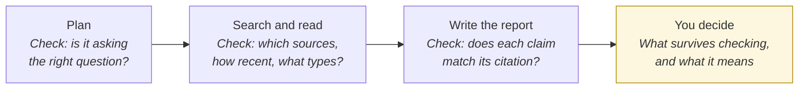
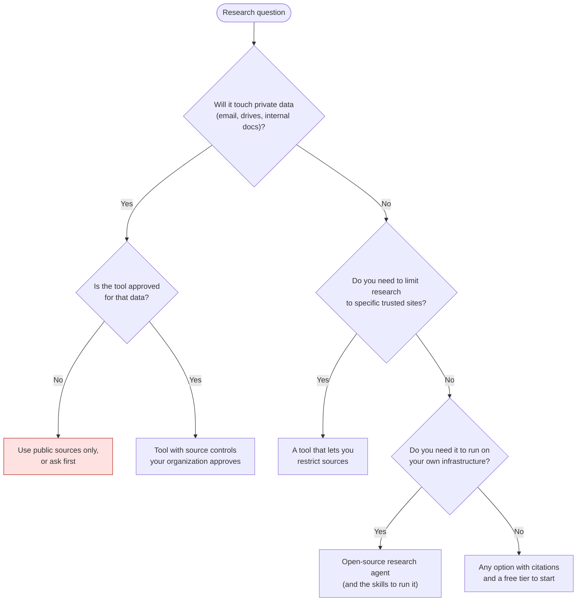
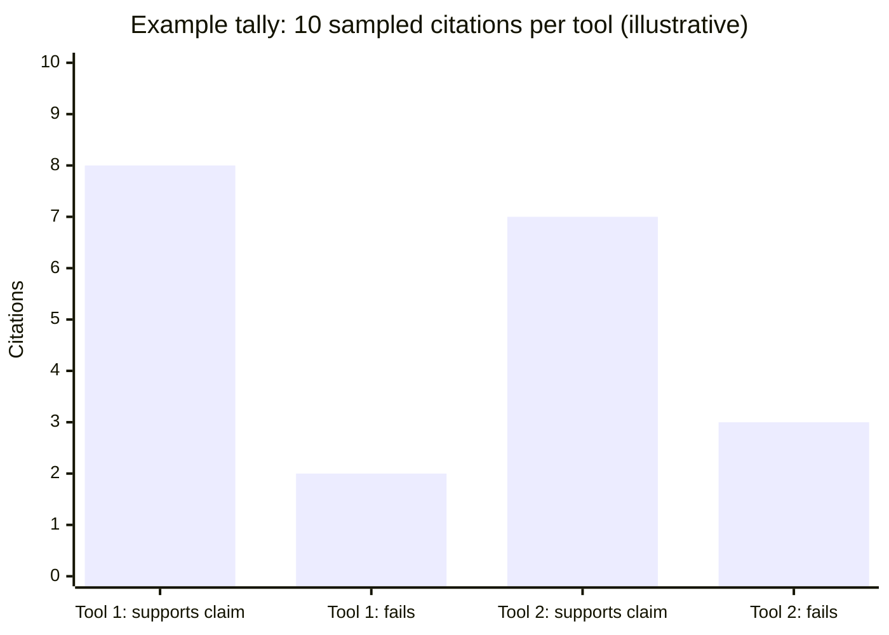

# Deep research tools: product landscape
{: .no_toc }

Tools that run many web searches for you, read the results, and write a cited report. This is rung 2 of the [learning ladder]().
{: .fs-6 .fw-300 }

{: .note }
**Last reviewed:** 2026-10-07. Products change often. Every entry below links to the vendor's official documentation or the project's official repository, and states only what that source said on the review date. Listing is not endorsement, and there is no ranking.

  
On this page

  {: .text-delta }
1. TOC
{:toc}

## What this category is

You describe a question. The tool plans an approach, runs dozens of searches, reads many pages, and writes a long report with citations, usually in a few minutes. It covers far more ground than you could by hand in the same time.

It also produces **more claims to check than any other tool type**. A 20-page report with 40 citations can contain invented, broken, or misread sources that look exactly like good ones. In the [learning ladder]() example, 3 of 14 citations in a deep-research report failed checking: two broken links and one real source that didn't support its claim. Treat a deep-research report as a well-organized **lead list**, not a finished answer. See [How LLMs fail]().

### Where to verify

Catching a bad plan early is the cheapest check. Checking claims against their citations takes the most time and catches the most errors.

## How to judge a tool in this category

| Question | Why it matters |
|:--|:--|
| **Can you review the plan before it runs?** | Fixing the question before the search is faster than fixing a 20-page report afterward. |
| **Can you control or restrict sources?** | Limiting research to trusted sites, or adding your own files, improves relevance and makes checking easier. |
| **Does the report cite sources?** | Citations are what make checking possible at all. |
| **Can it reach your private data?** | Some tools can also search connected email and drives. That's useful, and it's a [data classification]() decision. |
| **Is there a free option?** | Many tools allow limited free use. Check the vendor's plans page. |
| **Can you export the report?** | Exporting makes it easier to annotate during checking and to keep a record for your AI-use log. |

## Options

### Deep research in general AI assistants

| | ChatGPT deep research | Gemini Deep Research | Claude Research |
|:--|:--|:--|:--|
| **Vendor** | OpenAI | Google | Anthropic |
| **What it is** | Helps "accomplish complex online tasks by reasoning, researching, and synthesizing information into a documented report." | Lets you "conduct in-depth and real-time research on almost any subject." | "Claude operates agentically, conducting multiple searches that build on each other." |
| **Review the plan first?** | Yes. "You can review and modify it before the research begins." | Yes. "Gemini presents it to you, and you can refine it." | Not confirmed in official docs. |
| **Control sources?** | Yes. Public web, uploaded files, and connected apps. You can "restrict research to only the websites or domains you enter." | Google Search by default. "You can change or add other sources, like your personal Gmail or Drive." | Web search (must be on) and connected apps such as Gmail, Google Calendar, and Google Docs. |
| **Cites sources?** | Yes. "All deep research outputs include citations or source links." | Google's Workspace help says a report "includes the findings, citations, and an organized summary." | Yes: "easy-to-check citations." |
| **Free option?** | Not confirmed in official docs. "Usage varies by plan." | Yes. All users get basic limits, and paid plans get higher limits. Users must be 18+ and signed in. | No. Available on paid plans (Pro, Max, Team, Enterprise). |
| **Export** | Markdown, Word, and PDF | Not confirmed in official docs. | Not confirmed in official docs. |
| **Official sources** | [Deep research in ChatGPT](https://help.openai.com/en/articles/10500283-deep-research-in-chatgpt) | [Use Deep Research in Gemini Apps](https://support.google.com/gemini/answer/15719111) · [Overview](https://gemini.google/overview/deep-research/) · [Workspace help](https://support.google.com/docs/answer/17127708) | [Use research on Claude](https://support.claude.com/en/articles/11088861-use-research-on-claude) |
| **Checked** | 2026-10-07 | 2026-10-07 | 2026-10-07 |

### Search-first research tools

| | Perplexity Research |
|:--|:--|
| **Vendor** | Perplexity |
| **What it is** | "Conducts in-depth research and analysis on your behalf." It "performs dozens of searches, reads hundreds of sources," and delivers "a comprehensive report." |
| **Review the plan first?** | Not confirmed in official docs. The docs describe it "refining its research plan as it learns more." |
| **Control sources?** | Not confirmed in official docs. |
| **Cites sources?** | Perplexity's help center says "each answer includes numbered citations linking to the original sources." |
| **Free option?** | Yes. "Free users get limited access to Research," and subscribers get extended access. |
| **Export** | PDF or document, or a shareable Perplexity Page |
| **Official sources** | [What is Research mode?](https://www.perplexity.ai/help-center/en/articles/10738684-what-is-research-mode) · [How does Perplexity work?](https://www.perplexity.ai/help-center/en/articles/10352895-how-does-perplexity-work) |
| **Checked** | 2026-10-07 |

### Open-source and self-hosted

These run on your own computer or server, using a model provider (or local model) and a search provider that you configure. See [Running AI]() for what that involves.

| | GPT Researcher |
|:--|:--|
| **Maintainer** | Open-source project (GitHub: assafelovic/gpt-researcher) |
| **What it is** | "An autonomous agent that conducts deep research on any data using any LLM providers." |
| **Review the plan first?** | Not confirmed in official docs. |
| **Control sources?** | Yes. Web research, plus local documents (PDF, plain text, CSV, Excel, Markdown, PowerPoint, Word). |
| **Cites sources?** | Yes. It "produces detailed, factual, and unbiased research reports with citations," which is the project's own description. Verify as you would any report. |
| **Models** | Works with many LLM providers, including OpenAI-compatible APIs for local models |
| **Free option?** | Yes, open-source. Your model and search providers may charge. |
| **License** | Apache-2.0 |
| **Official source** | [GitHub repository](https://github.com/assafelovic/gpt-researcher) |
| **Checked** | 2026-10-07 |

{: .note }
**Not listed:** LangChain's Open Deep Research repository was archived by its owner on 2026-08-21, so it isn't included as an active option.

## How to choose

Whatever you choose, budget **more time for checking than for running.** A report that takes 5 minutes to generate can take an hour to verify properly.

## Try it: the known-answer test

The best way to judge a deep-research tool is to give it a question **you already know the answer to**:

1. Pick a topic you know well, such as your industry, a past project, or a course you've taught.
2. Run the same question in **two tools** from this page.
3. For each report, sample **10 citations**. For each one, record whether the source exists, whether it supports the claim, and how recent it is.
4. Note anything important the report **missed** that you know is true.
5. Compare the results:

The numbers above are only an example of how to record the tally. Your results will differ by tool, topic, and date, so record your own in an [AI-use log](#ai-use-log).

## Disclosure

The author has no paid, affiliate, or sponsorship relationship with any vendor or project listed on this page. This page was drafted with the help of an AI assistant made by Anthropic, one of the vendors listed. Each entry was checked against the official sources linked above, and every quoted phrase comes from those sources.

## Change log

| Date | Change |
|:--|:--|
| 2026-10-07 | Page created. LangChain's Open Deep Research was not listed because its repository was archived on 2026-08-21. |
