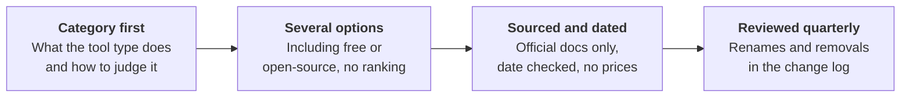

# Product landscape
{: .no_toc }

Named examples of real products and projects, one category of tool at a time, checked against official documentation and dated.
{: .fs-6 .fw-300 }

The rest of this guide describes *kinds* of tools, because the judgment you need doesn't change when products do. This section is the exception. It names current products so you can find them, but under strict rules:

- **Listing isn't endorsement.** There are no rankings, affiliate links, or sponsored placements.
- **Only official sources.** Every claim comes from the vendor's own documentation or the project's official repository, with the date it was checked. Where the docs are silent, the page says so.
- **No prices or plan limits.** They change too often. Check the vendor's plans page.
- **Nothing institution-specific.** These pages don't say which tools any organization licenses or approves. Check your own organization's approved list first. See [Data classification]().

The full rules are in the repository's [README](https://github.com/clarkngo/applied-ai-field-guide#naming-products-and-technologies).

## Categories

| Ladder rung | Landscape page | Status |
|:--|:--|:--|
| 3 · Source-grounded synthesis | [Source-grounded synthesis tools]() | Pilot. Last reviewed 2026-10-07. |
| 1, 2, 4, 5, 6 | Not yet written | Planned |
